# Student Registration App – CI/CD Pipeline Assignment

## 1. Project Overview

This project is a Python Flask-based Student Registration application being prepared for an end-to-end CI/CD pipeline assignment.

The application provides functionality to:

- View registered students
- Add students
- Update students
- Delete students
- Health/status checking through `/health`
- Store student data in MongoDB

The final assignment will integrate:

- GitHub
- GitHub Actions
- Python
- Pytest
- Docker
- Amazon **ECR**
- Amazon **EC2**
- **AWS** **IAM**
- Email notifications

The complete CI/CD architecture required by the assignment is:

```text
Developer
    |
    | git push
    v
GitHub Repository
    |
    v
GitHub Actions
    |
    +--------------------+
    |                    |
    v                    v
Install Dependencies   Run Tests
    |
    Tests Passed?
    /       \
    No         Yes
    |           |
    Stop          v
    Build Docker Image
    |
    v
    Amazon **ECR**
    |
    v
    **EC2**
    |
    v
    Deploy Container
    |
    v
    /health Check
    |
    +------+------+
    |             |
    Pass          Fail
    |             |
    v             v
    Success        Failure
    |             |
    +------+------+
    |
    v
    Email Notification
```

---

# 2. Assignment Objective

The objective of this assignment is to build a CI/CD pipeline that automatically:

## Checks out the latest source code.

## Installs Python dependencies. ## Runs the Pytest test suite. ## Stops the pipeline if tests fail. ## Builds a Docker image. ## Tags the image using the Git commit SHA. ## Pushes the image to Amazon ECR. ## Connects to an EC2 instance. ## Pulls the new Docker image. ## Stops and removes the old container. ## Starts the new container. ## Performs a `/health` verification. ## Sends a customized success/failure email notification.

---

# 3. Technology Stack

| Technology      | Purpose                           |
| --------------- | --------------------------------- |
| Python          | Application programming language  |
| Flask           | Web application framework         |
| Flask-PyMongo   | Flask integration with MongoDB    |
| PyMongo         | MongoDB Python driver             |
| Pytest          | Automated testing                 |
| Docker          | Application containerization      |
| Docker Compose  | Local multi-container environment |
| MongoDB         | Application database              |
| Git             | Source code version control       |
| GitHub          | Source code repository            |
| GitHub Actions  | CI/CD pipeline                    |
| Amazon ECR      | Docker image registry             |
| Amazon EC2      | Deployment target                 |
| AWS IAM         | Access control                    |
| SMTP / CI Email | Pipeline notifications            |

---

# 4. Application Requirements

The assignment requires the application to contain:

- A Flask application
- At least one health/status endpoint
- A `requirements.txt` file
- A Pytest test suite
- A Dockerfile
- Database connectivity
- A runnable Docker image

The application currently contains the required Flask application, health endpoint, tests, dependency file, Dockerfile, and MongoDB integration.

---

# 5. Project Location

The project is located at:

```text /Users/shiwanshu/Downloads/HeroViered/DevOps/**CICD**/GitHubActions/GradedAssignmentOnCICDPipeline/Student-Registration-App ```

To verify the current directory:

```bash pwd ```

Expected output:

```text /Users/shiwanshu/Downloads/HeroViered/DevOps/**CICD**/GitHubActions/GradedAssignmentOnCICDPipeline/Student-Registration-App ```

The project is being developed locally on macOS using the Zsh shell.

---

# 6. Python Virtual Environment

A Python virtual environment is being used for local development.

The terminal prompt shows:

```text (venv) ```

which confirms that the virtual environment is active.

The virtual environment is intentionally excluded from Docker using `.dockerignore`.

---

# 7. Initial Project Structure

The project was inspected using:

```bash ls -la ```

The project contains files and directories including:

```text .git/ .github/ .gitignore .env **README**.md **README**.pdf app.py requirements.txt start_flask.sh templates/ test_app.py venv/ azure-pipelines.yml ```

Important application files are:

```text app.py test_app.py requirements.txt Dockerfile .dockerignore docker-compose.yml .env templates/ ```

---

# 8. Python Dependencies

Initially, the complete virtual-environment dependency list was generated using:

```bash pip freeze > requirements.txt ```

This produced a large dependency list containing development and application packages.

The dependency file was then reduced to the packages actually required by the application and testing process.

The final `requirements.txt` is:

```text Flask==3.1.3 Flask-PyMongo==3.0.1 pymongo==4.17.0 python-dotenv==1.2.2 certifi==**2026**.7.22 pytest==9.1.1 ```

The file was verified using:

```bash cat requirements.txt ```

Final output:

```text Flask==3.1.3 Flask-PyMongo==3.0.1 pymongo==4.17.0 python-dotenv==1.2.2 certifi==**2026**.7.22 pytest==9.1.1 ```

## Why the dependency list was reduced

Using the entire output of:

```bash pip freeze ```

would include unrelated development tools such as:

```text black pylint bandit isort rich ```

and their dependencies.

For the application container, only the runtime and testing dependencies required by this project are maintained in `requirements.txt`.

This produces a cleaner and smaller Docker image.

---

# 9. Environment Variables

The application requires MongoDB configuration.

The `.env` file was inspected using:

```bash cat .env ```

The local configuration initially contained:

```text MONGO_URI=mongodb://localhost:**27017**/student_db SECRET_KEY=mysecretkey ```

The MongoDB **URI** was later changed for Docker Compose networking.

The MongoDB **URI** used inside the Docker Compose environment is:

```text mongodb://mongodb:**27017**/student_db ```

This is important because containers communicate using Docker Compose service names.

Inside the application container:

```text mongodb ```

resolves to the MongoDB container.

Therefore:

```text mongodb://mongodb:**27017**/student_db ```

is used instead of:

```text mongodb://localhost:**27017**/student_db ```

because `localhost` inside the Flask container refers to the Flask container itself, not the MongoDB container.

---

# 10. Security Note About `.env`

The `.env` file contains configuration values that should not be committed to GitHub.

The `.dockerignore` file therefore excludes:

```text .env ```

For the future cloud deployment, sensitive values such as:

- **AWS** credentials
- **SSH** private keys
- **EC2** connection details
- **SMTP** credentials

must be stored using GitHub Secrets or another secure credential mechanism.

They must never be hardcoded into the repository.

---

# 11. Docker Ignore Configuration

A `.dockerignore` file was created and inspected using:

```bash more .dockerignore ```

The configuration is:

```text venv/ __pycache__/ .pytest_cache/ .git/ .github/ .env .DS_Store *.pyc ```

## Purpose

The `.dockerignore` file prevents unnecessary files from being copied into the Docker build context.

For example:

```text venv/ ```

prevents the local Python virtual environment from being copied into the image.

```text .git/ ```

prevents Git repository metadata from being copied.

```text .env ```

prevents environment secrets from being included in the Docker image.

```text __pycache__/ .pytest_cache/ *.pyc ```

prevent Python cache files from being copied.

This reduces build context size and improves security.

---

# 12. Dockerfile

The Dockerfile was created using the following configuration:

```dockerfile **FROM** python:3.14-slim

**WORKDIR** /app

**COPY** requirements.txt .

**RUN** pip install --no-cache-dir -r requirements.txt

**COPY** app.py . **COPY** templates ./templates

**EXPOSE** **5000**

**CMD** [*python*, *app.py*] ```

## Dockerfile Explanation

### Base image

```dockerfile **FROM** python:3.14-slim ```

Uses a lightweight Python image.

### Working directory

```dockerfile **WORKDIR** /app ```

Creates `/app` as the working directory inside the container.

### Copy dependencies

```dockerfile **COPY** requirements.txt . ```

Copies the dependency file into the image.

### Install dependencies

```dockerfile **RUN** pip install --no-cache-dir -r requirements.txt ```

Installs all application dependencies.

`--no-cache-dir` prevents pip from storing unnecessary package cache files.

### Copy application

```dockerfile **COPY** app.py . **COPY** templates ./templates ```

Copies the Flask application and **HTML** templates.

### Application port

```dockerfile **EXPOSE** **5000** ```

Documents that Flask listens on port `**5000**`.

### Container startup command

```dockerfile **CMD** [*python*, *app.py*] ```

Starts the Flask application when the container starts.

---

# 13. Docker Installation Verification

Docker was checked using:

```bash docker info ```

Initially, Docker **CLI** was available but the Docker daemon was not running.

The error was:

```text Server: failed to connect to the docker **API** at unix:///Users/shiwanshu/.docker/run/docker.sock; check if the path is correct and if the daemon is running ```

This indicated that Docker Desktop needed to be running.

---

# 14. macOS Docker Service Difference

The following command was attempted:

```bash systemctl start docker ```

The result was:

```text zsh: command not found: systemctl ```

## Explanation

`systemctl` is a Linux systemd command.

The project is being developed on macOS using Docker Desktop.

Therefore, `systemctl` is not used to start Docker on this machine.

Docker Desktop provides the Docker daemon.

Once Docker Desktop was running, the following command successfully verified the Docker engine:

```bash docker info ```

---

# 15. Docker Engine Verification

The successful Docker verification showed:

```text
Server:
 Containers: 0
    Running: 0
    Paused: 0
    Stopped: 0
 Images: 0
 Server Version: 29.6.2
```

The Docker environment was:

```text Operating System: Docker Desktop OSType: linux Architecture: aarch64 ```

This confirms that Docker Desktop is running a Linux container environment on the Apple Silicon Mac.

Docker is therefore ready for local container testing.

---

# 16. Docker Image

The application Docker image was built and verified.

The image was listed using:

```bash docker images ```

The image appeared as:

```text student-registration-app:local ```

This confirmed that the Flask application could be packaged as a Docker image.

---

# 17. Initial Docker Container Test

The container was initially inspected using:

```bash docker ps ```

No running containers were present.

Then:

```bash docker ps -a ```

showed:

```text student-registration-app ```

with status:

```text Created ```

The container had been created but had not started successfully.

---

# 18. Docker Container Logs

The container logs were checked using:

```bash docker logs student-registration-app ```

Initially, there was no application output because the container was still in the `Created` state.

The container configuration was then inspected.

---

# 19. Docker Container State Inspection

The following command was used:

```bash docker inspect student-registration-app --format='Status={{.State.Status}} ExitCode={{.State.ExitCode}} Error={{.State.Error}}' ```

The result was:

```text Status=created ExitCode=0 Error= ```

This confirmed that the container had been created but had not actually started.

The container startup command was then inspected:

```bash docker inspect student-registration-app --format='Entrypoint={{.Config.Entrypoint}} Cmd={{.Config.Cmd}}' ```

The result was:

```text Entrypoint=[] Cmd=[python3 app.py] ```

This confirmed that Docker was configured to start:

```text python3 app.py ```

---

# 20. Port 5000 Conflict

The container was started using:

```bash docker start student-registration-app ```

The following error occurred:

```text ports are not available: exposing port **TCP** 0.0.0.0:**5000** bind: address already in use ```

This meant that port `**5000**` on the Mac was already being used by another process.

The port was checked using:

```bash lsof -i :**5000** ```

The output showed:

```text ControlCe **668** shiwanshu ... **TCP** *:commplex-main (**LISTEN**) ```

Therefore, port `**5000**` could not be mapped directly from the host.

---

# 21. Alternative Host Port

Instead of stopping the existing process, a different host port was selected.

The Docker mapping used was:

```text **5001**:**5000** ```

Meaning:

```text
Mac host port **5001**
    |
    v
Docker container port **5000**
```

The container was started using:

```bash
docker run -d \
    --name student-registration-app \
    -p **5001**:**5000** \
    student-registration-app:local
```

The container was created successfully.

However, it exited with:

```text Exited (1) ```

---

# 22. Docker Application Error

The container logs were checked:

```bash docker logs student-registration-app ```

The application failed with:

```text ValueError: You must specify a **URI** or set the MONGO_URI Flask config variable ```

## Root Cause

The Docker container did not have the required:

```text MONGO_URI ```

environment variable.

The local `.env` file existed on the Mac, but Docker does not automatically copy `.env` into a container.

This demonstrated that environment configuration needs to be explicitly passed to containers.

---

# 23. Docker Compose Solution

Instead of manually passing environment variables every time a container is started, Docker Compose was introduced.

A `docker-compose.yml` file was created.

The initial approach used:

```yaml
services:
    student-registration-app:
    build:
    context: .
    dockerfile: Dockerfile
    container_name: student-registration-app
    ports:
    - ***5001**:**5000***
    env_file:
    - .env
```

This allowed Docker Compose to load variables from `.env`.

However, the application still needed a MongoDB service because the assignment application uses MongoDB.

Therefore, the Compose configuration was improved.

---

# 24. MongoDB Docker Service

MongoDB was added as a separate Docker Compose service.

The final local Compose configuration is:

```yaml
services:
    mongodb:
    image: mongo:8
    container_name: student-mongodb
    ports:
    - ***27018**:**27017***

    student-registration-app:
    build:
    context: .
    dockerfile: Dockerfile
    container_name: student-registration-app
    ports:
    - ***5001**:**5000***
    environment:
    MONGO_URI: mongodb://mongodb:**27017**/student_db
    SECRET_KEY: mysecretkey
    depends_on:
    - mongodb
```

---

# 25. Docker Compose Configuration Explanation

## MongoDB service

```yaml mongodb: image: mongo:8 ```

Uses MongoDB version 8.

```yaml container_name: student-mongodb ```

Provides a predictable MongoDB container name.

```yaml ports: - ***27018**:**27017*** ```

Maps:

```text
Mac host:**27018**
    |
    v
MongoDB container:**27017**
```

Port `**27018**` was intentionally selected on the host because port `**27017**` was already occupied by a local MongoDB process.

---

# 26. Why the Application Uses Port 27017 Internally

The Flask container uses:

```text mongodb://mongodb:**27017**/student_db ```

The important point is that Docker containers communicate using the Compose service name:

```text mongodb ```

The internal MongoDB port remains:

```text **27017** ```

The host port:

```text **27018** ```

is only required when accessing MongoDB from the Mac host.

Therefore:

```text
Application container
    |
    | mongodb:27017
    v
MongoDB container
```

while the Mac can access MongoDB using:

```text localhost:**27018** ```

---

# 27. Application Service

The Flask application service is configured as:

```yaml
student-registration-app:
    build:
    context: .
    dockerfile: Dockerfile
    container_name: student-registration-app
    ports:
    - ***5001**:**5000***
```

This means:

```text
Browser / curl
    |
    | localhost:5001
    v
Docker
    |
    | container port 5000
    v
Flask application
```

---

# 28. MongoDB Environment Configuration

The Flask application receives:

```yaml
environment:
    MONGO_URI: mongodb://mongodb:**27017**/student_db
    SECRET_KEY: mysecretkey
```

This allows Flask-PyMongo to connect to the MongoDB service.

---

# 29. Service Dependency

The application contains:

```yaml depends_on: - mongodb ```

This tells Docker Compose that the MongoDB service should be started before the application service.

The application therefore has a defined dependency on MongoDB.

---

# 30. Validate Docker Compose Configuration

Before starting the services, the Compose configuration was validated using:

```bash docker compose config ```

The configuration was successfully rendered.

Important parts included:

```text
mongodb:
    image: mongo:8
    container_name: student-mongodb
    ports:
    - ***27018**:**27017***
```

and:

```text
student-registration-app:
    container_name: student-registration-app
    environment:
    MONGO_URI: mongodb://mongodb:**27017**/student_db
    SECRET_KEY: mysecretkey
    ports:
    - ***5001**:**5000***
```

This confirmed that Docker Compose could parse the configuration correctly.

---

# 31. Initial Docker Compose Container Name Conflict

The first attempt to start the complete Compose environment was:

```bash docker compose up -d ```

The image build completed successfully, but Docker reported:

```text Conflict. The container name */student-registration-app* is already in use ```

The reason was that an earlier manually-created container named:

```text student-registration-app ```

already existed.

---

# 32. Remove Old Container

The old container was removed using:

```bash docker rm student-registration-app ```

Docker returned:

```text student-registration-app ```

The remaining containers were checked:

```bash docker ps -a ```

At that point, the MongoDB container was present.

---

# 33. Start Docker Compose Environment

Docker Compose was started again using:

```bash docker compose up -d ```

The result was:

```text Container student-registration-app Started Container student-mongodb Started ```

This confirmed that both required services started successfully.

---

# 34. Verify Running Containers

The running containers were checked using:

```bash docker ps ```

The result showed:

```text student-registration-app ```

with:

```text 0.0.0.0:**5001**->**5000**/tcp ```

and:

```text student-mongodb ```

with:

```text 0.0.0.0:**27018**->**27017**/tcp ```

The final local architecture was therefore:

```text
    MacBook
    |
    +---------+---------+
    |                   |
    | localhost:5001    | localhost:27018
    |                   |
    v                   v
    Flask Container      MongoDB Container
    Port **5000**            Port **27017**
    |                   ^
    |                   |
    +---- mongodb ------+
```

---

# 35. Health Endpoint Verification

The application health endpoint was tested using:

```bash curl [http://localhost:**5001**/health](http://localhost:**5001**/health) ```

The response was:

```json {*status*: *healthy*} ```

This is an important assignment requirement because the CI/CD pipeline will later use `/health` as the deployment verification gate.

The current local test confirms:

```text
Container started
    |
    v
Flask application running
    |
    v
/health
    |
    v
**HTTP** **200**
    |
    v
{*status*: *healthy*}
```

---

# 36. Application Logs

The Flask container logs were checked using:

```bash docker logs student-registration-app ```

The logs showed:

```text
- Serving Flask app 'app'
- Debug mode: on
- Running on all addresses (0.0.0.0)
- Running on [http://**127**.0.0.1:**5000**](http://**127**.0.0.1:**5000**)
- Running on [http://**172**.18.0.3:**5000**](http://**172**.18.0.3:**5000**)
```

The logs also showed successful health requests:

```text ***GET** /health **HTTP**/1.1* **200** - ```

This confirms that the Flask application is running successfully inside the container.

---

# 37. MongoDB Data Verification

The MongoDB container was accessed using:

```bash docker exec -it student-mongodb mongosh student_db --eval 'db.students.find().pretty()' ```

The database returned a student record:

```text
[
    {
    _id: ObjectId('6a8173e4679bd87e963dd3f1'),
    name: 'Shiwanshu',
    email: '[herovired@gmail.com](mailto:herovired@gmail.com)',
    course: 'DevOps'
    }
]
```

This proves that:

## Flask can communicate with MongoDB.

## Student data can be inserted. ## MongoDB is storing the data. ## The Dockerized application is not merely serving the UI. ## Database functionality is working inside the Docker Compose environment.

---

# 38. MongoDB Port Verification

The MongoDB container port mapping was checked using:

```bash docker port student-mongodb ```

The result was:

```text **27017**/tcp -> 0.0.0.0:**27018** **27017**/tcp -> [::]:**27018** ```

This confirms:

```text
Host port **27018**
    |
    v
MongoDB container port **27017**
```

---

# 39. Host MongoDB Port Conflict Investigation

The original host port `**27017**` was checked using:

```bash lsof -i :**27017** ```

The output showed a local MongoDB process already listening:

```text mongod ... **TCP** localhost:**27017** (**LISTEN**) ```

Docker was also using the port through Docker Desktop.

Because port `**27017**` was already occupied, the Docker MongoDB service was moved to:

```text **27018** ```

on the host.

The internal Docker MongoDB port remains:

```text **27017** ```

This is why the final configuration uses:

```yaml ports: - ***27018**:**27017*** ```

---

# 40. Clean Docker Compose Restart

The complete environment was stopped and removed using:

```bash docker compose down ```

The output confirmed:

```text Container student-registration-app Removed Container student-mongodb Removed Network student-registration-app_default Removed ```

This removes the Compose containers and network while leaving the Docker images intact.

---

# 41. Start the Environment Again

The complete environment was started again using:

```bash docker compose up -d ```

The result was:

```text Network student-registration-app_default Created Container student-mongodb Started Container student-registration-app Started ```

This confirmed that the environment can be recreated cleanly.

---

# 42. Final Container Verification

The final running containers were checked using:

```bash docker ps ```

The result showed:

```text student-registration-app ```

running on:

```text 0.0.0.0:**5001**->**5000**/tcp ```

and:

```text student-mongodb ```

running on:

```text 0.0.0.0:**27018**->**27017**/tcp ```

Both containers were in the:

```text Up ```

state.

---

# 43. Final Health Check

The application was tested again after the clean restart:

```bash curl [http://localhost:**5001**/health](http://localhost:**5001**/health) ```

Response:

```json {*status*: *healthy*} ```

This confirms that the complete local environment survives a clean:

```bash docker compose down docker compose up -d ```

cycle.

---

# 44. Final Database Test

After the final Docker Compose environment was started, a student was successfully inserted through the application UI.

The student data was verified directly inside MongoDB using:

```bash docker exec -it student-mongodb mongosh student_db --eval 'db.students.find().pretty()' ```

The data was successfully stored.

Therefore the complete local application flow is working:

```text
Browser
    |
    v
### Flask Application
    |
    v
MongoDB
    |
    v
### Student Data Stored
```

---

# 45. Current Local Architecture# 47. Pytest Test Suite Validation

After completing the local application and Docker configuration, the automated test suite was executed using:

```bash pytest -v ```

The test suite successfully collected five test cases:

```text collected 5 items ```

All five tests passed:

```text test_app.py::test_home_page **PASSED** test_app.py::test_add_student **PASSED** test_app.py::test_update_student **PASSED** test_app.py::test_delete_student **PASSED** test_app.py::test_health **PASSED** ```

Final result:

```text 5 passed in 0.95s ```

This confirms that the application's existing functionality is currently passing the automated test suite.

The tests cover:

| Test                  | Purpose                   | Result   |
| --------------------- | ------------------------- | -------- |
| `test_home_page`      | Verify home page          | ✅ Passed |
| `test_add_student`    | Verify student creation   | ✅ Passed |
| `test_update_student` | Verify student update     | ✅ Passed |
| `test_delete_student` | Verify student deletion   | ✅ Passed |
| `test_health`         | Verify `/health` endpoint | ✅ Passed |

This test suite will later become the **CI test gate** in GitHub Actions.

The intended pipeline behavior will be:

```text
GitHub Push
    |
    v
### Install Dependencies
    |
    v
### Run Pytest
    |
    +----------+
    |          |
    **FAIL**       **PASS**
    |          |
    v          v
    **STOP**     Docker Build
```

---

# 48. Git Repository Status Before Commit

After completing the Docker and testing changes, Git was checked using:

```bash git status ```

The changes included:

```text modified:   .gitignore modified:   app.py modified:   requirements.txt modified:   test_app.py ```

New files included:

```text .dockerignore Dockerfile docker-compose.yml ```

The `.DS_Store` file was intentionally excluded from Git using `.gitignore`.

The working tree was then staged for the first project update.

---

# 49. Git Ignore Configuration

The macOS-specific `.DS_Store` file was added to `.gitignore`:

```text # macOS .DS_Store ```

This prevents macOS Finder metadata files from being committed to the repository.

The existing `.gitignore` already excludes the Python virtual environment:

```text venv/ ```

as well as other Python-generated files such as:

```text __pycache__/ .pytest_cache/ *.pyc ```

This keeps unnecessary local development files out of source control.

---

# 50. Files Staged for Commit

The staged changes were verified using:

```bash git diff --cached --stat ```

The result showed:

```text .dockerignore .gitignore Dockerfile app.py docker-compose.yml requirements.txt test_app.py ```

The staged change summary was:

```text 7 files changed 77 insertions 22 deletions ```

The staged files represent the completed local application, testing, and Dockerization work.

---

# 51. Review of Staged Changes

Before committing, the complete staged changes were reviewed using:

```bash git diff --cached ```

The review confirmed the following major changes:

### `.dockerignore`

Created to exclude:

```text venv/ __pycache__/ .pytest_cache/ .git/ .github/ .env .DS_Store *.pyc ```

### `.gitignore`

Updated to exclude:

```text .DS_Store ```

### `Dockerfile`

Created to package the Flask application into a Python Docker image.

### `docker-compose.yml`

Created to run:

```text
### Flask Application
- MongoDB
```

as a local multi-container environment.

### `requirements.txt`

Updated with the required application and testing dependencies.

### `app.py`

Updated to support the Dockerized application configuration.

### `test_app.py`

Updated with the application's automated tests.

---

# 52. Git Commit

After reviewing the staged changes, the changes were committed using:

```bash git commit -m *Add Docker Compose setup and application tests* ```

Git successfully created the commit:

```text [main bf6eed9] Add Docker Compose setup and application tests ```

The commit contained:

```text 7 files changed 77 insertions 22 deletions ```

New files created by the commit included:

```text .dockerignore Dockerfile docker-compose.yml ```

The commit represents the completed local Dockerization and testing milestone.

---

# 53. Git Repository Status After Commit

The repository was checked using:

```bash git status ```

The result was:

```text On branch main Your branch is ahead of 'origin/main' by 1 commit.

nothing to commit, working tree clean ```

This confirmed that:

## All intended changes were committed.

## No uncommitted changes remained. ## The local `main` branch contained one new commit that had not yet been pushed.

---

# 54. GitHub Repository Creation

A new GitHub repository was created specifically for this CI/CD assignment.

Repository name:

```text Student-Registration-App-**CICD**-GitHub-Actions ```

Repository owner:

```text shiwanshu97 ```

Repository:

```text [https://github.com/shiwanshu97/Student-Registration-App-**CICD**-GitHub-Actions.git](https://github.com/shiwanshu97/Student-Registration-App-**CICD**-GitHub-Actions.git) ```

The repository will be used as the source-code repository and later as the trigger source for GitHub Actions.

The intended relationship is:

```text
### Local Project
    |
    | git push
    v
GitHub Repository
    |
    v
GitHub Actions
```

---

# 55. Git Remote Configuration

Initially, the local project was pointing to a different GitHub repository:

```text [https://github.com/mohanDevOps-arch/flask_Practice.git](https://github.com/mohanDevOps-arch/flask_Practice.git) ```

The Git remote was changed to the newly created assignment repository.

The current remote was verified using:

```bash git remote -v ```

The result is:

```text origin  [https://github.com/shiwanshu97/Student-Registration-App-**CICD**-GitHub-Actions.git](https://github.com/shiwanshu97/Student-Registration-App-**CICD**-GitHub-Actions.git) (fetch) origin  [https://github.com/shiwanshu97/Student-Registration-App-**CICD**-GitHub-Actions.git](https://github.com/shiwanshu97/Student-Registration-App-**CICD**-GitHub-Actions.git) (push) ```

Therefore, the local project is now correctly connected to the assignment repository.

---

# 56. Push Local Commit to GitHub

After creating the commit and configuring the correct GitHub remote, the commit was pushed using:

```bash git push -u origin main ```

The push completed successfully.

GitHub reported:

```text [new branch] main -> main branch 'main' set up to track 'origin/main' ```

This confirms that the local `main` branch is now connected to the GitHub `main` branch.

The current source-control flow is:

```text
### Local Project
    |
    | git commit
    v
Local main
    |
    | git push
    v
GitHub main
```

---

# 57. Current Git Repository Status

The project is now successfully connected to the correct GitHub repository.

The repository contains the current application and Docker configuration.

The source-control milestone is complete:

```text ✅ Git repository initialized ✅ GitHub repository created ✅ Correct Git remote configured ✅ Application changes committed ✅ Docker files committed ✅ Test files committed ✅ Main branch pushed ✅ Local main tracking origin/main ```

The GitHub repository is:

```text Student-Registration-App-**CICD**-GitHub-Actions ```

---

The completed local environment is:

```text
                         Local MacBook

    |
    |
    [http://localhost:**5001**](http://localhost:**5001**)
    |
    v
    +-------------------------+
    | Student Registration    |
    | Flask Container          |
    |                         |
    | Port: 5000              |
    +------------+------------+
    |
    |
    mongodb:**27017**
    |
    v
    +-------------------------+
    | MongoDB Container        |
    |                         |
    | Image: mongo:8           |
    | Port: 27017              |
    +-------------------------+
    |
    v
    student_db
    |
    v
    students
```

Host port mappings:

```text Flask:

localhost:**5001**
    |
    v
container:**5000**

MongoDB:

localhost:**27018**
    |
    v
container:**27017**
```

## GitHub Actions CI Pipeline

After successfully pushing the application to the GitHub repository, the next phase was to implement the **Continuous Integration (CI)** portion of the assignment using GitHub Actions.

The GitHub repository is:

```text Student-Registration-App-**CICD**-GitHub-Actions ```

Repository:

```text [https://github.com/shiwanshu97/Student-Registration-App-**CICD**-GitHub-Actions](https://github.com/shiwanshu97/Student-Registration-App-**CICD**-GitHub-Actions) ```

The purpose of the CI pipeline is to automatically validate every code change before proceeding to the Docker image build and deployment stages.

The CI pipeline currently performs:

```text
GitHub Push
    |
    v
GitHub Actions
    |
    v
### Checkout Source Code
    |
    v
### Set Up Python
    |
    v
### Install Dependencies
    |
    v
Start MongoDB Service
    |
    v
### Run Pytest
    |
    v
5 Tests
    |
    +-------------+
    |             |
    **FAIL**          **PASS**
    |             |
    v             v
    Stop        Continue
```

---

# 59. GitHub Actions Workflow Directory

GitHub Actions workflows must be stored inside:

```text .github/workflows/ ```

The project already contains the `.github` directory.

The workflow structure used by GitHub Actions is:

```text Student-Registration-App/ │ ├── .github/ │   └── workflows/ │       └── ci.yml │ ├── app.py ├── test_app.py ├── requirements.txt ├── Dockerfile ├── docker-compose.yml └── **README**.md ```

The workflow file:

```text ci.yml ```

contains the CI pipeline definition.

---

# 60. Why GitHub Actions Was Selected

The assignment allows either:

```text Jenkins ```

or:

```text GitHub Actions ```

GitHub Actions was selected for this assignment.

The reason is that the source code is already hosted on GitHub, allowing the CI pipeline to be maintained alongside the application source code.

The resulting architecture is:

```text
Developer
    |
    | git push
    v
GitHub Repository
    |
    | workflow trigger
    v
GitHub Actions
    |
    +----------------------+
    |                      |
    v                      v
Python Environment     MongoDB Service
    |                      |
    +----------+-----------+
    |
    v
    Pytest
    |
    v
    Test Results
```

---

# 61. GitHub Actions Workflow File

The CI workflow was created under:

```text .github/workflows/ci.yml ```

The workflow performs the following operations:

## Trigger the pipeline when code is pushed.

## Run the workflow on an Ubuntu GitHub-hosted runner. ## Check out the repository. ## Install the required Python version. ## Install the dependencies from `requirements.txt`. ## Start MongoDB as a service container. ## Execute the Pytest test suite. ## Stop the pipeline automatically if any test fails.

The workflow is designed to validate the application before the later Docker/**ECR**/**EC2** deployment stages are added.

---

# 62. CI Workflow Trigger

The workflow is triggered by a Git push.

The basic trigger is:

```yaml on: push: ```

This means that when a new commit is pushed to GitHub, GitHub Actions automatically starts the CI pipeline.

The workflow therefore follows:

```text
### Local Change
    |
    v
git add
    |
    v
git commit
    |
    v
git push
    |
    v
GitHub
    |
    v
GitHub Actions
```

This removes the need to manually execute the test suite after every push.

---

# 63. GitHub Actions Runner

The CI job runs on a GitHub-hosted Ubuntu runner.

The runner environment used for the successful CI execution was:

```text Ubuntu 24.04 ```

The runner provides a temporary Linux environment in which the application is checked out and tested.

The CI environment is therefore separate from the local macOS development environment.

The architecture is:

```text
Developer MacBook
    |
    | git push
    v
GitHub
    |
    v
GitHub-hosted Runner
    |
    v
Ubuntu 24.04
    |
    v
Python + MongoDB + Pytest
```

---

# 64. Source Code Checkout

The first major step in the workflow is checking out the repository source code.

GitHub Actions uses the standard checkout action to retrieve the current repository contents.

Conceptually:

```yaml
- name: Checkout code
  uses: actions/checkout@v4
```

This makes the following project files available to the CI runner:

```text app.py test_app.py requirements.txt Dockerfile docker-compose.yml templates/ ```

Without this step, the GitHub Actions runner would not have access to the application source code.

---

# 65. Python Environment Setup

The workflow configures Python before installing application dependencies.

The CI environment uses:

```text Python 3.14 ```

The successful GitHub Actions execution reported:

```text Python 3.14.7 ```

This ensures that the CI environment uses the same major Python version expected by the project.

The workflow uses the standard Python setup action:

```yaml
- name: Set up Python
  uses: actions/setup-python@v5
```

The purpose of this step is to provide a controlled and reproducible Python environment for the tests.

---

# 66. Python Dependency Installation

After Python was configured, the workflow installs the project dependencies from:

```text requirements.txt ```

The installation is performed using:

```bash python -m pip install --upgrade pip python -m pip install -r requirements.txt ```

The CI runner therefore installs:

```text Flask Flask-PyMongo pymongo python-dotenv certifi pytest ```

The same dependency definition used by the application is therefore used by the CI pipeline.

This is important because it prevents the CI environment from depending on packages installed manually on the developer's MacBook.

---

# 67. MongoDB Service for CI

The application requires MongoDB for its database functionality.

The local development environment uses Docker Compose to provide MongoDB.

For GitHub Actions, MongoDB was configured as a GitHub Actions service container.

The CI environment therefore contains:

```text
GitHub Actions Runner
    |
    +----------------------+
    |                      |
    v                      v
 Python Application       MongoDB Service
    |                      |
    +----------+-----------+
    |
    v
    Pytest
```

The MongoDB service used during the successful CI run was:

```text MongoDB 7 ```

This provides the database required by the Flask application while the automated tests are running.

---

# 68. MongoDB CI Connectivity

The CI environment needs the Flask application to communicate with MongoDB.

The MongoDB service is exposed to the workflow so that the test process can connect to the database.

The application therefore receives a MongoDB connection configuration appropriate for the CI environment.

The important distinction is:

### Local Docker Compose

```text mongodb://mongodb:**27017**/student_db ```

because Docker Compose provides the service name:

```text mongodb ```

### GitHub Actions

The MongoDB service runs inside the GitHub Actions job environment and is accessed using the CI service configuration.

This allows the same application and test suite to execute successfully in the GitHub-hosted runner.

---

# 69. Pytest Execution in GitHub Actions

After the Python dependencies and MongoDB service were available, the test suite was executed using:

```bash pytest -v ```

This is the same test command used during local development.

The purpose of executing the same command in CI is to ensure that code passing locally also passes in a clean GitHub-hosted environment.

The CI pipeline therefore does not rely on the developer's local Python environment.

---

# 70. CI Test Collection

The GitHub Actions runner successfully collected:

```text 5 items ```

The five tests are:

```text test_home_page test_add_student test_update_student test_delete_student test_health ```

The tests were executed against the CI environment containing:

```text Python 3.14.7 MongoDB 7 ```

---

# 71. GitHub Actions Test Results

The CI test execution completed successfully.

The results were:

```text test_app.py::test_home_page **PASSED** test_app.py::test_add_student **PASSED** test_app.py::test_update_student **PASSED** test_app.py::test_delete_student **PASSED** test_app.py::test_health **PASSED** ```

Final result:

```text 5 passed in 0.25s ```

Therefore:

```text Total Tests: 5 Passed:      5 Failed:      0 ```

The CI test stage was successful.

---

# 72. CI Pipeline Success Flow

The successful GitHub Actions execution confirms the following flow:

```text
GitHub Push
    |
    v
GitHub Actions Trigger
    |
    v
Ubuntu 24.04 Runner
    |
    v
### Checkout Repository
    |
    v
Python 3.14.7
    |
    v
Install requirements.txt
    |
    v
Start MongoDB 7 Service
    |
    v
pytest -v
    |
    v
+-------------------------+
| 5 Tests                 |
|                         |
| 5 Passed                |
| 0 Failed                |
+-------------------------+
    |
    v
CI **SUCCESS**
```

This is the first completed automated CI milestone of the assignment.

---

# 73. CI Failure Behavior

The CI pipeline is designed so that a failed test causes the workflow to fail.

The intended behavior is:

```text
GitHub Push
    |
    v
### Install Dependencies
    |
    v
### Run Pytest
    |
    +----------------+
    |                |
    **FAIL**             **PASS**
    |                |
    v                v
Workflow           Continue
Failed                 |
    v
    Docker Build
```

If any of the five tests fails, the Pytest command returns a non-zero exit status.

GitHub Actions interprets this as a failed step.

The later CI/CD stages should therefore not execute when the test gate fails.

This provides an important quality-control mechanism.

---

# 74. Local Tests vs CI Tests

The test suite was successfully validated in both environments.

## Local Environment

The tests were executed using:

```bash pytest -v ```

Result:

```text 5 passed in 0.95s ```

## GitHub Actions Environment

The same test suite was executed using:

```bash pytest -v ```

Result:

```text 5 passed in 0.25s ```

The comparison demonstrates that the application tests are reproducible outside the developer's local machine.

---

# 75. CI Environment Independence

One of the main objectives of the CI pipeline is to eliminate dependency on the developer's local environment.

The local environment is:

```text macOS ### Docker Desktop Python virtual environment Local MongoDB / Docker MongoDB ```

The GitHub Actions environment is:

```text Ubuntu 24.04 Python 3.14.7 MongoDB 7 service Clean GitHub-hosted runner ```

Despite the difference in operating systems, the same test suite passed successfully.

This confirms that the project is suitable for automated CI execution.

---

# 76. GitHub Actions CI Verification

After the workflow was pushed to GitHub, GitHub Actions automatically detected the workflow file.

The workflow execution was monitored from the repository's:

```text Actions ```

section.

The successful workflow execution showed that:

```text
### Workflow Trigger
    |
    v
### Runner Provisioned
    |
    v
### Repository Checkout
    |
    v
### Python Setup
    |
    v
### Dependency Installation
    |
    v
MongoDB Service
    |
    v
Pytest
    |
    v
5/5 Tests Passed
    |
    v
### Workflow Successful
```

This confirms that GitHub Actions is correctly integrated with the repository.

---

# 77. CI Pipeline Milestone Completed

At this stage, the Continuous Integration portion of the assignment has been successfully implemented.

The following components are now complete:

```text ✅ GitHub repository ✅ GitHub Actions workflow ✅ Ubuntu 24.04 CI runner ✅ Python 3.14 environment ✅ Dependency installation ✅ MongoDB CI service ✅ Pytest execution ✅ Five automated tests ✅ All five tests passing ✅ Automatic CI execution after Git push ```

The current CI pipeline is:

```text
Developer
    |
    | git push
    v
GitHub Repository
    |
    v
GitHub Actions
    |
    v
Ubuntu 24.04
    |
    +-------------------+
    |                   |
    v                   v
Python 3.14.7       MongoDB 7
    |                   |
    +---------+---------+
    |
    v
    Pytest
    |
    v
    5 Tests Passed
    |
    v
    CI **SUCCESS**
```

---

# 78. CI/CD Pipeline – Current Progress

The assignment is being implemented incrementally.

The current progress is:

| Component                    | Status      |
| ---------------------------- | ----------- |
| Flask Application            | ✅ Completed |
| MongoDB Integration          | ✅ Completed |
| `/health` Endpoint           | ✅ Completed |
| Pytest Test Suite            | ✅ Completed |
| Dockerfile                   | ✅ Completed |
| Docker Compose               | ✅ Completed |
| Local Docker Testing         | ✅ Completed |
| Git Repository               | ✅ Completed |
| GitHub Repository            | ✅ Completed |
| GitHub Actions CI            | ✅ Completed |
| Python Setup in CI           | ✅ Completed |
| MongoDB Service in CI        | ✅ Completed |
| Automated Pytest in CI       | ✅ Completed |
| All 5 CI Tests Passing       | ✅ Completed |
| Docker Image Build in CI     | ⏳ Next      |
| Amazon ECR Push              | ⏳ Pending   |
| EC2 Deployment               | ⏳ Pending   |
| Container Replacement on EC2 | ⏳ Pending   |
| Deployment `/health` Check   | ⏳ Pending   |
| Email Notification           | ⏳ Pending   |

---

# 79. CI to CD Transition

The project has now completed the initial Continuous Integration stage.

The current pipeline is:

```text
Developer
    |
    | git push
    v
GitHub
    |
    v
GitHub Actions
    |
    v
Checkout
    |
    v
### Python Setup
    |
    v
### Install Dependencies
    |
    v
MongoDB Service
    |
    v
Pytest
    |
    v
5/5 Tests Passed
```

The next stage is to extend the successful CI pipeline into Continuous Delivery/Deployment.

The next planned flow is:

```text
GitHub Push
    |
    v
GitHub Actions
    |
    v
### Run Tests
    |
    v
### Tests Passed
    |
    v
### Build Docker Image
    |
    v
### Tag Image
    |
    v
Amazon **ECR**
    |
    v
### Push Image
    |
    v
Amazon **EC2**
    |
    v
### Pull New Image
    |
    v
### Stop Old Container
    |
    v
### Start New Container
    |
    v
/health Verification
    |
    +-------------+
    |             |
    **PASS**          **FAIL**
    |             |
    v             v
 Success        Failure
    |             |
    +------+------+
    |
    v
    Email Notification
```

---

# 80. Docker Image Tagging Strategy

The Docker image used in the CI/CD pipeline will be tagged using the Git commit **SHA**.

The reason for using the commit **SHA** is to create a unique and traceable Docker image for every source-code version.

For example:

```text student-flask-app:<commit-sha> ```

A Git commit:

```text abc1234 ```

could therefore produce:

```text student-flask-app:abc1234 ```

The relationship becomes:

```text
### Git Commit
    |
    v
Commit **SHA**
    |
    v
### Docker Image Tag
    |
    v
Amazon **ECR**
```

This allows a deployed Docker image to be traced back to the exact Git commit that produced it.

---

# 81. Why Commit SHA Tags Are Important

Using:

```text latest ```

alone does not provide strong version traceability because the same tag can point to different images over time.

Using the Git commit **SHA** provides immutable version identification.

For example:

```text student-flask-app:bf6eed9 student-flask-app:abc1234 student-flask-app:def5678 ```

Each image represents a specific source-code revision.

This is more appropriate for a production-style CI/CD pipeline.

---

# 82. Current Source Control State

The completed local Dockerization and testing changes were committed with:

```bash git commit -m *Add Docker Compose setup and application tests* ```

Commit:

```text bf6eed9 ```

The commit was pushed to:

```text origin/main ```

The GitHub repository is:

```text shiwanshu97/Student-Registration-App-**CICD**-GitHub-Actions ```

GitHub Actions is now connected to this repository and automatically executes the CI workflow after code pushes.

---

# 83. Completed CI Architecture

The completed CI architecture is:

```text
    Developer
    |
    | git push
    v
    +----------------------+
    | GitHub Repository    |
    |                      |
    | main branch          |
    +----------+-----------+
    |
    | workflow trigger
    v
    +----------------------+
    | GitHub Actions       |
    |                      |
    | Ubuntu 24.04         |
    +----------+-----------+
    |
    +-----------+-----------+
    |                       |
    v                       v
    +----------------+      +----------------+
    | Python 3.14.7  |      | MongoDB 7      |
    |                |      | Service        |
    +-------+--------+      +-------+--------+
    |                       |
    |                       |
    +-----------+-----------+
    |
    v
    +-------------+
    |   Pytest    |
    |             |
    | 5 Tests     |
    +------+------+
    |
    v
    +---------------+
    | 5/5 PASSED    |
    +---------------+
    |
    v
    CI **SUCCESS**
```

---

The missing section should go after Section 83, and then you can continue with the **ECR**/CD sections.

# 84. Docker Image Build in GitHub Actions

After successfully completing the CI test stage, the next step was to extend the GitHub Actions workflow to build the Docker image.

The Docker image is built only after the Pytest stage succeeds.

The pipeline flow is:

```text
GitHub Push
    |
    v
### Checkout Code
    |
    v
### Setup Python
    |
    v
### Install Dependencies
    |
    v
Start MongoDB
    |
    v
### Run Pytest
    |
    +----------------+
    |                |
    **FAIL**             **PASS**
    |                |
    v                v
    **STOP**         Build Docker Image

This ensures that a Docker image is not created from code that has failed the automated test suite.

## Docker Build Step in ci.yml

The Docker image build was added to the GitHub Actions workflow.

The Docker build step is:

- name: Build Docker image
    run: |
    docker build \
    -t student-registration-app:${{ github.sha }} \
    .

This command uses the Dockerfile present in the root of the repository.

The build context is:

.

which represents the project root.

The resulting image is tagged using the Git commit **SHA**.

## Why the Git Commit SHA Is Used as the Docker Image Tag

The image is not tagged only as:

latest

Instead, the GitHub Actions workflow uses:

${{ github.sha }}

GitHub automatically provides the **SHA** of the commit that triggered the workflow.

Therefore, a commit such as:

bf6eed9

can produce an image such as:

student-registration-app:bf6eed9

The complete relationship is:

### Git Commit

    |
    | github.sha
    v
### Docker Image Tag
    |
    v
student-registration-app:<commit-sha>

This provides traceability between the source code and the Docker image.

## Docker Image Build Command

The Docker image is built using:

docker build \
    -t student-registration-app:${{ github.sha }} \
    .

The command performs the following operations:

Dockerfile
    |
    v
### Docker Build Context
    |
    v
Install requirements.txt
    |
    v
Copy app.py
    |
    v
Copy templates/
    |
    v
### Create Docker Image

The Dockerfile used by the pipeline is:

**FROM** python:3.14-slim

**WORKDIR** /app

**COPY** requirements.txt .

**RUN** pip install --no-cache-dir -r requirements.txt

**COPY** app.py . **COPY** templates ./templates

**EXPOSE** **5000**

**CMD** [*python*, *app.py*] ## Docker Build Context

The final command:

docker build \
    -t student-registration-app:${{ github.sha }} \
    .

uses the current repository directory as the Docker build context.

The .dockerignore file prevents unnecessary files from being sent to Docker.

The current .dockerignore contains:

venv/ __pycache__/ .pytest_cache/ .git/ .github/ .env .DS_Store *.pyc

Therefore, files such as:

venv/ .git/ .env .pytest_cache/

are not included in the Docker build context.

This keeps the image build cleaner and prevents local environment files from being copied into the image.

## Docker Image Build Verification

After the Docker build step executes, the image can be verified using:

docker images

The expected image format is:

student-registration-app   <commit-sha>

For example:

student-registration-app   bf6eed9

The image therefore contains both:

Repository: student-registration-app

Tag: Git commit **SHA** ## Docker Image Build Flow in GitHub Actions

The GitHub Actions pipeline now performs:

Developer
    |
    | git push
    v
GitHub
    |
    v
GitHub Actions
    |
    v
### Checkout Source Code
    |
    v
Setup Python 3.14
    |
    v
Install requirements.txt
    |
    v
Start MongoDB Service
    |
    v
### Run Pytest
    |
    v
+-----------------------+
| 5 Tests Passed        |
+-----------+-----------+
    |
    v
    Docker Build
    |
    v
student-registration-app
    |
    v
    <Git **SHA** Tag>
## CI/CD ci.yml Docker Build Section

The relevant portion of ci.yml is:

- name: Run tests
  run: pytest -v

- name: Build Docker image
    run: |
    docker build \
    -t student-registration-app:${{ github.sha }} \
    .

The important point is that the Docker build step comes after:

- name: Run tests
  run: pytest -v

GitHub Actions stops the job automatically if:

pytest -v

returns a non-zero exit code.

Therefore, the Docker image is built only when all tests pass.

## Why Docker Build Is After Pytest

The order of the pipeline is intentional.

Incorrect approach:

### Build Docker Image

    |
    v
### Run Tests

This can create images from code that has not passed validation.

The implemented approach is:

### Run Tests

    |
    v
Tests Passed?
    |
    v
### Build Docker Image

This provides a CI quality gate.

The intended behavior is:

    Pytest
    |
    +--------+--------+
    |                 |
    **FAIL**              **PASS**
    |                 |
    v                 v
    **STOP**          Docker Build
    |
    v
    **ECR** Push
## Docker Image Naming

The application Docker image is named:

student-registration-app

The complete image reference is:

student-registration-app:<git-commit-sha>

For example:

student-registration-app:bf6eed9

Later, when Amazon **ECR** is introduced, this image will be converted into an **ECR** image reference such as:

<aws-account-id>.dkr.ecr.<region>.amazonaws.com/student-flask-app:<git-commit-sha>

The final production flow will therefore be:

GitHub Commit
    |
    v
### Docker Build
    |
    v
student-registration-app:<**SHA**>
    |
    v
Amazon **ECR**
    |
    v
**ECR** Image
    |
    v
Amazon **EC2**
## Docker Build Milestone

The Docker image build stage is now part of the CI/CD pipeline design.

The completed stages are:

✅ GitHub Repository ✅ GitHub Actions ✅ Checkout Source Code ✅ Python 3.14 Setup ✅ Dependency Installation ✅ MongoDB CI Service ✅ Pytest ✅ 5/5 Tests Passing ✅ Dockerfile ✅ Docker Image Build ✅ Git **SHA** Image Tag

The remaining Continuous Delivery stages are:

⏳ Amazon **ECR** Authentication ⏳ Amazon **ECR** Repository ⏳ Docker Image Push to **ECR** ⏳ **EC2** **SSH** Deployment ⏳ Pull Image on **EC2** ⏳ Stop Old Container ⏳ Remove Old Container ⏳ Start New Container ⏳ /health Verification ⏳ Email Notification ## Complete CI/CD Pipeline After Docker Build

The pipeline architecture is now:

    Developer
    |
    | git push
    v
    +----------------------+
    | GitHub Repository    |
    +----------+-----------+
    |
    v
    +----------------------+
    | GitHub Actions       |
    +----------+-----------+
    |
    v
    Checkout Source
    |
    v
    Setup Python 3.14
    |
    v
    Install Dependencies
    |
    v
    MongoDB Service
    |
    v
    Run Pytest
    |
    +--------+--------+
    |                 |
    **FAIL**              **PASS**
    |                 |
    v                 v
    **STOP**          Docker Build
    |
    v
    student-registration-app
    |
    v
    Git Commit **SHA**
    |
    v
    Amazon **ECR**
    |
    v
    Amazon **EC2**
    |
    v
    Deploy New Container
    |
    v
    /health Check
    |
    +-------+-------+
    |               |
    **PASS**            **FAIL**
    |               |
    v               v
    Success         Failure
    |               |
    +-------+-------+
    |
    v
    Email Notification
## Next CI/CD Stage – Amazon ECR

The next stage after successfully building the Docker image is Amazon Elastic Container Registry (**ECR**).

The intended process is:

GitHub Actions
    |
    v
### Docker Build
    |
    v
### Docker Image
    |
    v
**AWS** Authentication
    |
    v
Amazon **ECR** Login
    |
    v
Tag Image for **ECR**
    |
    v
### Push Image
    |
    v
Amazon **ECR** Repository

The **ECR** image will retain the Git commit **SHA** tag.

For example:

student-flask-app:bf6eed9

# Amazon ECR — Complete Setup and Deployment Steps

This section documents all steps performed to integrate the Student Registration application with **Amazon Elastic Container Registry (ECR)** and push the Docker image through the GitHub Actions CI/CD pipeline.

---

## 1. Verify AWS Region

First, verify the AWS CLI configured region:

```bash
aws configure get region
```

Expected output:

```text
ap-south-1
```

The project uses the **Asia Pacific (Mumbai)** AWS region.

---

## 2. Check Whether the ECR Repository Exists

Check whether the `student-registration-app` repository already exists:

```bash
aws ecr describe-repositories \
  --repository-names student-registration-app \
  --region ap-south-1
```

Initially, the repository did not exist and returned:

```text
RepositoryNotFoundException
```

---

## 3. Create the ECR Repository

Create the ECR repository:

```bash
aws ecr create-repository \
  --repository-name student-registration-app \
  --region ap-south-1
```

The repository was successfully created.

Repository URI:

```text
360999005537.dkr.ecr.ap-south-1.amazonaws.com/student-registration-app
```

The repository ARN was:

```text
arn:aws:ecr:ap-south-1:360999005537:repository/student-registration-app
```

---

## 4. Verify the ECR Repository

Verify that the repository now exists:

```bash
aws ecr describe-repositories \
  --repository-names student-registration-app \
  --region ap-south-1
```

---

# GitHub Actions ECR Integration

The GitHub Actions workflow was modified to authenticate with AWS and push the Docker image to ECR.

Workflow file:

```text
.github/workflows/ci_local.yml
```

---

## 5. Configure AWS Credentials in GitHub Actions

The following step was added to the workflow:

```yaml
- name: Configure AWS credentials
  uses: aws-actions/configure-aws-credentials@v4
  with:
    aws-access-key-id: ${{ secrets.AWS_ACCESS_KEY_ID }}
    aws-secret-access-key: ${{ secrets.AWS_SECRET_ACCESS_KEY }}
    aws-region: ap-south-1
```

---

## 6. Add AWS Secrets to GitHub

Go to:

```text
GitHub Repository
→ Settings
→ Secrets and variables
→ Actions
→ Repository secrets
```

Add the following two repository secrets:

```text
AWS_ACCESS_KEY_ID
AWS_SECRET_ACCESS_KEY
```

The values are the AWS IAM credentials used by GitHub Actions.

Never put these credentials directly inside the workflow YAML file.

---

## 7. Install Dependencies and Run Tests

The workflow installs Python dependencies:

```yaml
- name: Install dependencies
  run: |
    python -m pip install --upgrade pip
    pip install -r requirements.txt
```

Then runs the tests:

```yaml
- name: Run tests
  run: pytest -v
```

---

## 8. Build the Docker Image

The workflow builds the Docker image:

```yaml
- name: Build Docker image
  run: |
    docker build \
      -t student-registration-app:${{ github.sha }} \
      -t student-registration-app:latest \
      .
```

Two tags are created:

```text
student-registration-app:<GitHub commit SHA>
student-registration-app:latest
```

---

## 9. Login to Amazon ECR

The GitHub Actions runner logs into Amazon ECR:

```yaml
- name: Login to Amazon ECR
  run: |
    aws ecr get-login-password --region ap-south-1 | \
    docker login --username AWS --password-stdin \
    360999005537.dkr.ecr.ap-south-1.amazonaws.com
```

Equivalent command when testing locally:

```bash
aws ecr get-login-password --region ap-south-1 | \
docker login --username AWS --password-stdin \
360999005537.dkr.ecr.ap-south-1.amazonaws.com
```

Successful authentication returns:

```text
Login Succeeded
```

---

## 10. Tag the Docker Image for ECR

The local Docker image is tagged with the ECR repository URI.

GitHub commit SHA image:

```yaml
docker tag \
  student-registration-app:${{ github.sha }} \
  360999005537.dkr.ecr.ap-south-1.amazonaws.com/student-registration-app:${{ github.sha }}
```

Latest image:

```yaml
docker tag \
  student-registration-app:latest \
  360999005537.dkr.ecr.ap-south-1.amazonaws.com/student-registration-app:latest
```

The resulting image names are:

```text
360999005537.dkr.ecr.ap-south-1.amazonaws.com/student-registration-app:<GitHub-SHA>

360999005537.dkr.ecr.ap-south-1.amazonaws.com/student-registration-app:latest
```

---

## 11. Push Docker Image to ECR

Push the GitHub commit SHA image:

```yaml
docker push \
  360999005537.dkr.ecr.ap-south-1.amazonaws.com/student-registration-app:${{ github.sha }}
```

Push the latest image:

```yaml
docker push \
  360999005537.dkr.ecr.ap-south-1.amazonaws.com/student-registration-app:latest
```

---

# Git Commands Used for the Workflow Change

## 12. Check Workflow Changes

After modifying the workflow:

```bash
git diff -- .github/workflows/ci_local.yml
```

This confirmed that the AWS credentials, ECR login, image tagging, and image push steps were added.

---

## 13. Check Git Status

```bash
git status
```

The workflow showed as modified:

```text
modified: .github/workflows/ci_local.yml
```

---

## 14. Stage the Workflow

```bash
git add .github/workflows/ci_local.yml
```

---

## 15. Verify Staged Changes

```bash
git status
```

Expected:

```text
Changes to be committed:
    modified: .github/workflows/ci_local.yml
```

---

## 16. Commit the Changes

```bash
git commit -m "Add ECR push to CI/CD pipeline"
```

Commit created:

```text
9490f0c Add ECR push to CI/CD pipeline
```

---

## 17. Push the Workflow to GitHub

```bash
git push origin main
```

The changes were successfully pushed to:

```text
main
```

---

# Verify ECR Images

## 18. List Images in ECR

After GitHub Actions successfully completed, verify the images:

```bash
aws ecr describe-images \
  --repository-name student-registration-app \
  --region ap-south-1
```

The repository contained:

```text
9490f0c823f04900f223441296900d01c18cbadf
latest
```

The image was successfully pushed to ECR.

---

# Pull the Image Locally

## 19. Authenticate with ECR

```bash
aws ecr get-login-password --region ap-south-1 | \
docker login --username AWS --password-stdin \
360999005537.dkr.ecr.ap-south-1.amazonaws.com
```

Expected:

```text
Login Succeeded
```

---

## 20. Pull the Latest Image

```bash
docker pull 360999005537.dkr.ecr.ap-south-1.amazonaws.com/student-registration-app:latest
```

The image was successfully downloaded from ECR.

---

# Run the ECR Image Locally

## 21. Check Existing Containers

```bash
docker ps -a
```

Initially, a container named `student-registration-app` already existed.

---

## 22. Find the Existing Application Container

```bash
docker ps -a --filter "name=student-registration-app"
```

The existing container was using:

```text
student-registration-app
```

---

## 23. Run the ECR Image

The ECR image was started using:

```bash
docker run -d \
  --name student-registration-app \
  -p 5001:5000 \
  -e MONGO_URI="mongodb://host.docker.internal:27018/student_db" \
  -e SECRET_KEY="test-secret-key" \
  360999005537.dkr.ecr.ap-south-1.amazonaws.com/student-registration-app:latest
```

Because the Mac is Apple Silicon, Docker displayed a platform warning:

```text
The requested image's platform (linux/amd64) does not match the detected host platform (linux/arm64/v8)
```

The container nevertheless started successfully.

---

## 24. Verify Running Containers

```bash
docker ps
```

The application container was running with:

```text
0.0.0.0:5001->5000/tcp
```

MongoDB was running with:

```text
0.0.0.0:27018->27017/tcp
```

---

## 25. Test the Application

Test the application locally:

```bash
curl http://localhost:5001
```

The Flask Student Registration HTML page was returned successfully.

This confirmed that:

```text
Browser / curl
      ↓
localhost:5001
      ↓
Docker Container
      ↓
Flask Application :5000
      ↓
MongoDB :27018
```

---

# Verify Container Logs

## 26. Check Application Logs

```bash
docker logs student-registration-app
```

The logs confirmed that Flask started successfully:

```text
* Serving Flask app 'app'
* Debug mode: on
* Running on all addresses (0.0.0.0)
* Running on http://127.0.0.1:5000
```

A successful request was also recorded:

```text
"GET / HTTP/1.1" 200
```

---

# Verify the Container Is Using the ECR Image

## 27. Inspect the Container Image

```bash
docker inspect student-registration-app --format '{{.Config.Image}}'
```

Output:

```text
360999005537.dkr.ecr.ap-south-1.amazonaws.com/student-registration-app:latest
```

This confirmed that the running application container was created from the ECR image rather than the previous locally built image.

---

# Verify Git Commit

## 28. Check Latest Git Commit

```bash
git log -1 --oneline
```

Output:

```text
9490f0c (HEAD -> main, origin/main, origin/HEAD) Add ECR push to CI/CD pipeline
```

This confirms that the ECR CI/CD changes are committed and pushed to GitHub.

---

# Final ECR CI/CD Flow

The complete ECR flow implemented in this project is:

```text
Developer
    |
    | git push
    ↓
GitHub Repository
    |
    ↓
GitHub Actions
    |
    ├── Checkout Code
    |
    ├── Setup Python
    |
    ├── Start MongoDB Service
    |
    ├── Install Dependencies
    |
    ├── Run pytest
    |
    ├── Build Docker Image
    |
    ├── Configure AWS Credentials
    |
    ├── Login to Amazon ECR
    |
    ├── Tag Docker Image
    |
    └── Push Docker Image
              |
              ↓
       Amazon ECR
              |
              ↓
student-registration-app:latest
              |
              ↓
       Docker Pull
              |
              ↓
      Docker Container
              |
              ↓
       Flask Application
              |
              ↓
           MongoDB
```

## ECR Repository Details

```text
AWS Region:
ap-south-1

AWS Account:
360999005537

Repository:
student-registration-app

Repository URI:
360999005537.dkr.ecr.ap-south-1.amazonaws.com/student-registration-app

Latest Image:
360999005537.dkr.ecr.ap-south-1.amazonaws.com/student-registration-app:latest

Commit Image:
360999005537.dkr.ecr.ap-south-1.amazonaws.com/student-registration-app:9490f0c823f04900f223441296900d01c18cbadf
```

## ECR Integration Status

```text
[✓] AWS region configured
[✓] ECR repository created
[✓] GitHub Actions AWS credentials configured
[✓] GitHub repository secrets configured
[✓] Docker image built
[✓] ECR authentication successful
[✓] Docker image tagged
[✓] Docker image pushed to ECR
[✓] Image visible in ECR
[✓] Image pulled from ECR locally
[✓] ECR image started as Docker container
[✓] Flask application responding
[✓] Container logs verified
[✓] Running container verified to use ECR image
```


# Student Registration App – EC2 Deployment

## 1. Project Overview

This document covers the complete deployment of the Student Registration Flask application on an AWS EC2 instance using:

- Python Flask
- MongoDB
- Docker
- Amazon ECR
- AWS EC2
- Docker Bridge Network
- MongoDB Compass

The application image is stored in Amazon ECR and is pulled onto the EC2 instance.

The final architecture is:

    Internet
       |
       v
    AWS EC2
       |
       +-----------------------------+
       |                             |
       v                             v
    Flask App                    MongoDB
    Container                   Container
       |                             |
       +------ Docker Network -------+
              student-app-network


Application:
    student-registration-app

MongoDB:
    mongodb

Docker Network:
    student-app-network

Application Port:
    5000

MongoDB Port:
    27017


---

# 2. EC2 Instance Information

The application was deployed on an Ubuntu EC2 instance.

Verify the operating system:

    cat /etc/os-release

Verify the architecture:

    uname -m

Expected:

    x86_64

Our EC2 instance returned:

    x86_64


---

# 3. Verify Docker Installation

Check Docker:

    docker --version

Check Docker service:

    sudo systemctl status docker

If Docker is not running:

    sudo systemctl start docker

Enable Docker at boot:

    sudo systemctl enable docker

Verify:

    docker ps

Docker should return the list of running containers.


---

# 4. Verify AWS CLI Configuration

Check AWS CLI:

    aws --version

Check configured AWS region:

    aws configure get region

Our ECR repository is located in:

    ap-south-1

Therefore, use:

    AWS_REGION=ap-south-1

Check AWS identity:

    aws sts get-caller-identity

This confirms which AWS account/user/role the EC2 instance is using.


---

# 5. Amazon ECR Repository

The application image is stored in Amazon ECR.

Repository:

    student-registration-app

ECR registry:

    360999005537.dkr.ecr.ap-south-1.amazonaws.com

Complete image:

    360999005537.dkr.ecr.ap-south-1.amazonaws.com/student-registration-app:latest


---

# 6. Authenticate EC2 with Amazon ECR

Run:

    aws ecr get-login-password --region ap-south-1 | docker login --username AWS --password-stdin 360999005537.dkr.ecr.ap-south-1.amazonaws.com

Expected:

    Login Succeeded


---

# 7. Pull Application Image from ECR

Pull the latest application image:

    docker pull 360999005537.dkr.ecr.ap-south-1.amazonaws.com/student-registration-app:latest

Verify:

    docker images

Expected image:

    360999005537.dkr.ecr.ap-south-1.amazonaws.com/student-registration-app:latest


---

# 8. Create Docker Network

The Flask application and MongoDB need to communicate with each other.

Create a dedicated Docker bridge network:

    docker network create student-app-network

Expected output will be a long network ID.

Verify:

    docker network ls

Expected:

    student-app-network


---

# 9. Initial MongoDB Deployment

Initially MongoDB was started using MongoDB 8:

    docker run -d \
      --name mongodb \
      --network student-app-network \
      -p 27017:27017 \
      mongo:8

Verify:

    docker ps

Initially the container appeared to be running.


---

# 10. MongoDB Container Exit Code 139 Problem

After some time MongoDB stopped.

Check:

    docker ps -a

The MongoDB container showed:

    Exited (139)

This was an important deployment issue.

Exit code 139 generally indicates that the process terminated because of a segmentation fault (SIGSEGV).

We investigated the problem instead of simply restarting the container repeatedly.


---

# 11. Check MongoDB Logs

Run:

    docker logs mongodb

The MongoDB logs showed that MongoDB successfully started and reached:

    mongod startup complete

It was listening on:

    0.0.0.0:27017

Therefore MongoDB itself was able to start successfully before terminating.


---

# 12. Check MongoDB Exit State

Run:

    docker inspect mongodb --format 'ExitCode={{.State.ExitCode}} OOMKilled={{.State.OOMKilled}} Error={{.State.Error}}'

The result was:

    ExitCode=139
    OOMKilled=false
    Error=

This confirmed:

- Exit code was 139
- Docker did not report an OOM kill
- There was no Docker-level error message


---

# 13. Check Container State

Run:

    docker inspect mongodb --format '{{json .State}}'

The container showed:

    "Status":"exited"
    "Running":false
    "OOMKilled":false
    "ExitCode":139


---

# 14. Check EC2 Memory

Run:

    free -h

Our EC2 instance showed approximately:

    Mem:
    total       951Mi
    used        562Mi
    free        121Mi
    available   389Mi

Swap:

    0B

This showed that the EC2 instance had very limited memory and no swap.

This was a major warning sign because MongoDB is relatively memory-intensive for a very small EC2 instance.


---

# 15. Check Kernel Logs

Run:

    sudo dmesg -T | grep -Ei 'mongo|mongod|segfault|oom|killed'

This was used to check whether Linux reported:

- Out Of Memory
- Segmentation faults
- Process kills
- MongoDB-related kernel errors

No useful matching kernel message was returned in our case.


---

# 16. Check CPU Architecture

Run:

    uname -m

Result:

    x86_64

Therefore, the EC2 architecture was x86_64 and architecture mismatch was not the obvious problem.


---

# 17. Test MongoDB with Memory Limit

We removed the failed MongoDB container:

    docker rm mongodb

Then tested MongoDB with a memory limit:

    docker run -d \
      --name mongodb \
      --network student-app-network \
      --memory=400m \
      -p 27017:27017 \
      mongo:8

MongoDB initially started:

    docker ps

However, after some time it again exited with:

    Exited (139)

Therefore MongoDB 8 was not stable on this very small EC2 environment.


---

# 18. Resolution – Use MongoDB 7

We switched from:

    mongo:8

to:

    mongo:7

MongoDB 7 successfully started and remained running.

Verify:

    docker ps

Expected:

    mongo:7

with status similar to:

    Up About a minute


---

# 19. Verify MongoDB Image

Run:

    docker images

We had:

    mongo:7

The MongoDB 8 image may still exist locally:

    mongo:8

It can be removed later if required:

    docker rmi mongo:8

Do not remove an image while a container is using it.


---

# 20. Verify MongoDB Container

Run:

    docker ps

Expected:

    mongodb

with:

    0.0.0.0:27017->27017/tcp

The MongoDB container is now running successfully.


---

# 21. Verify Docker Network

Run:

    docker network inspect student-app-network

Initially MongoDB was connected to:

    student-app-network

The application container was then connected using:

    docker network connect student-app-network student-registration-app

Verify again:

    docker network inspect student-app-network

Both containers should appear under:

    Containers

Example:

    mongodb
    student-registration-app


---

# 22. Important MongoDB URI Problem

Initially the Flask application was configured with:

    MONGO_URI=mongodb://host.docker.internal:27017/student_db

This was not the correct setup for our EC2 Docker deployment.

The application and MongoDB are both Docker containers on the same Docker network.

Therefore, the application should connect to MongoDB using the MongoDB container name.


---

# 23. Correct MongoDB URI

The correct URI is:

    mongodb://mongodb:27017/student_db

Explanation:

    mongodb
        |
        +-- Docker container name

    27017
        |
        +-- MongoDB port

    student_db
        |
        +-- MongoDB database name


Docker provides internal DNS resolution for container names on the same Docker network.

Therefore:

    mongodb

resolves to the MongoDB container's internal IP address.


---

# 24. Stop Existing Application Container

Stop the existing application:

    docker stop student-registration-app

Remove it:

    docker rm student-registration-app


---

# 25. Start Application with Correct MongoDB URI

Run:

    docker run -d \
      --name student-registration-app \
      --network student-app-network \
      -p 5000:5000 \
      -e MONGO_URI=mongodb://mongodb:27017/student_db \
      -e SECRET_KEY=test-secret-key \
      360999005537.dkr.ecr.ap-south-1.amazonaws.com/student-registration-app:latest


---

# 26. Verify Containers

Run:

    docker ps

Expected:

    student-registration-app

and:

    mongodb

Both should show:

    Up


---

# 27. Verify MongoDB Environment Variable

Run:

    docker exec student-registration-app env | grep MONGO_URI

Expected:

    MONGO_URI=mongodb://mongodb:27017/student_db

This confirms that the application container received the correct MongoDB connection string.


---

# 28. Verify Docker DNS Resolution

Test whether the application container can resolve the MongoDB container name:

    docker exec student-registration-app python -c "import socket; print(socket.gethostbyname('mongodb')); print(socket.create_connection(('mongodb',27017),5))"

Expected output will contain an IP address such as:

    172.18.0.x

and:

    <socket.socket ...>

This confirms:

    Application Container
            |
            v
       Docker DNS
            |
            v
        mongodb
            |
            v
       MongoDB Container


---

# 29. Verify MongoDB Connectivity with PyMongo

Run:

    docker exec student-registration-app python -c "from pymongo import MongoClient; import os; c=MongoClient(os.environ['MONGO_URI'], serverSelectionTimeoutMS=5000); print(c.admin.command('ping'))"

Expected:

    {'ok': 1.0}

This is one of the most important tests.

It proves that:

1. Flask container can resolve MongoDB.
2. Network connectivity exists.
3. MongoDB is accepting connections.
4. PyMongo can connect.
5. The MongoDB URI is correct.


---

# 30. Check Application Logs

Run:

    docker logs --tail 50 student-registration-app

The application should show:

    * Serving Flask app 'app'

    * Running on all addresses (0.0.0.0)

    * Running on http://127.0.0.1:5000

    * Running on http://172.18.0.x:5000


Note:

The Flask application is currently running using the development server.

For production, a WSGI server such as Gunicorn should be used.


---

# 31. Test Flask Application Locally on EC2

Run:

    curl -I http://localhost:5000

Expected:

    HTTP/1.1 200 OK

This confirms that the Flask application is responding.


---

# 32. Access Application from Browser

Find the EC2 public IP:

    curl -s http://checkip.amazonaws.com

Our EC2 public IP was:

    13.233.58.203

Therefore the application can be accessed using:

    http://13.233.58.203:5000


Important:

The actual public IP may change if the EC2 instance is stopped and started unless an Elastic IP is attached.

Always use the current EC2 public IP.


---

# 33. EC2 Security Group Configuration

For browser access to Flask, the EC2 Security Group must allow inbound TCP traffic on:

    Port: 5000

Example:

    Type: Custom TCP
    Port: 5000
    Source: Your IP address

For temporary testing:

    Source: 0.0.0.0/0

However, exposing port 5000 to the entire internet is not recommended for production.


---

# 34. MongoDB Security Group Consideration

MongoDB is mapped using:

    -p 27017:27017

This means port 27017 is published on the EC2 host.

However, MongoDB should NOT normally be exposed publicly.

Do NOT add:

    0.0.0.0/0

for port 27017 in a production Security Group.

For MongoDB Compass, a safer approach is to use an SSH tunnel instead of exposing MongoDB publicly.


---

# 35. MongoDB Compass Connection

The MongoDB database is:

    student_db

Collection:

    students

The MongoDB container is:

    mongodb

Port:

    27017


For direct testing, MongoDB Compass can connect to the EC2 public IP if port 27017 is explicitly allowed by the Security Group.

Connection string:

    mongodb://13.233.58.203:27017/student_db

Replace the IP with the current EC2 public IP.


---

# 36. MongoDB Compass TLS/SSL Warning

MongoDB Compass may display:

    TLS/SSL is disabled. If possible, enable TLS/SSL to avoid security vulnerabilities.

This is a warning because our MongoDB container was started without TLS/SSL.

This is acceptable for this learning/assignment environment if MongoDB is not exposed publicly.

For a production deployment:

- Enable TLS/SSL.
- Enable MongoDB authentication.
- Restrict network access.
- Do not expose port 27017 publicly.
- Use private networking.
- Use secrets management.


---

# 37. Verify MongoDB Database

Check databases:

    docker exec mongodb mongosh --eval "show dbs"

Check the student database collections:

    docker exec mongodb mongosh student_db --eval "show collections"

Expected:

    students


---

# 38. Verify Student Data

Run:

    docker exec mongodb mongosh student_db --eval "db.students.find().pretty()"

Example result:

    [
      {
        _id: ObjectId('6a81a65ceee13142ff254c15'),
        name: 'Ec2',
        email: 'ec2@gmail.com',
        course: 'AWS, Docker'
      }
    ]


This confirms that the application successfully inserted student data into MongoDB.


---

# 39. End-to-End Test

The complete test flow is:

    Browser
       |
       v
    EC2 Public IP:5000
       |
       v
    Flask Container
       |
       | MONGO_URI
       |
       v
    mongodb:27017
       |
       v
    MongoDB Container
       |
       v
    student_db
       |
       v
    students collection


---

# 40. Useful Verification Commands

## Check running containers

    docker ps


## Check all containers

    docker ps -a


## Check Docker images

    docker images


## Check Docker networks

    docker network ls


## Inspect application network

    docker network inspect student-app-network


## Check application logs

    docker logs student-registration-app


## Follow application logs

    docker logs -f student-registration-app


## Check MongoDB logs

    docker logs mongodb


## Follow MongoDB logs

    docker logs -f mongodb


## Check application environment

    docker exec student-registration-app env


## Check MongoDB URI

    docker exec student-registration-app env | grep MONGO_URI


## Test application

    curl -I http://localhost:5000


## Check MongoDB collections

    docker exec mongodb mongosh student_db --eval "show collections"


## Check MongoDB records

    docker exec mongodb mongosh student_db --eval "db.students.find().pretty()"


---

# 41. Troubleshooting – Application Container Stops

Check:

    docker ps -a

Then:

    docker logs student-registration-app

Common causes:

- Incorrect environment variable.
- MongoDB connection failure.
- Python dependency issue.
- Application startup error.
- Incorrect Docker image.


---

# 42. Troubleshooting – MongoDB Container Stops

Check:

    docker ps -a

Then:

    docker logs mongodb

Check exit code:

    docker inspect mongodb --format 'ExitCode={{.State.ExitCode}} OOMKilled={{.State.OOMKilled}} Error={{.State.Error}}'

Check memory:

    free -h

Check architecture:

    uname -m

Check kernel messages:

    sudo dmesg -T | grep -Ei 'mongo|mongod|segfault|oom|killed'


For our environment:

    mongo:8

was repeatedly exiting with:

    ExitCode=139

The practical resolution was:

    mongo:7


---

# 43. Troubleshooting – MongoDB Connection Failure

If the application cannot connect to MongoDB:

Check:

    docker ps

MongoDB should be running.

Check network:

    docker network inspect student-app-network

Both containers should be connected.

Check MongoDB URI:

    docker exec student-registration-app env | grep MONGO_URI

Correct:

    mongodb://mongodb:27017/student_db


Incorrect for this Docker-to-Docker setup:

    mongodb://host.docker.internal:27017/student_db


---

# 44. Troubleshooting – Docker DNS

Test:

    docker exec student-registration-app python -c "import socket; print(socket.gethostbyname('mongodb'))"

If this fails, check:

    docker network inspect student-app-network

Make sure both:

    mongodb

and:

    student-registration-app

are attached to the same network.


---

# 45. Troubleshooting – MongoDB Ping

Run:

    docker exec student-registration-app python -c "from pymongo import MongoClient; import os; c=MongoClient(os.environ['MONGO_URI'], serverSelectionTimeoutMS=5000); print(c.admin.command('ping'))"

Expected:

    {'ok': 1.0}

If this fails:

1. Check MongoDB container.
2. Check Docker network.
3. Check MONGO_URI.
4. Check MongoDB logs.
5. Check application logs.


---

# 46. Troubleshooting – Application Returns 500 Error

Check application logs:

    docker logs student-registration-app

Check MongoDB:

    docker exec mongodb mongosh student_db --eval "show collections"

Check connection:

    docker exec student-registration-app python -c "from pymongo import MongoClient; import os; c=MongoClient(os.environ['MONGO_URI'], serverSelectionTimeoutMS=5000); print(c.admin.command('ping'))"


---

# 47. Troubleshooting – Data Not Appearing in MongoDB Compass

First verify the data directly from EC2:

    docker exec mongodb mongosh student_db --eval "db.students.find().pretty()"

If the record exists here but not in Compass, the application and MongoDB are working correctly.

Then check the Compass connection.

Verify:

    Host = EC2 public IP
    Port = 27017
    Database = student_db
    Collection = students


Also make sure MongoDB is running:

    docker ps

And verify that EC2 Security Group allows the connection if using direct Compass access.


---

# 48. Troubleshooting – ECR Image Not Found

Check login:

    aws ecr get-login-password --region ap-south-1 | docker login --username AWS --password-stdin 360999005537.dkr.ecr.ap-south-1.amazonaws.com

Then pull:

    docker pull 360999005537.dkr.ecr.ap-south-1.amazonaws.com/student-registration-app:latest


Make sure the ECR region is:

    ap-south-1

Do not accidentally use:

    us-east-1


---

# 49. Troubleshooting – ECR Repository Not Visible

AWS resources are region-specific.

Check:

    aws configure get region

If it returns:

    ap-south-1

then open the ECR console in:

    Asia Pacific (Mumbai) – ap-south-1

The repository must be viewed in the same AWS region where it was created.


---

# 50. Troubleshooting – Docker Network Already Exists

If:

    docker network create student-app-network

returns an error that the network already exists, simply verify:

    docker network ls

Then:

    docker network inspect student-app-network


Do not create another network unnecessarily.


---

# 51. Troubleshooting – Container Name Already Exists

If Docker reports:

    Conflict. The container name is already in use.

Check:

    docker ps -a

Remove the old container if it is no longer needed:

    docker rm -f mongodb

or:

    docker rm -f student-registration-app


Then recreate the container.


---

# 52. Troubleshooting – Port Already in Use

If Docker reports that port 5000 is already allocated:

    sudo ss -lntp | grep :5000

Check Docker containers:

    docker ps

If another container is using port 5000, stop/remove it or choose another host port.


For MongoDB:

    sudo ss -lntp | grep :27017


---

# 53. Important Difference: Host Port vs Container Port

Application:

    -p 5000:5000

means:

    EC2 host port 5000
            |
            v
    Container port 5000


MongoDB:

    -p 27017:27017

means:

    EC2 host port 27017
            |
            v
    MongoDB container port 27017


For application-to-MongoDB communication inside Docker, the application does NOT need to use the EC2 host IP.

It uses:

    mongodb:27017


---

# 54. Why Container Name Is Used

Docker provides DNS-based service discovery on user-defined networks.

Because both containers are connected to:

    student-app-network

the application can resolve:

    mongodb

to the MongoDB container.

Therefore:

    mongodb://mongodb:27017/student_db

is the correct internal connection string.


---

# 55. Final Working Docker Commands

MongoDB:

    docker run -d \
      --name mongodb \
      --network student-app-network \
      -p 27017:27017 \
      mongo:7


Application:

    docker run -d \
      --name student-registration-app \
      --network student-app-network \
      -p 5000:5000 \
      -e MONGO_URI=mongodb://mongodb:27017/student_db \
      -e SECRET_KEY=test-secret-key \
      360999005537.dkr.ecr.ap-south-1.amazonaws.com/student-registration-app:latest


---

# 56. Final Verification

Run:

    docker ps

Expected:

    mongodb
    student-registration-app

Both should show:

    Up


Then:

    docker exec student-registration-app env | grep MONGO_URI

Expected:

    MONGO_URI=mongodb://mongodb:27017/student_db


Then:

    docker exec student-registration-app python -c "from pymongo import MongoClient; import os; c=MongoClient(os.environ['MONGO_URI'], serverSelectionTimeoutMS=5000); print(c.admin.command('ping'))"

Expected:

    {'ok': 1.0}


Then:

    curl -I http://localhost:5000

Expected:

    HTTP/1.1 200 OK


Then:

    docker exec mongodb mongosh student_db --eval "show collections"

Expected:

    students


Then:

    docker exec mongodb mongosh student_db --eval "db.students.find().pretty()"

Expected to show inserted student records.


---

# 57. Final Deployment Architecture

    +------------------------------------------------------+
    |                    AWS EC2                           |
    |                                                      |
    |   +----------------------------------------------+   |
    |   |        Docker Network                        |   |
    |   |        student-app-network                   |   |
    |   |                                              |   |
    |   |   +----------------------+                   |   |
    |   |   | Student Registration |                   |   |
    |   |   | Flask Application    |                   |   |
    |   |   |                      |                   |   |
    |   |   | Port: 5000           |                   |   |
    |   |   +----------+-----------+                   |   |
    |   |              |                               |   |
    |   |              | mongodb:27017                 |   |
    |   |              |                               |   |
    |   |              v                               |   |
    |   |   +----------------------+                   |   |
    |   |   | MongoDB              |                   |   |
    |   |   | mongo:7              |                   |   |
    |   |   | Port: 27017          |                   |   |
    |   |   +----------------------+                   |   |
    |   |                                              |   |
    |   +----------------------------------------------+   |
    |                                                      |
    +------------------------------------------------------+
             |
             |
             v
       Internet / Browser
             |
             v
       EC2 Public IP:5000


---

# 58. ECR to EC2 Deployment Flow

The complete deployment flow is:

    Developer
        |
        v
    GitHub
        |
        v
    CI/CD Pipeline
        |
        v
    Docker Build
        |
        v
    Amazon ECR
        |
        | docker pull
        v
    EC2
        |
        +-----------------------+
        |                       |
        v                       v
    Flask Container        MongoDB Container
        |                       |
        +------ Docker Network--+
                |
                v
            student_db
                |
                v
            students


---

# 59. Lessons Learned from EC2 Deployment

## Lesson 1 – Containers need networking

Two containers should be placed on the same user-defined Docker network when they need to communicate.

## Lesson 2 – Use Docker DNS

Use:

    mongodb

instead of hard-coding a container IP address.

## Lesson 3 – Container IPs can change

Do not configure:

    mongodb://172.18.0.3:27017/student_db

because container IP addresses can change.

Use:

    mongodb://mongodb:27017/student_db


## Lesson 4 – Small EC2 instances have resource limitations

MongoDB requires more resources than a minimal EC2 instance comfortably provides.

## Lesson 5 – MongoDB version matters

MongoDB 8 repeatedly exited with code 139 in our environment.

MongoDB 7 successfully ran.

## Lesson 6 – Verify every layer

A successful deployment should be verified layer-by-layer:

    Docker
       |
       v
    Container
       |
       v
    Network
       |
       v
    DNS
       |
       v
    TCP
       |
       v
    MongoDB
       |
       v
    Flask
       |
       v
    Database
       |
       v
    Browser


---

# 60. Current Working State

At the end of the deployment troubleshooting, the following setup was working:

    Application Image:

    360999005537.dkr.ecr.ap-south-1.amazonaws.com/student-registration-app:latest


    Application Container:

    student-registration-app


    MongoDB Container:

    mongodb


    MongoDB Image:

    mongo:7


    Docker Network:

    student-app-network


    Application Port:

    5000


    MongoDB Port:

    27017


    MongoDB URI:

    mongodb://mongodb:27017/student_db


    Database:

    student_db


    Collection:

    students


The application successfully connected to MongoDB.

The MongoDB ping returned:

    {'ok': 1.0}

The Flask health/application endpoint returned:

    HTTP/1.1 200 OK

Student data was successfully inserted and verified inside MongoDB.


---

# 61. Important Production Improvements

The current deployment is suitable for the assignment and learning environment.

For a production-grade deployment, improve the following:

1. Use Gunicorn instead of Flask development server.
2. Use HTTPS.
3. Enable MongoDB authentication.
4. Enable MongoDB TLS/SSL.
5. Do not expose MongoDB port 27017 publicly.
6. Use AWS Secrets Manager or Parameter Store for secrets.
7. Use an Elastic IP or Load Balancer.
8. Put MongoDB on private networking.
9. Add persistent MongoDB storage using Docker volumes or a managed database.
10. Add health checks.
11. Add CloudWatch monitoring.
12. Configure automatic container restart.
13. Use least-privilege IAM roles.
14. Restrict Security Group rules.
15. Use a production WSGI server.
16. Add application logging.
17. Add backups for MongoDB.
18. Use Amazon DocumentDB or another managed database for a production AWS architecture if appropriate.


---

# 62. Final Health Checklist

Before considering the EC2 deployment complete, verify:

    [ ] Docker is running

    [ ] AWS CLI is configured

    [ ] EC2 can authenticate with ECR

    [ ] ECR image is available

    [ ] Application image is pulled

    [ ] student-app-network exists

    [ ] MongoDB container is running

    [ ] MongoDB uses mongo:7

    [ ] Application container is running

    [ ] Both containers are on student-app-network

    [ ] MONGO_URI is mongodb://mongodb:27017/student_db

    [ ] Docker DNS resolves mongodb

    [ ] TCP connection to MongoDB works

    [ ] MongoDB ping returns {'ok': 1.0}

    [ ] Flask returns HTTP 200

    [ ] Student data can be inserted

    [ ] Student data exists in MongoDB

    [ ] MongoDB Compass can access the database

    [ ] EC2 Security Group is correctly configured


---

# 63. Conclusion

The Student Registration Flask application was successfully deployed on an AWS EC2 instance using Docker.

The application image was pulled from Amazon ECR and deployed as a Docker container.

MongoDB was deployed as a separate Docker container.

Both containers were connected through a dedicated Docker bridge network:

    student-app-network

The initial MongoDB 8 deployment experienced repeated Exit Code 139 failures on the small EC2 instance.

After troubleshooting container logs, exit codes, memory availability, kernel messages, and architecture, MongoDB 7 was used successfully.

The application's original MongoDB configuration:

    mongodb://host.docker.internal:27017/student_db

was replaced with:

    mongodb://mongodb:27017/student_db

This allowed Docker's internal DNS to resolve the MongoDB container by name.

Connectivity was verified using PyMongo:

    {'ok': 1.0}

The Flask application returned:

    HTTP/1.1 200 OK

Student records were successfully stored in:

    student_db.students

The deployment was therefore successfully completed end-to-end.


# Student Registration App – EC2 Deployment Guide

This document describes the complete deployment of the Python Flask Student Registration application on an AWS EC2 instance using Docker and Amazon ECR.

The application uses MongoDB as its database.

---

# 1. Deployment Architecture

The deployment architecture used in this assignment is:

Developer
   |
   | Push code
   v
GitHub
   |
   v
CI/CD Pipeline
   |
   v
Docker Image
   |
   v
Amazon ECR
   |
   | docker pull
   v
AWS EC2
   |
   +-------------------------------+
   |                               |
   |  Docker Network               |
   |  student-app-network          |
   |                               |
   |   +-----------------------+   |
   |   | Flask Application     |   |
   |   | student-registration  |   |
   |   | Port 5000             |   |
   |   +-----------+-----------+   |
   |               |               |
   |               | MongoDB       |
   |               v               |
   |   +-----------------------+   |
   |   | MongoDB 7             |   |
   |   | Container: mongodb    |   |
   |   | Port 27017            |   |
   |   +-----------------------+   |
   |                               |
   +-------------------------------+

MongoDB Compass
       |
       | TCP 27017
       v
EC2 Public IP
       |
       v
MongoDB Container


---

# 2. Application Details

Application:

- Python
- Flask
- PyMongo
- MongoDB
- Docker
- Amazon ECR
- Amazon EC2

Application container:

    student-registration-app

MongoDB container:

    mongodb

Docker network:

    student-app-network

Application port:

    5000

MongoDB port:

    27017

Database:

    student_db

Collection:

    students


---

# 3. AWS Region

The AWS region used in this deployment is:

    ap-south-1

This is the Mumbai region.

Verify the configured region:

    aws configure get region

Expected:

    ap-south-1

IMPORTANT:

Make sure the ECR repository and EC2 deployment are using the expected AWS region.

Earlier, an ECR repository was created in `us-east-1` while the CLI configuration was `ap-south-1`. This can cause the repository to appear missing in the AWS Console if the Console is viewing a different region.

Always verify the region before troubleshooting ECR.


---

# 4. EC2 Instance

The application is deployed on an Ubuntu EC2 instance.

Example EC2 prompt:

    ubuntu@ip-10-0-4-221:~$

Verify the operating system:

    cat /etc/os-release

Check CPU architecture:

    uname -m

Expected:

    x86_64

The x86_64 architecture is important because the EC2 instance is running an x86_64 CPU architecture.


---

# 5. Check EC2 Memory

Check available memory:

    free -h

Example output:

    total        used        free      shared  buff/cache   available
    Mem:         951Mi      562Mi       121Mi       2.0Mi       395Mi       389Mi
    Swap:          0B          0B          0B

This EC2 instance has approximately 1 GB RAM.

IMPORTANT:

A small EC2 instance can create problems when running both:

- Flask application
- MongoDB

Therefore, resource usage should be monitored if containers unexpectedly terminate.


---

# 6. Install / Verify Docker

Check Docker:

    docker --version

Check Docker service:

    sudo systemctl status docker

If Docker is not installed, install it using:

    sudo apt update

    sudo apt install -y docker.io

Start Docker:

    sudo systemctl start docker

Enable Docker at boot:

    sudo systemctl enable docker

Verify:

    docker --version


---

# 7. Verify AWS CLI

Check AWS CLI:

    aws --version

Check AWS identity:

    aws sts get-caller-identity

This confirms which AWS account and IAM identity the EC2 instance/CLI is using.

Check region:

    aws configure get region

Expected:

    ap-south-1


---

# 8. Amazon ECR Repository

The Docker image is stored in Amazon ECR.

Repository:

    student-registration-app

ECR image:

    360999005537.dkr.ecr.ap-south-1.amazonaws.com/student-registration-app:latest

The general ECR image format is:

    <AWS_ACCOUNT_ID>.dkr.ecr.<REGION>.amazonaws.com/<REPOSITORY>:<TAG>


---

# 9. Authenticate Docker with Amazon ECR

Run:

    aws ecr get-login-password --region ap-south-1 | docker login --username AWS --password-stdin 360999005537.dkr.ecr.ap-south-1.amazonaws.com

Expected:

    Login Succeeded


---

# 10. Pull the Application Image from ECR

Pull the latest image:

    docker pull 360999005537.dkr.ecr.ap-south-1.amazonaws.com/student-registration-app:latest

Verify:

    docker images

Expected image:

    360999005537.dkr.ecr.ap-south-1.amazonaws.com/student-registration-app:latest


---

# 11. Verify Docker Images

Run:

    docker images

Example:

    IMAGE
    360999005537.dkr.ecr.ap-south-1.amazonaws.com/student-registration-app:latest

The application image is approximately 242 MB in this deployment.


---

# 12. Create Docker Network

Create a dedicated Docker bridge network:

    docker network create student-app-network

Expected output:

    667c7a4b0bce6dfa27ada3de83145513b51d257a691c33efc1274653af79543e


---

# 13. Why We Created a Docker Network

The Flask application and MongoDB are running in separate Docker containers.

The application needs to communicate with MongoDB.

Instead of using:

    host.docker.internal

we use Docker's internal DNS/networking.

The application connects to MongoDB using the container name:

    mongodb

Therefore:

    mongodb://mongodb:27017/student_db

is used instead of:

    mongodb://host.docker.internal:27017/student_db


---

# 14. Run MongoDB Container

Initially MongoDB 8 was attempted:

    docker run -d \
      --name mongodb \
      --network student-app-network \
      -p 27017:27017 \
      mongo:8

The container initially started successfully.

Check:

    docker ps


---

# 15. MongoDB 8 Container Failure

After some time MongoDB 8 exited:

    docker ps -a

Example:

    mongodb    mongo:8    Exited (139)

Exit code:

    139

Check the container state:

    docker inspect mongodb --format 'ExitCode={{.State.ExitCode}} OOMKilled={{.State.OOMKilled}} Error={{.State.Error}}'

Result:

    ExitCode=139 OOMKilled=false Error=


---

# 16. Check MongoDB Logs

Run:

    docker logs mongodb

The MongoDB logs showed that MongoDB successfully started and reached:

    Waiting for connections

and:

    mongod startup complete

However, the container later terminated with exit code 139.

This indicates the problem was not a normal MongoDB configuration or connection error.


---

# 17. Check for OOM / Kernel Problems

Check kernel logs:

    sudo dmesg -T | grep -Ei 'mongo|mongod|segfault|oom|killed'

No useful output was returned.

Check whether Docker reported an OOM kill:

    docker inspect mongodb --format '{{json .State}}'

Example:

    {
      "Status":"exited",
      "Running":false,
      "Paused":false,
      "Restarting":false,
      "OOMKilled":false,
      "Dead":false,
      "Pid":0,
      "ExitCode":139
    }


---

# 18. Check EC2 Architecture

Run:

    uname -m

Result:

    x86_64

Therefore the EC2 instance architecture was compatible with the MongoDB image architecture.


---

# 19. Check EC2 Memory

Run:

    free -h

The instance had approximately:

    951 MiB total memory

and:

    0B swap

Because the EC2 instance has limited memory, MongoDB 8 was considered unsuitable for this small environment after the unexplained exit code 139.


---

# 20. Resolution – Use MongoDB 7

Remove the failed MongoDB 8 container:

    docker rm mongodb

Run MongoDB 7:

    docker run -d \
      --name mongodb \
      --network student-app-network \
      -p 27017:27017 \
      mongo:7

Verify:

    docker ps

Expected:

    mongodb    mongo:7    Up


---

# 21. Verify MongoDB Stays Running

Run:

    docker ps

Example:

    CONTAINER ID   IMAGE      STATUS
    e4a483aa1ca2   mongo:7    Up About a minute

Run again after some time:

    docker ps

MongoDB should continue showing:

    Up


---

# 22. MongoDB Images

Check:

    docker images

Example:

    mongo:7
    mongo:8
    student-registration-app:latest

MongoDB 7 is now being used.

MongoDB 8 can be removed later if no longer required:

    docker rmi mongo:8

Only remove it after confirming that MongoDB 7 is working correctly.


---

# 23. Stop the Previous Application Container

If the application container already exists:

    docker stop student-registration-app

Remove it:

    docker rm student-registration-app


---

# 24. Run the Flask Application Container

Run:

    docker run -d \
      --name student-registration-app \
      --network student-app-network \
      -p 5000:5000 \
      -e MONGO_URI=mongodb://mongodb:27017/student_db \
      -e SECRET_KEY=test-secret-key \
      360999005537.dkr.ecr.ap-south-1.amazonaws.com/student-registration-app:latest


---

# 25. Verify Both Containers

Run:

    docker ps

Expected:

    student-registration-app    Up
    mongodb                     Up

Example:

    CONTAINER ID   IMAGE                                      STATUS       PORTS
    f96745505896   student-registration-app:latest            Up           0.0.0.0:5000->5000/tcp
    e4a483aa1ca2   mongo:7                                    Up           0.0.0.0:27017->27017/tcp


---

# 26. Verify MONGO_URI

Check the environment variable:

    docker exec student-registration-app env | grep MONGO_URI

Expected:

    MONGO_URI=mongodb://mongodb:27017/student_db

IMPORTANT:

The hostname must be:

    mongodb

because `mongodb` is the name of the MongoDB container.

Do NOT use:

    mongodb://host.docker.internal:27017/student_db

for this EC2 Docker-to-Docker setup.


---

# 27. Verify Docker Network

Run:

    docker network inspect student-app-network

Both containers should appear under:

    "Containers"

Expected:

    student-registration-app

and:

    mongodb

Example network:

    172.18.0.0/16

Example container addresses:

    student-registration-app = 172.18.0.2
    mongodb = 172.18.0.3

The exact IP addresses may differ.


---

# 28. Test MongoDB DNS Resolution from Application

Run:

    docker exec student-registration-app python -c "import socket; print(socket.gethostbyname('mongodb')); print(socket.create_connection(('mongodb',27017,5))"

Expected behavior:

The hostname:

    mongodb

should resolve to a Docker network IP.

A TCP socket should successfully connect to:

    mongodb:27017


---

# 29. Test MongoDB Connection Using PyMongo

Run:

    docker exec student-registration-app python -c "from pymongo import MongoClient; import os; c=MongoClient(os.environ['MONGO_URI'], serverSelectionTimeoutMS=5000); print(c.admin.command('ping'))"

Expected:

    {'ok': 1.0}

This confirms:

    Flask container
        |
        v
    Docker DNS
        |
        v
    MongoDB container
        |
        v
    MongoDB server

is working correctly.


---

# 30. Check Application Logs

Run:

    docker logs --tail 50 student-registration-app

Expected:

    Serving Flask app 'app'

    Running on all addresses (0.0.0.0)

    Running on http://127.0.0.1:5000

    Running on http://172.18.x.x:5000


IMPORTANT:

The application currently shows:

    Debug mode: on

and:

    Debugger is active!

This is acceptable for development/testing but should NOT be enabled in a production deployment.

For production, use:

    Debug mode: off

and preferably run Flask through a production WSGI server such as Gunicorn.


---

# 31. Test Flask Application from EC2

Run:

    curl -I http://localhost:5000

Expected:

    HTTP/1.1 200 OK

Example:

    HTTP/1.1 200 OK
    Server: Werkzeug/3.1.8
    Content-Type: text/html; charset=utf-8


---

# 32. Test Application from Browser

Find the EC2 public IP:

    curl -s http://checkip.amazonaws.com

Example:

    13.233.58.203

Open:

    http://13.233.58.203:5000

Replace the IP with the actual public IP of the EC2 instance.

The Flask Student Registration application should appear.


---

# 33. EC2 Security Group Configuration

For browser access to the Flask application, the EC2 Security Group must allow:

    TCP 5000

Recommended assignment/demo configuration:

    Type: Custom TCP
    Port: 5000
    Source: Your IP address

For temporary testing, you may use:

    0.0.0.0/0

but this exposes the application publicly.

For production, restrict the source wherever possible.


---

# 34. MongoDB Compass Connectivity

MongoDB Compass can connect directly to MongoDB running inside the EC2 Docker container.

The MongoDB port is mapped:

    -p 27017:27017

Therefore:

    EC2 Public IP:27017

can reach MongoDB.

Example EC2 public IP:

    13.233.58.203

MongoDB Compass connection string:

    mongodb://13.233.58.203:27017


---

# 35. MongoDB Compass Security Group

For Compass to connect, EC2 Security Group must allow:

    TCP 27017

Recommended:

    Type: Custom TCP
    Port: 27017
    Source: YOUR_PUBLIC_IP/32

Do NOT use:

    0.0.0.0/0

for MongoDB in a production environment.

MongoDB should normally remain private and should not be exposed directly to the internet.


---

# 36. MongoDB Compass TLS Warning

MongoDB Compass may show:

    TLS/SSL is disabled. If possible, enable TLS/SSL to avoid security vulnerabilities.

This occurs because the MongoDB container was started without TLS configuration.

For this assignment/demo environment, the connection can work without TLS.

However, in a production environment:

- Enable TLS
- Enable authentication
- Use strong credentials
- Restrict network access
- Do not expose MongoDB publicly


---

# 37. Verify MongoDB Database

Check available collections:

    docker exec mongodb mongosh student_db --eval "show collections"

Expected:

    students


---

# 38. Verify Student Records Directly from EC2

Run:

    docker exec mongodb mongosh student_db --eval "db.students.find().pretty()"

Example:

    [
      {
        _id: ObjectId('6a81a65ceee13142ff254c15'),
        name: 'Ec2',
        email: 'ec2@gmail.com',
        course: 'AWS, Docker'
      }
    ]

This proves that the student record is actually stored inside MongoDB.


---

# 39. Verify Data from MongoDB Compass

Open MongoDB Compass.

Connect to:

    mongodb://<EC2_PUBLIC_IP>:27017

Then navigate:

    student_db
        |
        +--- students

Open the `students` collection.

The student record added through the Flask application should appear there.


---

# 40. End-to-End Test

Perform the following test:

1. Open the Flask application.

2. Add a student.

Example:

    Name:
    Ec2

    Email:
    ec2@gmail.com

    Course:
    AWS, Docker

3. Submit the form.

4. Verify the application response.

5. Check MongoDB directly:

    docker exec mongodb mongosh student_db --eval "db.students.find().pretty()"

6. Verify the record exists.

7. Open MongoDB Compass.

8. Open:

    student_db
        -> students

9. Verify that the same student appears.

This confirms the complete flow:

    Browser
       |
       v
    Flask Application
       |
       v
    Docker Network
       |
       v
    MongoDB
       |
       v
    student_db
       |
       v
    students collection


---

# 41. Useful Docker Commands

List running containers:

    docker ps

List all containers:

    docker ps -a

List images:

    docker images

View application logs:

    docker logs student-registration-app

View last 50 application logs:

    docker logs --tail 50 student-registration-app

View MongoDB logs:

    docker logs mongodb

Follow application logs:

    docker logs -f student-registration-app

Follow MongoDB logs:

    docker logs -f mongodb

Inspect application:

    docker inspect student-registration-app

Inspect MongoDB:

    docker inspect mongodb

Inspect network:

    docker network inspect student-app-network

Check application environment:

    docker exec student-registration-app env

Check MongoDB container:

    docker exec mongodb mongosh

Check MongoDB database:

    docker exec mongodb mongosh student_db


---

# 42. Useful Container Lifecycle Commands

Stop application:

    docker stop student-registration-app

Start application:

    docker start student-registration-app

Restart application:

    docker restart student-registration-app

Stop MongoDB:

    docker stop mongodb

Start MongoDB:

    docker start mongodb

Restart MongoDB:

    docker restart mongodb

Remove application:

    docker rm student-registration-app

Remove MongoDB:

    docker rm mongodb


---

# 43. Troubleshooting – Application Container Not Running

Check:

    docker ps -a

If the application is exited:

    docker logs student-registration-app

Look for:

- Python errors
- Flask errors
- MongoDB connection errors
- Missing environment variables
- Port conflicts


---

# 44. Troubleshooting – MongoDB Container Not Running

Check:

    docker ps -a

Then:

    docker logs mongodb

Check state:

    docker inspect mongodb --format 'ExitCode={{.State.ExitCode}} OOMKilled={{.State.OOMKilled}} Error={{.State.Error}}'


---

# 45. Troubleshooting – MongoDB Exit Code 139

If MongoDB shows:

    Exited (139)

Check:

    docker inspect mongodb --format 'ExitCode={{.State.ExitCode}} OOMKilled={{.State.OOMKilled}} Error={{.State.Error}}'

Check memory:

    free -h

Check architecture:

    uname -m

Check kernel logs:

    sudo dmesg -T | grep -Ei 'mongo|mongod|segfault|oom|killed'

In our deployment:

    MongoDB 8
        |
        v
    Exit code 139
        |
        v
    No OOMKilled flag
        |
        v
    EC2 had approximately 1 GB RAM
        |
        v
    Switched to MongoDB 7
        |
        v
    MongoDB 7 remained running


---

# 46. Troubleshooting – MongoDB Service Not Found

Running:

    sudo systemctl status mongod

returned:

    Unit mongod.service could not be found.

This is expected because MongoDB is NOT installed as an Ubuntu system service.

MongoDB is running inside Docker.

Therefore, use:

    docker ps

and:

    docker logs mongodb

instead of:

    systemctl status mongod


---

# 47. Troubleshooting – Application Cannot Connect to MongoDB

Check the environment variable:

    docker exec student-registration-app env | grep MONGO_URI

It must show:

    MONGO_URI=mongodb://mongodb:27017/student_db

Check Docker network:

    docker network inspect student-app-network

Both containers must be connected to:

    student-app-network


---

# 48. Test MongoDB DNS

Run:

    docker exec student-registration-app python -c "import socket; print(socket.gethostbyname('mongodb'))"

If an IP address is returned, Docker DNS is resolving the MongoDB container name.

Example:

    172.18.0.3


---

# 49. Test MongoDB TCP Connection

Run:

    docker exec student-registration-app python -c "import socket; print(socket.create_connection(('mongodb',27017,5))"

If a socket object is returned, TCP connectivity is working.


---

# 50. Test MongoDB with PyMongo

Run:

    docker exec student-registration-app python -c "from pymongo import MongoClient; import os; c=MongoClient(os.environ['MONGO_URI'], serverSelectionTimeoutMS=5000); print(c.admin.command('ping'))"

Expected:

    {'ok': 1.0}


---

# 51. Troubleshooting – Data Not Showing in MongoDB Compass

First verify that the application is actually writing data.

Run:

    docker exec mongodb mongosh student_db --eval "show collections"

Expected:

    students

Then:

    docker exec mongodb mongosh student_db --eval "db.students.find().pretty()"

If records appear here but not in Compass, the issue is likely the Compass connection.

Check:

- EC2 public IP
- Port 27017
- Security Group
- Compass connection string
- Database name
- Collection name

Connection:

    mongodb://<EC2_PUBLIC_IP>:27017

Database:

    student_db

Collection:

    students


---

# 52. Troubleshooting – Wrong MongoDB URI

Incorrect for this Docker network:

    mongodb://host.docker.internal:27017/student_db

Correct:

    mongodb://mongodb:27017/student_db

Reason:

`mongodb` is the Docker container name and Docker's internal DNS resolves it automatically.


---

# 53. Troubleshooting – Application Port

Check:

    docker ps

Application should show:

    0.0.0.0:5000->5000/tcp

Test locally:

    curl -I http://localhost:5000

Expected:

    HTTP/1.1 200 OK

If local access works but browser access does not work, check the EC2 Security Group for port 5000.


---

# 54. Troubleshooting – MongoDB Compass Cannot Connect

If Compass cannot connect:

1. Check MongoDB:

       docker ps

2. Check MongoDB port:

       docker ps

3. Check EC2 public IP:

       curl -s http://checkip.amazonaws.com

4. Check Security Group TCP 27017.

5. Check MongoDB is listening:

       docker logs mongodb

6. Verify:

       Listening on 0.0.0.0:27017

7. Test MongoDB locally:

       docker exec mongodb mongosh student_db --eval "db.runCommand({ping:1})"


---

# 55. Important Security Considerations

The current setup is suitable for an assignment/demo environment.

It should NOT be considered a production-ready MongoDB deployment.

Current setup exposes:

    Port 5000
    Port 27017

For production:

- Do not expose MongoDB directly to the internet.
- Keep MongoDB on a private subnet/network.
- Enable MongoDB authentication.
- Enable TLS/SSL.
- Use AWS Secrets Manager or Parameter Store for secrets.
- Restrict Security Group rules.
- Use HTTPS for the application.
- Disable Flask debug mode.
- Use Gunicorn or another production WSGI server.
- Use a reverse proxy/load balancer.
- Use persistent storage for MongoDB.
- Configure backups.
- Configure monitoring and logging.


---

# 56. Important Data Persistence Consideration

The current MongoDB container does not explicitly use a Docker volume.

Therefore, for production, use persistent storage.

Example:

    docker volume create mongodb-data

Then run MongoDB with:

    docker run -d \
      --name mongodb \
      --network student-app-network \
      -p 27017:27017 \
      -v mongodb-data:/data/db \
      mongo:7

This ensures MongoDB data is stored outside the container's writable layer.

For production workloads, a managed database such as Amazon DocumentDB or another managed MongoDB-compatible service should also be evaluated instead of running MongoDB directly on a small EC2 instance.


---

# 57. Current Working Configuration

Application container:

    student-registration-app

Application image:

    360999005537.dkr.ecr.ap-south-1.amazonaws.com/student-registration-app:latest

MongoDB container:

    mongodb

MongoDB image:

    mongo:7

Docker network:

    student-app-network

Application port:

    5000

MongoDB port:

    27017

MongoDB URI:

    mongodb://mongodb:27017/student_db

Database:

    student_db

Collection:

    students


---

# 58. Final Verification Checklist

Run:

    docker ps

Both containers should be running.

Verify application environment:

    docker exec student-registration-app env | grep MONGO_URI

Expected:

    MONGO_URI=mongodb://mongodb:27017/student_db

Verify network:

    docker network inspect student-app-network

Both containers should be present.

Verify MongoDB:

    docker exec mongodb mongosh student_db --eval "db.runCommand({ping:1})"

Expected:

    { ok: 1 }

Verify collections:

    docker exec mongodb mongosh student_db --eval "show collections"

Expected:

    students

Verify student records:

    docker exec mongodb mongosh student_db --eval "db.students.find().pretty()"

Verify application:

    curl -I http://localhost:5000

Expected:

    HTTP/1.1 200 OK

Verify EC2 public IP:

    curl -s http://checkip.amazonaws.com

Open:

    http://<EC2_PUBLIC_IP>:5000

Verify MongoDB Compass:

    mongodb://<EC2_PUBLIC_IP>:27017

Verify:

    student_db
        |
        +--- students
                |
                +--- Student records


---

# 59. Complete Deployment Flow

The final deployment flow is:

    1. Developer pushes code
            |
            v
    2. CI/CD pipeline runs
            |
            v
    3. Python tests execute
            |
            v
    4. Docker image is built
            |
            v
    5. Docker image pushed to Amazon ECR
            |
            v
    6. EC2 authenticates with ECR
            |
            v
    7. EC2 pulls latest image
            |
            v
    8. Docker network is created
            |
            v
    9. MongoDB container starts
            |
            v
    10. Flask application container starts
            |
            v
    11. Flask connects to MongoDB
            |
            v
    12. User accesses application
            |
            v
    13. Student details are submitted
            |
            v
    14. Flask writes data to MongoDB
            |
            v
    15. Data appears in student_db.students
            |
            v
    16. MongoDB Compass verifies stored data


---

# 60. Key Interview Explanation

If asked to explain the EC2 deployment:

"The Flask application is packaged as a Docker image and stored in Amazon ECR. On the EC2 instance, Docker pulls the image from ECR and runs it as the student-registration-app container.

MongoDB is also running as a Docker container. Both containers are attached to a custom Docker bridge network called student-app-network.

Instead of connecting to localhost or host.docker.internal, the Flask application uses the MongoDB container name as the hostname:

mongodb://mongodb:27017/student_db

Docker's internal DNS resolves the container name `mongodb` to the MongoDB container's IP address.

I verified connectivity using DNS resolution, TCP connectivity, and a PyMongo ping command.

The Flask application exposes port 5000, while MongoDB uses port 27017. The EC2 Security Group controls external access to these ports.

For database verification, I used mongosh from inside the MongoDB container and MongoDB Compass from my local machine.

During deployment, MongoDB 8 terminated with exit code 139 on the small EC2 instance. I investigated the container state, OOM status, system architecture, memory, kernel logs, and MongoDB logs. Since the environment had limited memory and MongoDB 8 was unstable in this setup, I switched to MongoDB 7, which remained stable.

For production, I would not expose MongoDB publicly. I would use private networking, authentication, TLS, persistent storage, secrets management, monitoring, and a managed database where appropriate."


---

# 61. Important Commands – Quick Reference

AWS identity:

    aws sts get-caller-identity

AWS region:

    aws configure get region

Docker version:

    docker --version

Docker status:

    sudo systemctl status docker

Docker containers:

    docker ps

All containers:

    docker ps -a

Docker images:

    docker images

Create network:

    docker network create student-app-network

Inspect network:

    docker network inspect student-app-network

Application logs:

    docker logs student-registration-app

MongoDB logs:

    docker logs mongodb

Application environment:

    docker exec student-registration-app env | grep MONGO_URI

MongoDB shell:

    docker exec mongodb mongosh

MongoDB collections:

    docker exec mongodb mongosh student_db --eval "show collections"

MongoDB records:

    docker exec mongodb mongosh student_db --eval "db.students.find().pretty()"

MongoDB ping:

    docker exec mongodb mongosh student_db --eval "db.runCommand({ping:1})"

Application health:

    curl -I http://localhost:5000

EC2 public IP:

    curl -s http://checkip.amazonaws.com

Memory:

    free -h

Architecture:

    uname -m

MongoDB container state:

    docker inspect mongodb --format 'ExitCode={{.State.ExitCode}} OOMKilled={{.State.OOMKilled}} Error={{.State.Error}}'

Kernel logs:

    sudo dmesg -T | grep -Ei 'mongo|mongod|segfault|oom|killed'


---

# 62. Final Status

The EC2 deployment is successfully working.

Current architecture:

    AWS EC2
       |
       +--- Docker
             |
             +--- student-registration-app
             |       |
             |       +--- Flask
             |       +--- Port 5000
             |       |
             |       +----------+
             |                  |
             |                  | Docker Network
             |                  |
             +--- mongodb <----+
                     |
                     +--- MongoDB 7
                     +--- Port 27017
                     +--- student_db
                             |
                             +--- students

Verified successfully:

    [x] EC2 instance
    [x] Docker
    [x] AWS CLI
    [x] Amazon ECR
    [x] ECR image pull
    [x] Docker network
    [x] MongoDB container
    [x] MongoDB 7
    [x] Flask application container
    [x] MONGO_URI
    [x] Docker DNS
    [x] TCP connectivity
    [x] PyMongo connectivity
    [x] Flask HTTP 200
    [x] Student insertion
    [x] MongoDB collection
    [x] MongoDB records
    [x] MongoDB Compass
    [x] EC2 Security Group connectivity

The EC2 deployment phase is complete.

# Student Registration App – EC2 Deployment Guide

This document describes the complete deployment of the Python Flask Student Registration application on an AWS EC2 instance using Docker and Amazon ECR.

The application uses MongoDB as its database.

---

# 1. Deployment Architecture

The deployment architecture used in this assignment is:

Developer
   |
   | Push code
   v
GitHub
   |
   v
CI/CD Pipeline
   |
   v
Docker Image
   |
   v
Amazon ECR
   |
   | docker pull
   v
AWS EC2
   |
   +-------------------------------+
   |                               |
   |  Docker Network               |
   |  student-app-network          |
   |                               |
   |   +-----------------------+   |
   |   | Flask Application     |   |
   |   | student-registration  |   |
   |   | Port 5000             |   |
   |   +-----------+-----------+   |
   |               |               |
   |               | MongoDB       |
   |               v               |
   |   +-----------------------+   |
   |   | MongoDB 7             |   |
   |   | Container: mongodb    |   |
   |   | Port 27017            |   |
   |   +-----------------------+   |
   |                               |
   +-------------------------------+

MongoDB Compass
       |
       | TCP 27017
       v
EC2 Public IP
       |
       v
MongoDB Container


---

# 2. Application Details

Application:

- Python
- Flask
- PyMongo
- MongoDB
- Docker
- Amazon ECR
- Amazon EC2

Application container:

    student-registration-app

MongoDB container:

    mongodb

Docker network:

    student-app-network

Application port:

    5000

MongoDB port:

    27017

Database:

    student_db

Collection:

    students


---

# 3. AWS Region

The AWS region used in this deployment is:

    ap-south-1

This is the Mumbai region.

Verify the configured region:

    aws configure get region

Expected:

    ap-south-1

IMPORTANT:

Make sure the ECR repository and EC2 deployment are using the expected AWS region.

Earlier, an ECR repository was created in `us-east-1` while the CLI configuration was `ap-south-1`. This can cause the repository to appear missing in the AWS Console if the Console is viewing a different region.

Always verify the region before troubleshooting ECR.


---

# 4. EC2 Instance

The application is deployed on an Ubuntu EC2 instance.

Example EC2 prompt:

    ubuntu@ip-10-0-4-221:~$

Verify the operating system:

    cat /etc/os-release

Check CPU architecture:

    uname -m

Expected:

    x86_64

The x86_64 architecture is important because the EC2 instance is running an x86_64 CPU architecture.


---

# 5. Check EC2 Memory

Check available memory:

    free -h

Example output:

    total        used        free      shared  buff/cache   available
    Mem:         951Mi      562Mi       121Mi       2.0Mi       395Mi       389Mi
    Swap:          0B          0B          0B

This EC2 instance has approximately 1 GB RAM.

IMPORTANT:

A small EC2 instance can create problems when running both:

- Flask application
- MongoDB

Therefore, resource usage should be monitored if containers unexpectedly terminate.


---

# 6. Install / Verify Docker

Check Docker:

    docker --version

Check Docker service:

    sudo systemctl status docker

If Docker is not installed, install it using:

    sudo apt update

    sudo apt install -y docker.io

Start Docker:

    sudo systemctl start docker

Enable Docker at boot:

    sudo systemctl enable docker

Verify:

    docker --version


---

# 7. Verify AWS CLI

Check AWS CLI:

    aws --version

Check AWS identity:

    aws sts get-caller-identity

This confirms which AWS account and IAM identity the EC2 instance/CLI is using.

Check region:

    aws configure get region

Expected:

    ap-south-1


---

# 8. Amazon ECR Repository

The Docker image is stored in Amazon ECR.

Repository:

    student-registration-app

ECR image:

    360999005537.dkr.ecr.ap-south-1.amazonaws.com/student-registration-app:latest

The general ECR image format is:

    <AWS_ACCOUNT_ID>.dkr.ecr.<REGION>.amazonaws.com/<REPOSITORY>:<TAG>


---

# 9. Authenticate Docker with Amazon ECR

Run:

    aws ecr get-login-password --region ap-south-1 | docker login --username AWS --password-stdin 360999005537.dkr.ecr.ap-south-1.amazonaws.com

Expected:

    Login Succeeded


---

# 10. Pull the Application Image from ECR

Pull the latest image:

    docker pull 360999005537.dkr.ecr.ap-south-1.amazonaws.com/student-registration-app:latest

Verify:

    docker images

Expected image:

    360999005537.dkr.ecr.ap-south-1.amazonaws.com/student-registration-app:latest


---

# 11. Verify Docker Images

Run:

    docker images

Example:

    IMAGE
    360999005537.dkr.ecr.ap-south-1.amazonaws.com/student-registration-app:latest

The application image is approximately 242 MB in this deployment.


---

# 12. Create Docker Network

Create a dedicated Docker bridge network:

    docker network create student-app-network

Expected output:

    667c7a4b0bce6dfa27ada3de83145513b51d257a691c33efc1274653af79543e


---

# 13. Why We Created a Docker Network

The Flask application and MongoDB are running in separate Docker containers.

The application needs to communicate with MongoDB.

Instead of using:

    host.docker.internal

we use Docker's internal DNS/networking.

The application connects to MongoDB using the container name:

    mongodb

Therefore:

    mongodb://mongodb:27017/student_db

is used instead of:

    mongodb://host.docker.internal:27017/student_db


---

# 14. Run MongoDB Container

Initially MongoDB 8 was attempted:

    docker run -d \
      --name mongodb \
      --network student-app-network \
      -p 27017:27017 \
      mongo:8

The container initially started successfully.

Check:

    docker ps


---

# 15. MongoDB 8 Container Failure

After some time MongoDB 8 exited:

    docker ps -a

Example:

    mongodb    mongo:8    Exited (139)

Exit code:

    139

Check the container state:

    docker inspect mongodb --format 'ExitCode={{.State.ExitCode}} OOMKilled={{.State.OOMKilled}} Error={{.State.Error}}'

Result:

    ExitCode=139 OOMKilled=false Error=


---

# 16. Check MongoDB Logs

Run:

    docker logs mongodb

The MongoDB logs showed that MongoDB successfully started and reached:

    Waiting for connections

and:

    mongod startup complete

However, the container later terminated with exit code 139.

This indicates the problem was not a normal MongoDB configuration or connection error.


---

# 17. Check for OOM / Kernel Problems

Check kernel logs:

    sudo dmesg -T | grep -Ei 'mongo|mongod|segfault|oom|killed'

No useful output was returned.

Check whether Docker reported an OOM kill:

    docker inspect mongodb --format '{{json .State}}'

Example:

    {
      "Status":"exited",
      "Running":false,
      "Paused":false,
      "Restarting":false,
      "OOMKilled":false,
      "Dead":false,
      "Pid":0,
      "ExitCode":139
    }


---

# 18. Check EC2 Architecture

Run:

    uname -m

Result:

    x86_64

Therefore the EC2 instance architecture was compatible with the MongoDB image architecture.


---

# 19. Check EC2 Memory

Run:

    free -h

The instance had approximately:

    951 MiB total memory

and:

    0B swap

Because the EC2 instance has limited memory, MongoDB 8 was considered unsuitable for this small environment after the unexplained exit code 139.


---

# 20. Resolution – Use MongoDB 7

Remove the failed MongoDB 8 container:

    docker rm mongodb

Run MongoDB 7:

    docker run -d \
      --name mongodb \
      --network student-app-network \
      -p 27017:27017 \
      mongo:7

Verify:

    docker ps

Expected:

    mongodb    mongo:7    Up


---

# 21. Verify MongoDB Stays Running

Run:

    docker ps

Example:

    CONTAINER ID   IMAGE      STATUS
    e4a483aa1ca2   mongo:7    Up About a minute

Run again after some time:

    docker ps

MongoDB should continue showing:

    Up


---

# 22. MongoDB Images

Check:

    docker images

Example:

    mongo:7
    mongo:8
    student-registration-app:latest

MongoDB 7 is now being used.

MongoDB 8 can be removed later if no longer required:

    docker rmi mongo:8

Only remove it after confirming that MongoDB 7 is working correctly.


---

# 23. Stop the Previous Application Container

If the application container already exists:

    docker stop student-registration-app

Remove it:

    docker rm student-registration-app


---

# 24. Run the Flask Application Container

Run:

    docker run -d \
      --name student-registration-app \
      --network student-app-network \
      -p 5000:5000 \
      -e MONGO_URI=mongodb://mongodb:27017/student_db \
      -e SECRET_KEY=test-secret-key \
      360999005537.dkr.ecr.ap-south-1.amazonaws.com/student-registration-app:latest


---

# 25. Verify Both Containers

Run:

    docker ps

Expected:

    student-registration-app    Up
    mongodb                     Up

Example:

    CONTAINER ID   IMAGE                                      STATUS       PORTS
    f96745505896   student-registration-app:latest            Up           0.0.0.0:5000->5000/tcp
    e4a483aa1ca2   mongo:7                                    Up           0.0.0.0:27017->27017/tcp


---

# 26. Verify MONGO_URI

Check the environment variable:

    docker exec student-registration-app env | grep MONGO_URI

Expected:

    MONGO_URI=mongodb://mongodb:27017/student_db

IMPORTANT:

The hostname must be:

    mongodb

because `mongodb` is the name of the MongoDB container.

Do NOT use:

    mongodb://host.docker.internal:27017/student_db

for this EC2 Docker-to-Docker setup.


---

# 27. Verify Docker Network

Run:

    docker network inspect student-app-network

Both containers should appear under:

    "Containers"

Expected:

    student-registration-app

and:

    mongodb

Example network:

    172.18.0.0/16

Example container addresses:

    student-registration-app = 172.18.0.2
    mongodb = 172.18.0.3

The exact IP addresses may differ.


---

# 28. Test MongoDB DNS Resolution from Application

Run:

    docker exec student-registration-app python -c "import socket; print(socket.gethostbyname('mongodb')); print(socket.create_connection(('mongodb',27017,5))"

Expected behavior:

The hostname:

    mongodb

should resolve to a Docker network IP.

A TCP socket should successfully connect to:

    mongodb:27017


---

# 29. Test MongoDB Connection Using PyMongo

Run:

    docker exec student-registration-app python -c "from pymongo import MongoClient; import os; c=MongoClient(os.environ['MONGO_URI'], serverSelectionTimeoutMS=5000); print(c.admin.command('ping'))"

Expected:

    {'ok': 1.0}

This confirms:

    Flask container
        |
        v
    Docker DNS
        |
        v
    MongoDB container
        |
        v
    MongoDB server

is working correctly.


---

# 30. Check Application Logs

Run:

    docker logs --tail 50 student-registration-app

Expected:

    Serving Flask app 'app'

    Running on all addresses (0.0.0.0)

    Running on http://127.0.0.1:5000

    Running on http://172.18.x.x:5000


IMPORTANT:

The application currently shows:

    Debug mode: on

and:

    Debugger is active!

This is acceptable for development/testing but should NOT be enabled in a production deployment.

For production, use:

    Debug mode: off

and preferably run Flask through a production WSGI server such as Gunicorn.


---

# 31. Test Flask Application from EC2

Run:

    curl -I http://localhost:5000

Expected:

    HTTP/1.1 200 OK

Example:

    HTTP/1.1 200 OK
    Server: Werkzeug/3.1.8
    Content-Type: text/html; charset=utf-8


---

# 32. Test Application from Browser

Find the EC2 public IP:

    curl -s http://checkip.amazonaws.com

Example:

    13.233.58.203

Open:

    http://13.233.58.203:5000

Replace the IP with the actual public IP of the EC2 instance.

The Flask Student Registration application should appear.


---

# 33. EC2 Security Group Configuration

For browser access to the Flask application, the EC2 Security Group must allow:

    TCP 5000

Recommended assignment/demo configuration:

    Type: Custom TCP
    Port: 5000
    Source: Your IP address

For temporary testing, you may use:

    0.0.0.0/0

but this exposes the application publicly.

For production, restrict the source wherever possible.


---

# 34. MongoDB Compass Connectivity

MongoDB Compass can connect directly to MongoDB running inside the EC2 Docker container.

The MongoDB port is mapped:

    -p 27017:27017

Therefore:

    EC2 Public IP:27017

can reach MongoDB.

Example EC2 public IP:

    13.233.58.203

MongoDB Compass connection string:

    mongodb://13.233.58.203:27017


---

# 35. MongoDB Compass Security Group

For Compass to connect, EC2 Security Group must allow:

    TCP 27017

Recommended:

    Type: Custom TCP
    Port: 27017
    Source: YOUR_PUBLIC_IP/32

Do NOT use:

    0.0.0.0/0

for MongoDB in a production environment.

MongoDB should normally remain private and should not be exposed directly to the internet.


---

# 36. MongoDB Compass TLS Warning

MongoDB Compass may show:

    TLS/SSL is disabled. If possible, enable TLS/SSL to avoid security vulnerabilities.

This occurs because the MongoDB container was started without TLS configuration.

For this assignment/demo environment, the connection can work without TLS.

However, in a production environment:

- Enable TLS
- Enable authentication
- Use strong credentials
- Restrict network access
- Do not expose MongoDB publicly


---

# 37. Verify MongoDB Database

Check available collections:

    docker exec mongodb mongosh student_db --eval "show collections"

Expected:

    students


---

# 38. Verify Student Records Directly from EC2

Run:

    docker exec mongodb mongosh student_db --eval "db.students.find().pretty()"

Example:

    [
      {
        _id: ObjectId('6a81a65ceee13142ff254c15'),
        name: 'Ec2',
        email: 'ec2@gmail.com',
        course: 'AWS, Docker'
      }
    ]

This proves that the student record is actually stored inside MongoDB.


---

# 39. Verify Data from MongoDB Compass

Open MongoDB Compass.

Connect to:

    mongodb://<EC2_PUBLIC_IP>:27017

Then navigate:

    student_db
        |
        +--- students

Open the `students` collection.

The student record added through the Flask application should appear there.


---

# 40. End-to-End Test

Perform the following test:

1. Open the Flask application.

2. Add a student.

Example:

    Name:
    Ec2

    Email:
    ec2@gmail.com

    Course:
    AWS, Docker

3. Submit the form.

4. Verify the application response.

5. Check MongoDB directly:

    docker exec mongodb mongosh student_db --eval "db.students.find().pretty()"

6. Verify the record exists.

7. Open MongoDB Compass.

8. Open:

    student_db
        -> students

9. Verify that the same student appears.

This confirms the complete flow:

    Browser
       |
       v
    Flask Application
       |
       v
    Docker Network
       |
       v
    MongoDB
       |
       v
    student_db
       |
       v
    students collection


---

# 41. Useful Docker Commands

List running containers:

    docker ps

List all containers:

    docker ps -a

List images:

    docker images

View application logs:

    docker logs student-registration-app

View last 50 application logs:

    docker logs --tail 50 student-registration-app

View MongoDB logs:

    docker logs mongodb

Follow application logs:

    docker logs -f student-registration-app

Follow MongoDB logs:

    docker logs -f mongodb

Inspect application:

    docker inspect student-registration-app

Inspect MongoDB:

    docker inspect mongodb

Inspect network:

    docker network inspect student-app-network

Check application environment:

    docker exec student-registration-app env

Check MongoDB container:

    docker exec mongodb mongosh

Check MongoDB database:

    docker exec mongodb mongosh student_db


---

# 42. Useful Container Lifecycle Commands

Stop application:

    docker stop student-registration-app

Start application:

    docker start student-registration-app

Restart application:

    docker restart student-registration-app

Stop MongoDB:

    docker stop mongodb

Start MongoDB:

    docker start mongodb

Restart MongoDB:

    docker restart mongodb

Remove application:

    docker rm student-registration-app

Remove MongoDB:

    docker rm mongodb


---

# 43. Troubleshooting – Application Container Not Running

Check:

    docker ps -a

If the application is exited:

    docker logs student-registration-app

Look for:

- Python errors
- Flask errors
- MongoDB connection errors
- Missing environment variables
- Port conflicts


---

# 44. Troubleshooting – MongoDB Container Not Running

Check:

    docker ps -a

Then:

    docker logs mongodb

Check state:

    docker inspect mongodb --format 'ExitCode={{.State.ExitCode}} OOMKilled={{.State.OOMKilled}} Error={{.State.Error}}'


---

# 45. Troubleshooting – MongoDB Exit Code 139

If MongoDB shows:

    Exited (139)

Check:

    docker inspect mongodb --format 'ExitCode={{.State.ExitCode}} OOMKilled={{.State.OOMKilled}} Error={{.State.Error}}'

Check memory:

    free -h

Check architecture:

    uname -m

Check kernel logs:

    sudo dmesg -T | grep -Ei 'mongo|mongod|segfault|oom|killed'

In our deployment:

    MongoDB 8
        |
        v
    Exit code 139
        |
        v
    No OOMKilled flag
        |
        v
    EC2 had approximately 1 GB RAM
        |
        v
    Switched to MongoDB 7
        |
        v
    MongoDB 7 remained running


---

# 46. Troubleshooting – MongoDB Service Not Found

Running:

    sudo systemctl status mongod

returned:

    Unit mongod.service could not be found.

This is expected because MongoDB is NOT installed as an Ubuntu system service.

MongoDB is running inside Docker.

Therefore, use:

    docker ps

and:

    docker logs mongodb

instead of:

    systemctl status mongod


---

# 47. Troubleshooting – Application Cannot Connect to MongoDB

Check the environment variable:

    docker exec student-registration-app env | grep MONGO_URI

It must show:

    MONGO_URI=mongodb://mongodb:27017/student_db

Check Docker network:

    docker network inspect student-app-network

Both containers must be connected to:

    student-app-network


---

# 48. Test MongoDB DNS

Run:

    docker exec student-registration-app python -c "import socket; print(socket.gethostbyname('mongodb'))"

If an IP address is returned, Docker DNS is resolving the MongoDB container name.

Example:

    172.18.0.3


---

# 49. Test MongoDB TCP Connection

Run:

    docker exec student-registration-app python -c "import socket; print(socket.create_connection(('mongodb',27017,5))"

If a socket object is returned, TCP connectivity is working.


---

# 50. Test MongoDB with PyMongo

Run:

    docker exec student-registration-app python -c "from pymongo import MongoClient; import os; c=MongoClient(os.environ['MONGO_URI'], serverSelectionTimeoutMS=5000); print(c.admin.command('ping'))"

Expected:

    {'ok': 1.0}


---

# 51. Troubleshooting – Data Not Showing in MongoDB Compass

First verify that the application is actually writing data.

Run:

    docker exec mongodb mongosh student_db --eval "show collections"

Expected:

    students

Then:

    docker exec mongodb mongosh student_db --eval "db.students.find().pretty()"

If records appear here but not in Compass, the issue is likely the Compass connection.

Check:

- EC2 public IP
- Port 27017
- Security Group
- Compass connection string
- Database name
- Collection name

Connection:

    mongodb://<EC2_PUBLIC_IP>:27017

Database:

    student_db

Collection:

    students


---

# 52. Troubleshooting – Wrong MongoDB URI

Incorrect for this Docker network:

    mongodb://host.docker.internal:27017/student_db

Correct:

    mongodb://mongodb:27017/student_db

Reason:

`mongodb` is the Docker container name and Docker's internal DNS resolves it automatically.


---

# 53. Troubleshooting – Application Port

Check:

    docker ps

Application should show:

    0.0.0.0:5000->5000/tcp

Test locally:

    curl -I http://localhost:5000

Expected:

    HTTP/1.1 200 OK

If local access works but browser access does not work, check the EC2 Security Group for port 5000.


---

# 54. Troubleshooting – MongoDB Compass Cannot Connect

If Compass cannot connect:

1. Check MongoDB:

       docker ps

2. Check MongoDB port:

       docker ps

3. Check EC2 public IP:

       curl -s http://checkip.amazonaws.com

4. Check Security Group TCP 27017.

5. Check MongoDB is listening:

       docker logs mongodb

6. Verify:

       Listening on 0.0.0.0:27017

7. Test MongoDB locally:

       docker exec mongodb mongosh student_db --eval "db.runCommand({ping:1})"


---

# 55. Important Security Considerations

The current setup is suitable for an assignment/demo environment.

It should NOT be considered a production-ready MongoDB deployment.

Current setup exposes:

    Port 5000
    Port 27017

For production:

- Do not expose MongoDB directly to the internet.
- Keep MongoDB on a private subnet/network.
- Enable MongoDB authentication.
- Enable TLS/SSL.
- Use AWS Secrets Manager or Parameter Store for secrets.
- Restrict Security Group rules.
- Use HTTPS for the application.
- Disable Flask debug mode.
- Use Gunicorn or another production WSGI server.
- Use a reverse proxy/load balancer.
- Use persistent storage for MongoDB.
- Configure backups.
- Configure monitoring and logging.


---

# 56. Important Data Persistence Consideration

The current MongoDB container does not explicitly use a Docker volume.

Therefore, for production, use persistent storage.

Example:

    docker volume create mongodb-data

Then run MongoDB with:

    docker run -d \
      --name mongodb \
      --network student-app-network \
      -p 27017:27017 \
      -v mongodb-data:/data/db \
      mongo:7

This ensures MongoDB data is stored outside the container's writable layer.

For production workloads, a managed database such as Amazon DocumentDB or another managed MongoDB-compatible service should also be evaluated instead of running MongoDB directly on a small EC2 instance.


---

# 57. Current Working Configuration

Application container:

    student-registration-app

Application image:

    360999005537.dkr.ecr.ap-south-1.amazonaws.com/student-registration-app:latest

MongoDB container:

    mongodb

MongoDB image:

    mongo:7

Docker network:

    student-app-network

Application port:

    5000

MongoDB port:

    27017

MongoDB URI:

    mongodb://mongodb:27017/student_db

Database:

    student_db

Collection:

    students


---

# 58. Final Verification Checklist

Run:

    docker ps

Both containers should be running.

Verify application environment:

    docker exec student-registration-app env | grep MONGO_URI

Expected:

    MONGO_URI=mongodb://mongodb:27017/student_db

Verify network:

    docker network inspect student-app-network

Both containers should be present.

Verify MongoDB:

    docker exec mongodb mongosh student_db --eval "db.runCommand({ping:1})"

Expected:

    { ok: 1 }

Verify collections:

    docker exec mongodb mongosh student_db --eval "show collections"

Expected:

    students

Verify student records:

    docker exec mongodb mongosh student_db --eval "db.students.find().pretty()"

Verify application:

    curl -I http://localhost:5000

Expected:

    HTTP/1.1 200 OK

Verify EC2 public IP:

    curl -s http://checkip.amazonaws.com

Open:

    http://<EC2_PUBLIC_IP>:5000

Verify MongoDB Compass:

    mongodb://<EC2_PUBLIC_IP>:27017

Verify:

    student_db
        |
        +--- students
                |
                +--- Student records


---

# 59. Complete Deployment Flow

The final deployment flow is:

    1. Developer pushes code
            |
            v
    2. CI/CD pipeline runs
            |
            v
    3. Python tests execute
            |
            v
    4. Docker image is built
            |
            v
    5. Docker image pushed to Amazon ECR
            |
            v
    6. EC2 authenticates with ECR
            |
            v
    7. EC2 pulls latest image
            |
            v
    8. Docker network is created
            |
            v
    9. MongoDB container starts
            |
            v
    10. Flask application container starts
            |
            v
    11. Flask connects to MongoDB
            |
            v
    12. User accesses application
            |
            v
    13. Student details are submitted
            |
            v
    14. Flask writes data to MongoDB
            |
            v
    15. Data appears in student_db.students
            |
            v
    16. MongoDB Compass verifies stored data


---

# 60. Key Interview Explanation

If asked to explain the EC2 deployment:

"The Flask application is packaged as a Docker image and stored in Amazon ECR. On the EC2 instance, Docker pulls the image from ECR and runs it as the student-registration-app container.

MongoDB is also running as a Docker container. Both containers are attached to a custom Docker bridge network called student-app-network.

Instead of connecting to localhost or host.docker.internal, the Flask application uses the MongoDB container name as the hostname:

mongodb://mongodb:27017/student_db

Docker's internal DNS resolves the container name `mongodb` to the MongoDB container's IP address.

I verified connectivity using DNS resolution, TCP connectivity, and a PyMongo ping command.

The Flask application exposes port 5000, while MongoDB uses port 27017. The EC2 Security Group controls external access to these ports.

For database verification, I used mongosh from inside the MongoDB container and MongoDB Compass from my local machine.

During deployment, MongoDB 8 terminated with exit code 139 on the small EC2 instance. I investigated the container state, OOM status, system architecture, memory, kernel logs, and MongoDB logs. Since the environment had limited memory and MongoDB 8 was unstable in this setup, I switched to MongoDB 7, which remained stable.

For production, I would not expose MongoDB publicly. I would use private networking, authentication, TLS, persistent storage, secrets management, monitoring, and a managed database where appropriate."


---

# 61. Important Commands – Quick Reference

AWS identity:

    aws sts get-caller-identity

AWS region:

    aws configure get region

Docker version:

    docker --version

Docker status:

    sudo systemctl status docker

Docker containers:

    docker ps

All containers:

    docker ps -a

Docker images:

    docker images

Create network:

    docker network create student-app-network

Inspect network:

    docker network inspect student-app-network

Application logs:

    docker logs student-registration-app

MongoDB logs:

    docker logs mongodb

Application environment:

    docker exec student-registration-app env | grep MONGO_URI

MongoDB shell:

    docker exec mongodb mongosh

MongoDB collections:

    docker exec mongodb mongosh student_db --eval "show collections"

MongoDB records:

    docker exec mongodb mongosh student_db --eval "db.students.find().pretty()"

MongoDB ping:

    docker exec mongodb mongosh student_db --eval "db.runCommand({ping:1})"

Application health:

    curl -I http://localhost:5000

EC2 public IP:

    curl -s http://checkip.amazonaws.com

Memory:

    free -h

Architecture:

    uname -m

MongoDB container state:

    docker inspect mongodb --format 'ExitCode={{.State.ExitCode}} OOMKilled={{.State.OOMKilled}} Error={{.State.Error}}'

Kernel logs:

    sudo dmesg -T | grep -Ei 'mongo|mongod|segfault|oom|killed'


---

# 62. Final Status

The EC2 deployment is successfully working.

Current architecture:

    AWS EC2
       |
       +--- Docker
             |
             +--- student-registration-app
             |       |
             |       +--- Flask
             |       +--- Port 5000
             |       |
             |       +----------+
             |                  |
             |                  | Docker Network
             |                  |
             +--- mongodb <----+
                     |
                     +--- MongoDB 7
                     +--- Port 27017
                     +--- student_db
                             |
                             +--- students

Verified successfully:

    [x] EC2 instance
    [x] Docker
    [x] AWS CLI
    [x] Amazon ECR
    [x] ECR image pull
    [x] Docker network
    [x] MongoDB container
    [x] MongoDB 7
    [x] Flask application container
    [x] MONGO_URI
    [x] Docker DNS
    [x] TCP connectivity
    [x] PyMongo connectivity
    [x] Flask HTTP 200
    [x] Student insertion
    [x] MongoDB collection
    [x] MongoDB records
    [x] MongoDB Compass
    [x] EC2 Security Group connectivity

The EC2 deployment phase is complete.

# EC2 Deployment Automation

## 1. Overview

This document describes the complete EC2 deployment automation implemented for the **Student Registration Flask Application**.

The deployment process uses:

* GitHub
* GitHub Actions
* Python
* Pytest
* Docker
* Amazon ECR
* Amazon EC2
* MongoDB
* SSH
* Flask Health Check

The objective is to automatically deploy the Dockerized Flask application from Amazon ECR to an EC2 instance whenever changes are pushed to the `main` branch.

---

# 2. Overall Deployment Architecture

```text
Developer
    |
    | git push
    v
GitHub Repository
    |
    v
GitHub Actions
    |
    +----------------------+
    |                      |
    v                      v
Install Dependencies      Run Pytest
    |                      |
    +----------+-----------+
               |
               v
        Build Docker Image
               |
               v
        Login to Amazon ECR
               |
               v
        Push Docker Image
               |
               v
       Amazon ECR Repository
               |
               | docker pull
               v
        SSH into EC2
               |
               v
       EC2 Ubuntu Server
               |
        +------+------+
        |             |
        v             v
 Flask Container   MongoDB Container
     :5000             :27017
        |
        v
   /health endpoint
        |
        v
 {"status": "healthy"}
```

---

# 3. AWS Environment

The AWS environment used by the application is:

```text
AWS Account ID:
360999005537

AWS Region:
ap-south-1

ECR Repository:
student-registration-app

ECR Registry:
360999005537.dkr.ecr.ap-south-1.amazonaws.com

Application Port:
5000

MongoDB Port:
27017
```

---

# 4. ECR Repository Verification

Before deploying to EC2, the Docker image was verified in Amazon ECR.

The repository used by the GitHub Actions workflow is:

```text
student-registration-app
```

The ECR repository is located in:

```text
ap-south-1
```

The repository contains Docker images tagged with:

```text
<git-commit-sha>
latest
```

For example:

```text
11c5deb8029946b1da8358662bae4419483ef826
latest
```

---

# 5. ECR Image Verification from Local Machine

The ECR repository was verified using AWS CLI.

Command:

```bash
aws ecr describe-images \
  --repository-name student-registration-app \
  --region ap-south-1
```

The command returned image information including:

```text
registryId
repositoryName
imageDigest
imageTags
imageSizeInBytes
imagePushedAt
imageStatus
```

Example result:

```text
repositoryName:
student-registration-app

registryId:
360999005537

imageTags:
11c5deb8029946b1da8358662bae4419483ef826
latest

imageStatus:
ACTIVE
```

This confirmed that the Docker image was successfully pushed to Amazon ECR.

---

# 6. Important ECR Repository Name Issue

Initially, the following command was attempted:

```bash
aws ecr describe-images \
  --repository-name student-flask-app \
  --region ap-south-1
```

It returned:

```text
RepositoryNotFoundException:
The repository with name 'student-flask-app' does not exist
```

The actual repository used by the project is:

```text
student-registration-app
```

Therefore, the correct command is:

```bash
aws ecr describe-images \
  --repository-name student-registration-app \
  --region ap-south-1
```

This command succeeded.

---

# 7. GitHub Actions ECR Configuration

The GitHub Actions workflow uses:

```yaml
aws-region: ap-south-1
```

The ECR registry is:

```text
360999005537.dkr.ecr.ap-south-1.amazonaws.com
```

The ECR repository is:

```text
student-registration-app
```

---

# 8. Docker Image Build

GitHub Actions builds two local Docker image tags:

```bash
docker build \
  -t student-registration-app:${{ github.sha }} \
  -t student-registration-app:latest \
  .
```

The first tag uses the GitHub commit SHA.

Example:

```text
student-registration-app:11c5deb8029946b1da8358662bae4419483ef826
```

The second tag is:

```text
student-registration-app:latest
```

Using the commit SHA provides an immutable version identifier for each deployment.

---

# 9. Login to Amazon ECR

GitHub Actions authenticates Docker with Amazon ECR using:

```bash
aws ecr get-login-password --region ap-south-1 | \
docker login --username AWS --password-stdin \
360999005537.dkr.ecr.ap-south-1.amazonaws.com
```

This allows Docker to push images into the private ECR repository.

---

# 10. Tag Docker Image for ECR

The GitHub Actions workflow tags the image with the ECR repository URL.

Commit-based tag:

```bash
docker tag \
  student-registration-app:${{ github.sha }} \
  360999005537.dkr.ecr.ap-south-1.amazonaws.com/student-registration-app:${{ github.sha }}
```

Latest tag:

```bash
docker tag \
  student-registration-app:latest \
  360999005537.dkr.ecr.ap-south-1.amazonaws.com/student-registration-app:latest
```

---

# 11. Push Docker Image to ECR

The commit-specific image is pushed using:

```bash
docker push \
  360999005537.dkr.ecr.ap-south-1.amazonaws.com/student-registration-app:${{ github.sha }}
```

The latest image is pushed using:

```bash
docker push \
  360999005537.dkr.ecr.ap-south-1.amazonaws.com/student-registration-app:latest
```

At this point the Docker image is available in Amazon ECR.

---

# 12. EC2 Environment

The EC2 server is running Ubuntu.

The EC2 server contains:

```text
Docker
MongoDB Docker container
Student Registration Docker container
student-app-network
```

The application communicates with MongoDB through the Docker network.

---

# 13. EC2 Docker Container Verification

After connecting to EC2, the following command was executed:

```bash
docker ps -a
```

The output showed:

```text
CONTAINER ID   IMAGE   STATUS   PORTS   NAMES
```

The important containers were:

```text
student-registration-app
mongodb
```

The application container was running on:

```text
0.0.0.0:5000->5000/tcp
```

MongoDB was running on:

```text
0.0.0.0:27017->27017/tcp
```

This confirmed that both the application and database containers were running.

---

# 14. MongoDB Container

The MongoDB container uses:

```text
mongo:7
```

The container name is:

```text
mongodb
```

The application connects to MongoDB using the Docker service/container name:

```text
mongodb
```

The MongoDB connection string used during EC2 deployment is:

```text
mongodb://mongodb:27017/student_db
```

This is important because containers on the same Docker network can communicate using container names.

---

# 15. Docker Network Verification

The deployment requires a Docker network named:

```text
student-app-network
```

The following command was executed on EC2:

```bash
docker network ls
```

The output confirmed:

```text
student-app-network
```

The network uses:

```text
DRIVER: bridge
SCOPE: local
```

Therefore, the Flask application and MongoDB container can communicate through:

```text
student-app-network
```

---

# 16. Application Health Check

Before relying on automated deployment, the application's health endpoint was manually tested.

Command:

```bash
curl -fsS http://localhost:5000/health
```

The application returned:

```json
{"status": "healthy"}
```

This confirmed that:

1. The Flask application was running.
2. Port `5000` was accessible locally.
3. The `/health` endpoint was working.
4. The application was ready to be used by the deployment health check.

---

# 17. GitHub Actions Deployment Automation

After verifying the EC2 environment manually, deployment was automated using GitHub Actions.

The workflow file is:

```text
.github/workflows/ci_local.yml
```

The workflow starts on:

```yaml
on:
  push:
    branches:
      - main

  workflow_dispatch:
```

Therefore, deployment can happen through:

1. A push to `main`
2. Manual execution using GitHub Actions

---

# 18. SSH Configuration

GitHub Actions creates an SSH directory:

```bash
mkdir -p ~/.ssh
```

The EC2 private key is loaded from the GitHub Actions secret:

```text
EC2_SSH_KEY
```

The key is written to:

```bash
~/.ssh/ec2_key.pem
```

Command:

```bash
printf '%s\n' "${{ secrets.EC2_SSH_KEY }}" > ~/.ssh/ec2_key.pem
```

The private key permissions are then restricted:

```bash
chmod 600 ~/.ssh/ec2_key.pem
```

This prevents other users from reading the private key.

---

# 19. Add EC2 Host to Known Hosts

GitHub Actions scans the EC2 host key using:

```bash
ssh-keyscan -H "${{ secrets.EC2_HOST }}" >> ~/.ssh/known_hosts
```

This allows SSH to connect to EC2 without an interactive host-key confirmation.

---

# 20. Generate ECR Login Password

GitHub Actions generates an ECR authentication password:

```bash
aws ecr get-login-password \
  --region ap-south-1 > /tmp/ecr_password
```

The password is temporarily stored in:

```text
/tmp/ecr_password
```

---

# 21. Login to ECR from EC2

The ECR password is sent to EC2 through SSH:

```bash
cat /tmp/ecr_password | \
ssh \
  -i ~/.ssh/ec2_key.pem \
  "${{ secrets.EC2_USER }}@${{ secrets.EC2_HOST }}" \
  "docker login \
    --username AWS \
    --password-stdin \
    360999005537.dkr.ecr.ap-south-1.amazonaws.com"
```

This authenticates Docker running on EC2 against Amazon ECR.

Therefore, EC2 can pull private Docker images from ECR.

---

# 22. Deployment Image Tag

GitHub Actions passes the current Git commit SHA to the EC2 deployment script.

Example:

```text
IMAGE_TAG=11c5deb8029946b1da8358662bae4419483ef826
```

The deployment command is:

```bash
ssh \
  -i ~/.ssh/ec2_key.pem \
  "${{ secrets.EC2_USER }}@${{ secrets.EC2_HOST }}" \
  "IMAGE_TAG='${{ github.sha }}' bash -s"
```

This means the EC2 deployment uses the exact Docker image generated by the current Git commit.

---

# 23. Construct ECR Image URL

Inside the EC2 deployment script:

```bash
IMAGE="360999005537.dkr.ecr.ap-south-1.amazonaws.com/student-registration-app:${IMAGE_TAG}"
```

For example:

```text
360999005537.dkr.ecr.ap-south-1.amazonaws.com/student-registration-app:11c5deb8029946b1da8358662bae4419483ef826
```

---

# 24. Pull New Docker Image

The EC2 server pulls the new Docker image:

```bash
docker pull "$IMAGE"
```

During the successful deployment, EC2 reported:

```text
Status: Downloaded newer image
```

This confirmed that EC2 successfully retrieved the newly pushed image from ECR.

---

# 25. Verify MongoDB Container

Before replacing the application container, the deployment script checks whether MongoDB is running.

Command:

```bash
docker ps --format '{{.Names}}'
```

The output is checked using:

```bash
grep -q '^mongodb$'
```

Complete check:

```bash
if ! docker ps --format '{{.Names}}' | grep -q '^mongodb$'; then
  echo "ERROR: MongoDB container is not running."
  echo "Deployment stopped to protect the database."
  exit 1
fi
```

This is a safety mechanism.

If MongoDB is not running, deployment stops.

The application container is not replaced.

---

# 26. Verify Docker Network

The deployment checks whether:

```text
student-app-network
```

exists.

Command:

```bash
docker network inspect student-app-network
```

The actual check is:

```bash
if ! docker network inspect student-app-network >/dev/null 2>&1; then
  echo "ERROR: student-app-network does not exist."
  exit 1
fi
```

If the network does not exist, deployment stops.

---

# 27. Remove Previous Application Container

The old application container is removed using:

```bash
docker rm -f student-registration-app 2>/dev/null || true
```

This performs a forced removal.

The `|| true` prevents the deployment from failing if the container does not already exist.

---

# 28. Start New Application Container

The new application container is started using:

```bash
docker run -d \
  --name student-registration-app \
  --network student-app-network \
  -p 5000:5000 \
  -e MONGO_URI=mongodb://mongodb:27017/student_db \
  -e SECRET_KEY=test-secret-key \
  "$IMAGE"
```

The command performs several things.

### Detached mode

```text
-d
```

Runs the container in the background.

### Container name

```text
--name student-registration-app
```

The container is given a predictable name.

### Docker network

```text
--network student-app-network
```

Connects the Flask application to the MongoDB container.

### Port mapping

```text
-p 5000:5000
```

Maps:

```text
EC2 port 5000
        |
        v
Container port 5000
```

### MongoDB connection

```text
-e MONGO_URI=mongodb://mongodb:27017/student_db
```

The Flask application connects to the MongoDB container using:

```text
mongodb
```

as the hostname.

### Secret key

```text
-e SECRET_KEY=test-secret-key
```

Provides the application's secret key as an environment variable.

---

# 29. Wait for Application Startup

After starting the container, the deployment waits:

```bash
sleep 10
```

This gives Flask time to start before the health check begins.

---

# 30. Verify Application Container

The deployment checks the running application container:

```bash
docker ps --filter "name=student-registration-app"
```

The successful deployment showed:

```text
STATUS
Up
```

and:

```text
0.0.0.0:5000->5000/tcp
```

This confirmed that the new application container was running.

---

# 31. Automated Application Health Check

The deployment performs an automated health check against:

```text
http://localhost:5000/health
```

Command:

```bash
curl -fsS http://localhost:5000/health
```

The check is repeated up to 10 times.

The deployment loop is:

```bash
for i in {1..10}; do
  if curl -fsS http://localhost:5000/health; then
    echo
    echo "========================================="
    echo "Deployment successful!"
    echo "========================================="
    exit 0
  fi

  echo "Health check attempt $i failed."
  sleep 3
done
```

Therefore:

```text
Maximum attempts = 10
Delay between attempts = 3 seconds
```

---

# 32. Successful Health Check

During the successful deployment, the EC2 application returned:

```json
{"status": "healthy"}
```

The deployment then printed:

```text
=========================================
Deployment successful!
=========================================
```

This caused the deployment step to exit successfully:

```bash
exit 0
```

---

# 33. Deployment Failure Handling

If the application does not become healthy after all attempts, the workflow prints:

```text
=========================================
Deployment failed!
=========================================
```

It then displays the latest application logs:

```bash
docker logs --tail 100 student-registration-app
```

Finally:

```bash
exit 1
```

This causes the GitHub Actions deployment step to fail.

---

# 34. Final Deployment Verification

After successful deployment, GitHub Actions connects to EC2 again and executes:

```bash
docker ps --format 'table {{.Names}}\t{{.Status}}\t{{.Ports}}'
```

This provides a final verification of the running containers.

The workflow then prints:

```text
CI/CD pipeline completed successfully.
```

---

# 35. Complete GitHub Actions Deployment Section

The complete deployment portion of the workflow is:

```yaml
# --------------------------------------------------
# 10. Prepare SSH configuration
# --------------------------------------------------
- name: Prepare SSH
  run: |
    mkdir -p ~/.ssh

    printf '%s\n' "${{ secrets.EC2_SSH_KEY }}" > ~/.ssh/ec2_key.pem

    chmod 600 ~/.ssh/ec2_key.pem

    ssh-keyscan -H "${{ secrets.EC2_HOST }}" >> ~/.ssh/known_hosts

# --------------------------------------------------
# 11. Generate ECR login password
# --------------------------------------------------
- name: Generate ECR login password
  run: |
    aws ecr get-login-password \
      --region ap-south-1 > /tmp/ecr_password

# --------------------------------------------------
# 12. Login to ECR on EC2
# --------------------------------------------------
- name: Login to ECR on EC2
  run: |
    cat /tmp/ecr_password | \
    ssh \
      -i ~/.ssh/ec2_key.pem \
      "${{ secrets.EC2_USER }}@${{ secrets.EC2_HOST }}" \
      "docker login \
        --username AWS \
        --password-stdin \
        360999005537.dkr.ecr.ap-south-1.amazonaws.com"

# --------------------------------------------------
# 13. Deploy application to EC2
# --------------------------------------------------
- name: Deploy application to EC2
  run: |
    ssh \
      -i ~/.ssh/ec2_key.pem \
      "${{ secrets.EC2_USER }}@${{ secrets.EC2_HOST }}" \
      "IMAGE_TAG='${{ github.sha }}' bash -s" <<'REMOTE_SCRIPT'

    set -e

    echo "========================================="
    echo "Starting deployment"
    echo "========================================="

    echo "Using image tag: $IMAGE_TAG"

    IMAGE="360999005537.dkr.ecr.ap-south-1.amazonaws.com/student-registration-app:${IMAGE_TAG}"

    echo "Pulling new Docker image..."
    docker pull "$IMAGE"

    echo "Checking MongoDB container..."
    if ! docker ps --format '{{.Names}}' | grep -q '^mongodb$'; then
      echo "ERROR: MongoDB container is not running."
      echo "Deployment stopped to protect the database."
      exit 1
    fi

    echo "Checking Docker network..."
    if ! docker network inspect student-app-network >/dev/null 2>&1; then
      echo "ERROR: student-app-network does not exist."
      exit 1
    fi

    echo "Removing old application container..."

    docker rm -f student-registration-app 2>/dev/null || true

    echo "Starting new application container..."

    docker run -d \
      --name student-registration-app \
      --network student-app-network \
      -p 5000:5000 \
      -e MONGO_URI=mongodb://mongodb:27017/student_db \
      -e SECRET_KEY=test-secret-key \
      "$IMAGE"

    echo "Waiting for application to start..."
    sleep 10

    echo "Checking application container..."
    docker ps --filter "name=student-registration-app"

    echo "Checking application health..."

    for i in {1..10}; do
      if curl -fsS http://localhost:5000/health; then
        echo
        echo "========================================="
        echo "Deployment successful!"
        echo "========================================="
        exit 0
      fi

      echo "Health check attempt $i failed."
      sleep 3
    done

    echo "========================================="
    echo "Deployment failed!"
    echo "========================================="

    echo "Application container logs:"
    docker logs --tail 100 student-registration-app

    exit 1

    REMOTE_SCRIPT

# --------------------------------------------------
# 14. Final deployment verification
# --------------------------------------------------
- name: Verify deployment
  run: |
    ssh \
      -i ~/.ssh/ec2_key.pem \
      "${{ secrets.EC2_USER }}@${{ secrets.EC2_HOST }}" \
      "docker ps --format 'table {{.Names}}\t{{.Status}}\t{{.Ports}}'"

    echo "CI/CD pipeline completed successfully."
```

---

# 36. Complete Deployment Sequence

The complete deployment process is therefore:

```text
1. Developer pushes code to main
                |
                v
2. GitHub Actions starts
                |
                v
3. Checkout source code
                |
                v
4. Setup Python 3.14
                |
                v
5. Configure AWS credentials
                |
                v
6. Install Python dependencies
                |
                v
7. Start MongoDB service for tests
                |
                v
8. Run Pytest
                |
                v
9. Build Docker image
                |
                v
10. Login to Amazon ECR
                |
                v
11. Tag Docker image
                |
                v
12. Push image to ECR
                |
                v
13. Prepare SSH configuration
                |
                v
14. Generate ECR login password
                |
                v
15. Login to ECR from EC2
                |
                v
16. Send Git commit SHA to EC2
                |
                v
17. Pull exact Docker image from ECR
                |
                v
18. Verify MongoDB container
                |
                v
19. Verify Docker network
                |
                v
20. Remove old Flask container
                |
                v
21. Start new Flask container
                |
                v
22. Wait 10 seconds
                |
                v
23. Verify Flask container
                |
                v
24. Execute /health check
                |
                v
25. If healthy -> deployment successful
                |
                v
26. Final docker ps verification
                |
                v
27. Pipeline completed successfully
```

---

# 37. Commands Manually Executed on EC2

The following commands were manually used to verify the EC2 environment before relying on automation.

### Check running containers

```bash
docker ps -a
```

### Check Docker networks

```bash
docker network ls
```

### Check application health

```bash
curl -fsS http://localhost:5000/health
```

The result was:

```json
{"status": "healthy"}
```

These checks confirmed that the EC2 environment was ready for automated deployment.

---

# 38. Automated Commands Executed on EC2

During GitHub Actions deployment, the following Docker commands are executed remotely.

### Pull image

```bash
docker pull "$IMAGE"
```

### Check MongoDB

```bash
docker ps --format '{{.Names}}' | grep -q '^mongodb$'
```

### Check Docker network

```bash
docker network inspect student-app-network
```

### Remove old application

```bash
docker rm -f student-registration-app
```

### Start new application

```bash
docker run -d \
  --name student-registration-app \
  --network student-app-network \
  -p 5000:5000 \
  -e MONGO_URI=mongodb://mongodb:27017/student_db \
  -e SECRET_KEY=test-secret-key \
  "$IMAGE"
```

### Check application container

```bash
docker ps --filter "name=student-registration-app"
```

### Health check

```bash
curl -fsS http://localhost:5000/health
```

### View application logs if deployment fails

```bash
docker logs --tail 100 student-registration-app
```

### Final container verification

```bash
docker ps --format 'table {{.Names}}\t{{.Status}}\t{{.Ports}}'
```

---

# 39. Docker Networking

The EC2 deployment uses a custom Docker bridge network:

```text
student-app-network
```

The containers are:

```text
student-registration-app
        |
        | Docker network
        |
        v
student-app-network
        |
        v
mongodb
```

The Flask application uses:

```text
mongodb://mongodb:27017/student_db
```

The hostname:

```text
mongodb
```

is the MongoDB container name.

This allows the application container to communicate with MongoDB without using the EC2 host's IP address.

---

# 40. Why the Deployment Uses Git Commit SHA

The Docker image is tagged using:

```text
${{ github.sha }}
```

Example:

```text
11c5deb8029946b1da8358662bae4419483ef826
```

Therefore, each Git commit produces a uniquely identifiable Docker image.

Instead of deploying:

```text
latest
```

the EC2 server deploys:

```text
student-registration-app:11c5deb8029946b1da8358662bae4419483ef826
```

This provides better traceability.

For example:

```text
Git Commit
    |
    v
11c5deb8029946b1da8358662bae4419483ef826
    |
    v
Docker Image
    |
    v
ECR
    |
    v
EC2 Deployment
```

This makes it possible to identify exactly which Git commit is running on EC2.

---

# 41. Deployment Safety Checks

The deployment contains several safety checks.

## MongoDB check

```bash
if ! docker ps --format '{{.Names}}' | grep -q '^mongodb$'; then
```

If MongoDB is unavailable:

```text
Deployment stops.
```

This prevents the application from being deployed when its database dependency is unavailable.

## Docker network check

```bash
docker network inspect student-app-network
```

If the network is missing:

```text
Deployment stops.
```

## Application health check

```bash
curl -fsS http://localhost:5000/health
```

If the application does not become healthy:

```text
Deployment fails.
```

Application logs are then displayed:

```bash
docker logs --tail 100 student-registration-app
```

---

# 42. Successful Deployment Evidence

The successful deployment produced the following important output:

```text
Starting deployment
```

Then:

```text
Using image tag:
11c5deb8029946b1da8358662bae4419483ef826
```

The image was successfully downloaded:

```text
Status: Downloaded newer image
```

MongoDB was verified:

```text
Checking MongoDB container...
```

The Docker network was verified:

```text
Checking Docker network...
```

The old container was removed:

```text
Removing old application container...
student-registration-app
```

The new container was started:

```text
Starting new application container...
```

The container was running:

```text
Up 10 seconds
0.0.0.0:5000->5000/tcp
```

The health endpoint returned:

```json
{"status": "healthy"}
```

Finally:

```text
=========================================
Deployment successful!
=========================================
```

Therefore, the EC2 deployment was successfully automated.

---

# 43. Final CI/CD Status

The current pipeline successfully performs:

```text
Source Code
    |
    v
GitHub
    |
    v
GitHub Actions
    |
    +---- Pytest
    |
    +---- Docker Build
    |
    +---- ECR Push
    |
    +---- SSH to EC2
    |
    +---- ECR Login on EC2
    |
    +---- Docker Pull
    |
    +---- MongoDB Verification
    |
    +---- Docker Network Verification
    |
    +---- Old Container Removal
    |
    +---- New Container Deployment
    |
    +---- Health Check
    |
    +---- Final Verification
    |
    v
Successful EC2 Deployment
```

---

# 44. Current Project Achievement

At this stage, the project has successfully implemented:

* [x] GitHub source control
* [x] GitHub Actions CI/CD
* [x] Python application
* [x] Automated Pytest execution
* [x] Docker image creation
* [x] Amazon ECR integration
* [x] ECR image tagging using Git commit SHA
* [x] ECR image push
* [x] EC2 deployment
* [x] SSH-based deployment
* [x] ECR authentication from EC2
* [x] Docker image pull on EC2
* [x] MongoDB container verification
* [x] Docker network verification
* [x] Automated application container replacement
* [x] Application health check
* [x] Deployment failure handling
* [x] Final deployment verification

## Remaining Assignment Requirement

The remaining feature to implement is:

```text
Email notification
```

The email notification should report whether the CI/CD pipeline completed successfully or failed.

The existing working deployment should be preserved before adding this final feature.


# Amazon SES Email Notification Integration

## 1. Objective

Amazon SES (Simple Email Service) was integrated into the Student Registration App CI/CD pipeline to send automated email notifications from GitHub Actions.

The pipeline now supports:

- Deployment success email
- Deployment failure email
- GitHub Actions workflow information
- Commit SHA
- Branch name
- Docker image tag
- EC2 deployment information

No Gmail password is required.

---

## 2. What is Amazon SES?

SES stands for **Amazon Simple Email Service**.

Amazon SES is an AWS-managed email service used to send transactional and application-generated emails.

In this project, Amazon SES is used to notify us about the result of the CI/CD pipeline.

The notification flow is:

    Developer
        |
        | git push
        v
    GitHub Repository
        |
        v
    GitHub Actions
        |
        +---- Test
        |
        +---- Build Docker Image
        |
        +---- Push Image to Amazon ECR
        |
        +---- Deploy to Amazon EC2
        |
        +---- Verify Deployment
        |
        +---- Amazon SES
                 |
                 +---- Success Email
                 |
                 +---- Failure Email

---

## 3. Why Amazon SES Instead of Gmail SMTP?

We decided not to use Gmail SMTP because it would require handling Gmail authentication credentials or app passwords.

Instead, Amazon SES is used because:

- It is an AWS-native service.
- It integrates directly with the AWS CLI.
- GitHub Actions already authenticates with AWS.
- No Gmail password is required.
- It is suitable for application and CI/CD notification emails.
- Email sending can be controlled using IAM permissions.

---

# 4. AWS Region

The project uses the AWS Mumbai region:

    ap-south-1

All SES commands therefore use:

    --region ap-south-1

---

# 5. Check Amazon SES Account Status

First, we checked the SES account configuration:

    aws sesv2 get-account

Example response:

    {
        "DedicatedIpAutoWarmupEnabled": true,
        "EnforcementStatus": "HEALTHY",
        "ProductionAccessEnabled": false,
        "SendQuota": {
            "Max24HourSend": 200.0,
            "MaxSendRate": 1.0,
            "SentLast24Hours": 0.0
        },
        "SendingEnabled": true,
        "SuppressionAttributes": {
            "SuppressedReasons": [
                "BOUNCE",
                "COMPLAINT"
            ]
        },
        "PricingAttributes": {
            "CurrentPlan": "ESSENTIALS"
        }
    }

Important values:

    EnforcementStatus: HEALTHY
    SendingEnabled: true
    ProductionAccessEnabled: false
    Max24HourSend: 200
    MaxSendRate: 1

---

# 6. SES Sandbox / Production Access

The account showed:

    ProductionAccessEnabled: false

This means the SES account is currently operating with restricted/sandbox access.

For this project, this is sufficient because we are using verified email identities.

While in the SES sandbox:

- The sender email must be verified.
- The recipient email should also be verified.
- The account can send test emails within the allowed limits.

We did not need to request production access for this assignment.

---

# 7. Verify AWS IAM Identity

Before configuring SES, we checked the AWS CLI authentication:

    aws sts get-caller-identity

Example output:

    {
        "UserId": "AIDAVIDJXVVQ46DAOO3CO",
        "Account": "360999005537",
        "Arn": "arn:aws:iam::360999005537:user/Shiwanshu"
    }

This confirmed that the AWS CLI was authenticated using:

    AWS Account: 360999005537
    IAM User: Shiwanshu

---

# 8. IAM Permissions

The IAM user already had the following AWS-managed policy:

    AdministratorAccess

Therefore, no additional IAM policy was required for the current implementation.

For a production implementation, AdministratorAccess should not normally be used.

A least-privilege policy would be preferable, with permissions such as:

    ses:SendEmail
    ses:SendRawEmail

along with only the ECR and EC2 permissions required by the CI/CD pipeline.

---

# 9. Verify Email Identity in Amazon SES

Amazon SES requires the sender identity to be verified before email can be sent.

In AWS Console:

    AWS Console
        ↓
    Amazon SES
        ↓
    Verified identities
        ↓
    Create identity
        ↓
    Email address

Enter the email address that will be used by SES.

Amazon SES sends a verification email to that address.

Open the verification email and click the verification link.

After verification, the identity status becomes:

    Verified

The verified identity was in:

    AWS Region: Asia Pacific (Mumbai)

The ARN looked similar to:

    arn:aws:ses:ap-south-1:360999005537:identity/<EMAIL_ADDRESS>

---

# 10. Sender and Recipient Email

For this project, the same verified email address can be used as both sender and recipient.

Example:

    From: verified-email@gmail.com
    To:   verified-email@gmail.com

This is acceptable as long as the identity is verified and the account is operating within the SES sandbox restrictions.

---

# 11. Initial SES Test

We first attempted an SES test using a placeholder email address:

    aws sesv2 send-email \
      --from-email-address "YOUR_EMAIL@gmail.com" \
      --destination '{"ToAddresses":["YOUR_EMAIL@gmail.com"]}' \
      --content '{"Simple":{"Subject":{"Data":"SES Test Email"},"Body":{"Text":{"Data":"This is a test email from Amazon SES."}}}}' \
      --region ap-south-1

This failed with:

    MessageRejected:
    Email address is not verified.

The reason was that:

    YOUR_EMAIL@gmail.com

was only a placeholder and was not a verified SES identity.

---

# 12. Correct SES Test

After replacing the placeholder with the actual verified email address, we executed:

    aws sesv2 send-email \
      --from-email-address "YOUR_VERIFIED_EMAIL@gmail.com" \
      --destination '{"ToAddresses":["YOUR_VERIFIED_EMAIL@gmail.com"]}' \
      --content '{"Simple":{"Subject":{"Data":"SES Test Email"},"Body":{"Text":{"Data":"This is a test email from Amazon SES."}}}}' \
      --region ap-south-1

The email was successfully received.

This confirmed that:

    AWS CLI
        ↓
    Amazon SES
        ↓
    Verified Identity
        ↓
    Email Inbox

was working correctly.

---

# 13. GitHub Repository Secrets

The SES configuration was stored in GitHub Actions Secrets.

Go to:

    GitHub Repository
        ↓
    Settings
        ↓
    Secrets and variables
        ↓
    Actions
        ↓
    Repository secrets

The following SES secrets were added:

    SES_FROM_EMAIL
    SES_TO_EMAIL
    SES_REGION

---

# 14. SES_FROM_EMAIL

This secret contains the verified sender email address.

Example:

    SES_FROM_EMAIL
    = your-email@gmail.com

The email must be verified in Amazon SES.

---

# 15. SES_TO_EMAIL

This secret contains the email address that receives the deployment notifications.

Example:

    SES_TO_EMAIL
    = your-email@gmail.com

Because the SES account is in sandbox mode, the recipient should also be a verified identity.

---

# 16. SES_REGION

This secret contains:

    SES_REGION
    = ap-south-1

This ensures that the GitHub Actions workflow uses the same AWS region where the SES identity was verified.

---

# 17. Why GitHub Secrets Are Used

We do not hard-code email addresses inside the workflow.

Instead of:

    --from-email-address "your-email@gmail.com"

we use:

    --from-email-address "${{ secrets.SES_FROM_EMAIL }}"

Instead of:

    --destination '{"ToAddresses":["your-email@gmail.com"]}'

we use:

    --destination '{"ToAddresses":["${{ secrets.SES_TO_EMAIL }}"]}'

And instead of hard-coding the region:

    --region ap-south-1

we use:

    --region "${{ secrets.SES_REGION }}"

This keeps configuration outside the source code.

---

# 18. Existing CI/CD Pipeline Before SES

Before adding SES, the pipeline performed:

    1. Checkout source code
    2. Set up Python
    3. Configure AWS credentials
    4. Install Python dependencies
    5. Run automated tests
    6. Build Docker image
    7. Login to Amazon ECR
    8. Tag Docker image
    9. Push Docker image to Amazon ECR
    10. Prepare SSH configuration
    11. Generate ECR login password
    12. Login to ECR from EC2
    13. Deploy application to EC2
    14. Verify deployment

SES was then added as:

    15. Send deployment success email
    16. Send deployment failure email

---

# 19. GitHub Actions Workflow File

The workflow file is:

    .github/workflows/ci_local.yml

The workflow begins with:

    name: Student Registration CI/CD

It runs when code is pushed to main:

    on:
      push:
        branches:
          - main
      workflow_dispatch:

The workflow can also be manually started using:

    workflow_dispatch

---

# 20. AWS Credentials Already Configured in GitHub Actions

The workflow already contains AWS authentication:

    - name: Configure AWS credentials
      uses: aws-actions/configure-aws-credentials@v4
      with:
        aws-access-key-id: ${{ secrets.AWS_ACCESS_KEY_ID }}
        aws-secret-access-key: ${{ secrets.AWS_SECRET_ACCESS_KEY }}
        aws-region: ap-south-1

These AWS credentials are also used by the Amazon SES CLI command.

Therefore, we do not need a separate AWS login specifically for SES.

---

# 21. Deployment Success Email

The following step was added after deployment verification:

    # --------------------------------------------------
    # 15. Send deployment success email using Amazon SES
    # --------------------------------------------------
    - name: Send deployment success email
      if: success()
      run: |
        aws sesv2 send-email \
          --from-email-address "${{ secrets.SES_FROM_EMAIL }}" \
          --destination '{"ToAddresses":["${{ secrets.SES_TO_EMAIL }}"]}' \
          --content '{
            "Simple": {
              "Subject": {
                "Data": "Student Registration App - Deployment Successful"
              },
              "Body": {
                "Text": {
                  "Data": "Deployment successful!\n\nApplication: Student Registration App\nEnvironment: EC2\nImage Tag: ${{ github.sha }}\nBranch: ${{ github.ref_name }}\nCommit: ${{ github.sha }}\n\nThe application has been successfully deployed to EC2."
                }
              }
            }
          }' \
          --region "${{ secrets.SES_REGION }}"

---

# 22. Success Email Condition

The important condition is:

    if: success()

This means the success email is sent when the previous CI/CD steps complete successfully.

The flow is:

    Tests
      ↓
    Docker Build
      ↓
    ECR Push
      ↓
    EC2 Deployment
      ↓
    Health Check
      ↓
    Deployment Verification
      ↓
    SUCCESS
      ↓
    SES Success Email

---

# 23. Information Included in Success Email

The success email contains:

    Deployment successful!

    Application: Student Registration App
    Environment: EC2
    Image Tag: <GitHub SHA>
    Branch: main
    Commit: <GitHub SHA>

    The application has been successfully deployed to EC2.

Example:

    Deployment successful!

    Application: Student Registration App
    Environment: EC2
    Image Tag: 10aa53565aa05f66a7e93f2260172f731b42a415
    Branch: main
    Commit: 10aa53565aa05f66a7e93f2260172f731b42a415

    The application has been successfully deployed to EC2.

---

# 24. Deployment Failure Email

The graded assignment also requires failure notification.

Therefore, a failure email step was added:

    # --------------------------------------------------
    # 16. Send deployment failure email using Amazon SES
    # --------------------------------------------------
    - name: Send deployment failure email
      if: failure()
      run: |
        aws sesv2 send-email \
          --from-email-address "${{ secrets.SES_FROM_EMAIL }}" \
          --destination '{"ToAddresses":["${{ secrets.SES_TO_EMAIL }}"]}' \
          --content '{
            "Simple": {
              "Subject": {
                "Data": "Student Registration App - Deployment FAILED"
              },
              "Body": {
                "Text": {
                  "Data": "Deployment FAILED!\n\nApplication: Student Registration App\nEnvironment: EC2\nImage Tag: ${{ github.sha }}\nBranch: ${{ github.ref_name }}\nCommit: ${{ github.sha }}\n\nOne or more CI/CD pipeline steps failed.\n\nPlease check the GitHub Actions workflow logs for the exact failure details.\n\nWorkflow: ${{ github.workflow }}\nRun ID: ${{ github.run_id }}"
                }
              }
            }
          }' \
          --region "${{ secrets.SES_REGION }}"

---

# 25. Failure Email Condition

The important condition is:

    if: failure()

This means the failure notification is executed when a previous workflow step fails.

Examples of failures that can trigger the notification:

    pytest failure
        ↓
    Failure email

    Docker build failure
        ↓
    Failure email

    ECR push failure
        ↓
    Failure email

    SSH failure
        ↓
    Failure email

    EC2 deployment failure
        ↓
    Failure email

    Health check failure
        ↓
    Failure email

---

# 26. Information Included in Failure Email

The failure email contains:

    Deployment FAILED!

    Application: Student Registration App
    Environment: EC2
    Image Tag: <GitHub SHA>
    Branch: main
    Commit: <GitHub SHA>

    One or more CI/CD pipeline steps failed.

    Please check the GitHub Actions workflow logs for the exact failure details.

    Workflow: Student Registration CI/CD
    Run ID: <GitHub Run ID>

The GitHub Actions Run ID makes it easier to identify the exact failed workflow execution.

---

# 27. Final CI/CD Flow

The complete pipeline is now:

    Developer
        |
        | git push
        v
    GitHub Repository
        |
        v
    GitHub Actions
        |
        +---- Checkout
        |
        +---- Python Setup
        |
        +---- Install Dependencies
        |
        +---- Pytest
        |
        +---- Docker Build
        |
        +---- ECR Login
        |
        +---- Docker Tag
        |
        +---- Docker Push
        |
        +---- SSH Configuration
        |
        +---- EC2 ECR Login
        |
        +---- Docker Pull
        |
        +---- MongoDB Check
        |
        +---- Docker Network Check
        |
        +---- Application Deployment
        |
        +---- Health Check
        |
        +---- Deployment Verification
        |
        +----------------------------+
                                     |
                              +------+------+
                              |             |
                           SUCCESS        FAILURE
                              |             |
                              v             v
                         Amazon SES    Amazon SES
                              |             |
                              v             v
                       Success Email   Failure Email
                              |             |
                              +------+------+
                                     |
                                     v
                               Email Inbox

---

# 28. Validate Git Workflow Changes

After modifying the workflow, we checked for whitespace errors:

    git diff --check

No output was returned.

This means Git did not detect whitespace errors.

---

# 29. Review Workflow Changes

We checked the complete workflow changes using:

    git diff .github/workflows/ci_local.yml

This was used to verify the SES modifications before committing.

---

# 30. Verify Success Email Section

We checked the success notification section using:

    grep -n -A25 -B5 "Send deployment success email" .github/workflows/ci_local.yml

This confirmed that the success SES step existed.

---

# 31. Verify Failure Email Section

We checked the failure notification section using:

    grep -n -A25 -B5 "Send deployment failure email" .github/workflows/ci_local.yml

This confirmed that the failure SES step existed.

The output showed:

    Send deployment failure email
    if: failure()

and the corresponding SES command.

---

# 32. Check Git Status

We checked the repository using:

    git status

Initially, the workflow showed as modified:

    modified: .github/workflows/ci_local.yml

After committing the changes, Git showed:

    On branch main
    Your branch is ahead of 'origin/main' by 1 commit.

    nothing to commit, working tree clean

This confirmed that the changes had been committed locally.

---

# 33. Stage Workflow Changes

The workflow was staged using:

    git add .github/workflows/ci_local.yml

---

# 34. Commit SES Changes

The SES changes were committed using:

    git commit -m "Add SES success and failure email notifications"

---

# 35. Push Changes to GitHub

The commit was pushed to GitHub using:

    git push origin main

Because the workflow is configured to run on pushes to main, pushing the commit automatically triggered GitHub Actions.

---

# 36. Successful SES Notification Test

After the CI/CD pipeline completed successfully, the success email was received.

Example:

    Subject:
    Student Registration App - Deployment Successful

    Body:

    Deployment successful!

    Application: Student Registration App
    Environment: EC2
    Image Tag: 10aa53565aa05f66a7e93f2260172f731b42a415
    Branch: main
    Commit: 10aa53565aa05f66a7e93f2260172f731b42a415

    The application has been successfully deployed to EC2.

This confirmed that GitHub Actions was able to use Amazon SES successfully.

---

# 37. Failure Scenario

The workflow also contains a failure notification.

For example, if the deployment health check fails:

    Application Container
            |
            v
    /health check fails
            |
            v
    Deployment step fails
            |
            v
    GitHub Actions job fails
            |
            v
    failure() condition becomes true
            |
            v
    Amazon SES
            |
            v
    Failure Email

The failure email contains the GitHub Actions workflow and Run ID so that the failure can be investigated.

---

# 38. Security

No Gmail password is stored anywhere in the project.

The implementation does NOT require:

    Gmail password
    Gmail SMTP password
    Gmail app password

AWS authentication is handled through GitHub Secrets:

    AWS_ACCESS_KEY_ID
    AWS_SECRET_ACCESS_KEY

SES configuration is handled through:

    SES_FROM_EMAIL
    SES_TO_EMAIL
    SES_REGION

The workflow accesses these values using:

    ${{ secrets.SECRET_NAME }}

---

# 39. GitHub Secrets Used by the Project

The project currently uses the following important GitHub Secrets:

    AWS_ACCESS_KEY_ID
    AWS_SECRET_ACCESS_KEY

    EC2_SSH_KEY
    EC2_HOST
    EC2_USER

    SES_FROM_EMAIL
    SES_TO_EMAIL
    SES_REGION

Their purposes are:

    AWS_ACCESS_KEY_ID
    AWS_SECRET_ACCESS_KEY
        ↓
    Authenticate with AWS

    EC2_SSH_KEY
    EC2_HOST
    EC2_USER
        ↓
    SSH deployment to EC2

    SES_FROM_EMAIL
    SES_TO_EMAIL
    SES_REGION
        ↓
    Amazon SES email notifications

---

# 40. Final Architecture

The final Student Registration App CI/CD architecture is:

    Developer
        |
        | git push
        v
    GitHub
        |
        v
    GitHub Actions
        |
        +-----------------------------+
        |                             |
        v                             v
    Automated Tests              Docker Build
        |                             |
        +-------------+---------------+
                      |
                      v
                 Amazon ECR
                      |
                      v
                    EC2
                      |
          +-----------+-----------+
          |                       |
          v                       v
       MongoDB                Flask App
                                  |
                                  v
                              /health
                                  |
                                  v
                           Deployment Check
                                  |
                    +-------------+-------------+
                    |                           |
                 SUCCESS                     FAILURE
                    |                           |
                    v                           v
               Amazon SES                  Amazon SES
                    |                           |
                    v                           v
             Success Email                Failure Email

---

# 41. Final Result

Amazon SES has now been successfully integrated into the Student Registration App CI/CD pipeline.

The project supports:

    Automated testing
    Docker image creation
    Amazon ECR image push
    EC2 deployment
    MongoDB validation
    Docker network validation
    Application health checking
    Deployment verification
    Success email notification
    Failure email notification

The final notification mechanism is:

    CI/CD SUCCESS
          ↓
    Amazon SES
          ↓
    Success Email

and:

    CI/CD FAILURE
          ↓
    Amazon SES
          ↓
    Failure Email

This completes the Amazon SES email notification requirement of the graded CI/CD assignment.

# Amazon SES Failure Email Notification

## 1. Objective

A failure email notification was added to the Student Registration App CI/CD pipeline.

The purpose is to automatically send an email through Amazon SES whenever any important CI/CD pipeline step fails.

The pipeline now supports both:

- Deployment success email
- Deployment failure email

The failure notification helps identify failed CI/CD executions without manually checking GitHub Actions every time.

---

# 2. Failure Notification Flow

The failure flow is:

    Developer
        |
        | git push
        v
    GitHub Repository
        |
        v
    GitHub Actions
        |
        +---- Run Tests
        |
        +---- Build Docker Image
        |
        +---- Push Image to Amazon ECR
        |
        +---- Deploy to Amazon EC2
        |
        +---- Health Check
        |
        +---- Deployment Verification
        |
        v
      FAILURE
        |
        v
    Amazon SES
        |
        v
    Failure Email
        |
        v
    Email Inbox

---

# 3. Failure Email GitHub Actions Configuration

The following step was added to:

    .github/workflows/ci_local.yml

Configuration:

    # --------------------------------------------------
    # 16. Send deployment failure email using Amazon SES
    # --------------------------------------------------
    - name: Send deployment failure email
      if: failure()
      run: |
        aws sesv2 send-email \
          --from-email-address "${{ secrets.SES_FROM_EMAIL }}" \
          --destination '{"ToAddresses":["${{ secrets.SES_TO_EMAIL }}"]}' \
          --content '{
            "Simple": {
              "Subject": {
                "Data": "Student Registration App - Deployment FAILED"
              },
              "Body": {
                "Text": {
                  "Data": "Deployment FAILED!\n\nApplication: Student Registration App\nEnvironment: EC2\nImage Tag: ${{ github.sha }}\nBranch: ${{ github.ref_name }}\nCommit: ${{ github.sha }}\n\nOne or more CI/CD pipeline steps failed.\n\nPlease check the GitHub Actions workflow logs for the exact failure details.\n\nWorkflow: ${{ github.workflow }}\nRun ID: ${{ github.run_id }}"
                }
              }
            }
          }' \
          --region "${{ secrets.SES_REGION }}"

---

# 4. Understanding `if: failure()`

The most important part of the failure email configuration is:

    if: failure()

This tells GitHub Actions to execute the email step when a previous step in the job has failed.

For example:

    Run Tests
        |
        v
      FAIL
        |
        v
    Failure Email
        |
        v
    Amazon SES
        |
        v
    Email Inbox

---

# 5. What Can Trigger the Failure Email?

The failure notification can be triggered by failures in steps such as:

    Python dependency installation
            |
            v
    Automated tests
            |
            v
    Docker image build
            |
            v
    ECR login
            |
            v
    Docker image push
            |
            v
    SSH connection
            |
            v
    EC2 deployment
            |
            v
    MongoDB validation
            |
            v
    Docker network validation
            |
            v
    Application startup
            |
            v
    Health check
            |
            v
    Deployment verification
            |
            v
    Failure Email

---

# 6. Failure Email Subject

The failure email uses the subject:

    Student Registration App - Deployment FAILED

This makes failed deployments easy to identify in the email inbox.

---

# 7. Failure Email Content

The email contains:

    Deployment FAILED!

    Application: Student Registration App
    Environment: EC2
    Image Tag: <GitHub SHA>
    Branch: main
    Commit: <GitHub SHA>

    One or more CI/CD pipeline steps failed.

    Please check the GitHub Actions workflow logs for the exact failure details.

    Workflow: Student Registration CI/CD
    Run ID: <GitHub Run ID>

---

# 8. GitHub Dynamic Variables

The failure email uses GitHub Actions variables to provide information about the failed execution.

## GitHub Commit SHA

    ${{ github.sha }}

This identifies the exact commit that triggered the workflow.

---

## GitHub Branch

    ${{ github.ref_name }}

This identifies the branch.

Example:

    main

---

## GitHub Workflow Name

    ${{ github.workflow }}

This identifies the workflow.

Example:

    Student Registration CI/CD

---

## GitHub Run ID

    ${{ github.run_id }}

This identifies the specific GitHub Actions workflow execution.

This is useful when investigating failures.

---

# 9. Amazon SES Configuration

The failure notification uses the same SES configuration as the success notification.

The workflow uses:

    SES_FROM_EMAIL
    SES_TO_EMAIL
    SES_REGION

These are stored as GitHub Actions Secrets.

---

# 10. SES Sender

The sender is configured through:

    ${{ secrets.SES_FROM_EMAIL }}

Example:

    SES_FROM_EMAIL = verified-email@gmail.com

The sender email must be verified in Amazon SES.

---

# 11. SES Recipient

The recipient is configured through:

    ${{ secrets.SES_TO_EMAIL }}

Example:

    SES_TO_EMAIL = verified-email@gmail.com

Because the SES account is operating in sandbox mode, the recipient should also be verified.

---

# 12. SES Region

The SES region is:

    ap-south-1

The workflow uses:

    --region "${{ secrets.SES_REGION }}"

The SES identity was verified in:

    Asia Pacific (Mumbai)

---

# 13. Why Failure Email Testing Was Required

The graded CI/CD assignment requires the pipeline to report both successful and failed executions.

Therefore, testing only the success email was not sufficient.

We needed to verify:

    SUCCESS
       ↓
    Success Email

and:

    FAILURE
       ↓
    Failure Email

---

# 14. Creating an Intentional Failure

To test the failure notification, the automated test step was temporarily modified.

Original configuration:

    # --------------------------------------------------
    # 5. Run automated tests
    # --------------------------------------------------
    - name: Run tests
      run: |
        pytest -v

For the failure test, we temporarily added:

    # --------------------------------------------------
    # 5. Run automated tests
    # --------------------------------------------------
    - name: Run tests
      run: |
        pytest -v
        exit 1

---

# 15. Why `exit 1` Was Used

Linux commands use exit codes.

Successful execution:

    exit 0

Failed execution:

    exit 1

Therefore:

    pytest -v
    exit 1

means:

1. Run the automated tests.
2. The tests can complete normally.
3. Explicitly return exit code `1`.
4. GitHub Actions marks the step as failed.
5. The workflow enters a failure state.
6. The failure email step executes.
7. Amazon SES sends the failure email.

---

# 16. Failure Test Workflow

The intentional failure created this flow:

    GitHub Actions
          |
          v
    Install Dependencies
          |
          v
       pytest
          |
          v
       exit 1
          |
          v
      STEP FAILED
          |
          v
    failure() = true
          |
          v
    Send Failure Email
          |
          v
    Amazon SES
          |
          v
    Email Inbox

---

# 17. Verify the Workflow Modification

After adding the intentional failure, the workflow was checked using:

    git diff .github/workflows/ci_local.yml

The important change appeared as:

    @@
         - name: Run tests
           run: |
             pytest -v
    +        exit 1

---

# 18. Check for Whitespace Errors

The workflow was checked using:

    git diff --check

No output means that Git did not find whitespace errors.

This check is important before committing the workflow.

---

# 19. Check Git Status

The repository status was checked using:

    git status

The modified workflow appeared as:

    modified: .github/workflows/ci_local.yml

---

# 20. Stage the Failure Test

The workflow was staged using:

    git add .github/workflows/ci_local.yml

Then Git status was checked:

    git status

The file appeared under:

    Changes to be committed

---

# 21. Commit the Failure Test

The intentional failure test was committed using:

    git commit -m "Test CI/CD failure notification"

Example commit:

    [main 1ef5486] Test CI/CD failure notification

This commit intentionally caused the GitHub Actions workflow to fail.

---

# 22. Push the Failure Test

The commit was pushed to GitHub using:

    git push origin main

Because the workflow is configured to run on pushes to `main`, this automatically started a new GitHub Actions workflow.

---

# 23. Verify GitHub Actions Failure

After pushing the commit:

    GitHub Repository
          |
          v
       Actions
          |
          v
    Student Registration CI/CD
          |
          v
    Latest Workflow Run

The workflow showed a failed execution because:

    exit 1

was intentionally executed.

---

# 24. Verify Failure Email Step

The GitHub Actions workflow then evaluated:

    if: failure()

Because the test step failed, the failure email step was executed.

The workflow therefore performed:

    Test Failure
        |
        v
    failure()
        |
        v
    AWS SES send-email
        |
        v
    Failure Email

---

# 25. Failure Email Received

The failure email was successfully received.

Subject:

    Student Registration App - Deployment FAILED

The email contained information similar to:

    Deployment FAILED!

    Application: Student Registration App
    Environment: EC2
    Image Tag: <GitHub SHA>
    Branch: main
    Commit: <GitHub SHA>

    One or more CI/CD pipeline steps failed.

    Please check the GitHub Actions workflow logs for the exact failure details.

    Workflow: Student Registration CI/CD
    Run ID: <GitHub Run ID>

This confirmed that Amazon SES successfully handled the failure notification.

---

# 26. Important: Restore the Pipeline

The:

    exit 1

command was added only for testing.

It must NOT remain permanently in the test step.

Otherwise, every pipeline execution will intentionally fail.

After receiving the failure email, the line:

    exit 1

was removed.

The test step was restored to:

    # --------------------------------------------------
    # 5. Run automated tests
    # --------------------------------------------------
    - name: Run tests
      run: |
        pytest -v

---

# 27. Verify the Restoration

After removing `exit 1`, the workflow was checked again:

    git diff .github/workflows/ci_local.yml

Then:

    git diff --check

The workflow should contain no intentional failure command.

---

# 28. Final Success and Failure Configuration

The final workflow contains both notification steps.

## Success

    - name: Send deployment success email
      if: success()

This sends:

    Student Registration App - Deployment Successful

---

## Failure

    - name: Send deployment failure email
      if: failure()

This sends:

    Student Registration App - Deployment FAILED

---

# 29. Final Notification Logic

The final notification logic is:

    CI/CD Pipeline
          |
          v
       All Steps
          |
       +--+--+
       |     |
    SUCCESS FAILURE
       |     |
       v     v
      SES   SES
       |     |
       v     v
    Success Failure
     Email  Email

---

# 30. Complete Failure Scenario

A real deployment failure could occur like this:

    Developer
        |
        | git push
        v
    GitHub
        |
        v
    GitHub Actions
        |
        v
    Automated Tests
        |
        v
    Docker Build
        |
        v
    Push to ECR
        |
        v
    Deploy to EC2
        |
        v
    Application Health Check
        |
        X
      FAILURE
        |
        v
    failure()
        |
        v
    Amazon SES
        |
        v
    Failure Email
        |
        v
    Developer Email Inbox

---

# 31. Why This Is Useful in Production

Failure notification is important because DevOps engineers should not need to continuously monitor the GitHub Actions console.

Instead:

    Deployment Failure
           |
           v
    Automatic Notification
           |
           v
        Email
           |
           v
    Engineer Investigates

The email provides enough information to quickly identify:

- Which application failed
- Which branch was deployed
- Which commit caused the execution
- Which workflow ran
- Which workflow run needs investigation

---

# 32. Commands Used for Failure Email Testing

The main commands used were:

    git diff .github/workflows/ci_local.yml

    git diff --check

    git status

    git add .github/workflows/ci_local.yml

    git commit -m "Test CI/CD failure notification"

    git push origin main

---

# 33. Verification Commands

To verify the success email section:

    grep -n -A25 -B5 "Send deployment success email" .github/workflows/ci_local.yml

To verify the failure email section:

    grep -n -A25 -B5 "Send deployment failure email" .github/workflows/ci_local.yml

To verify the working tree:

    git status

To verify there are no whitespace errors:

    git diff --check

---

# 34. Final Result

The Amazon SES integration now supports complete CI/CD email notification.

Successful pipeline:

    CI/CD SUCCESS
          |
          v
    Amazon SES
          |
          v
    Success Email

Failed pipeline:

    CI/CD FAILURE
          |
          v
    Amazon SES
          |
          v
    Failure Email

The failure scenario was intentionally tested using:

    exit 1

The GitHub Actions workflow failed as expected, the:

    if: failure()

condition was triggered, and the failure email was successfully received.

After verification, the intentional `exit 1` was removed so that the normal CI/CD pipeline could continue to operate correctly.

---

# 35. Assignment Requirement Completed

The CI/CD pipeline now satisfies the email notification requirement by supporting:

    Automated Test Result
            |
            +-------------------+
            |                   |
         SUCCESS             FAILURE
            |                   |
            v                   v
       Success Email       Failure Email
            |                   |
            +---------+---------+
                      |
                      v
                 Amazon SES
                      |
                      v
                 Email Inbox

This demonstrates both successful and failed CI/CD notification handling using Amazon SES and GitHub Actions.


```Images```

### 1. Pytest Cases Passed

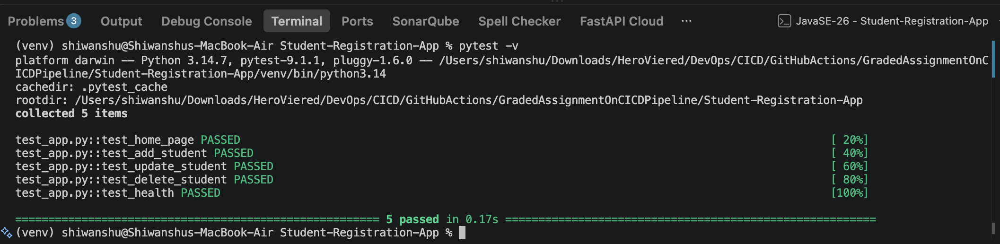

### 2. Docker Health Check and Logs – Local

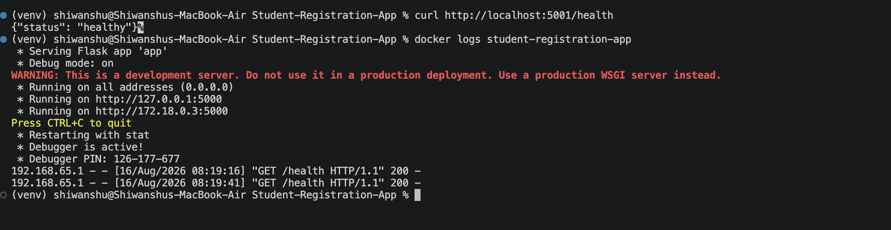

### 3. Application UI – Local

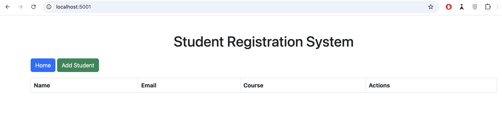

### 4. Database Created – Local

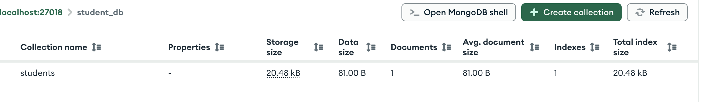

### 5. Data Insertion Details – Local

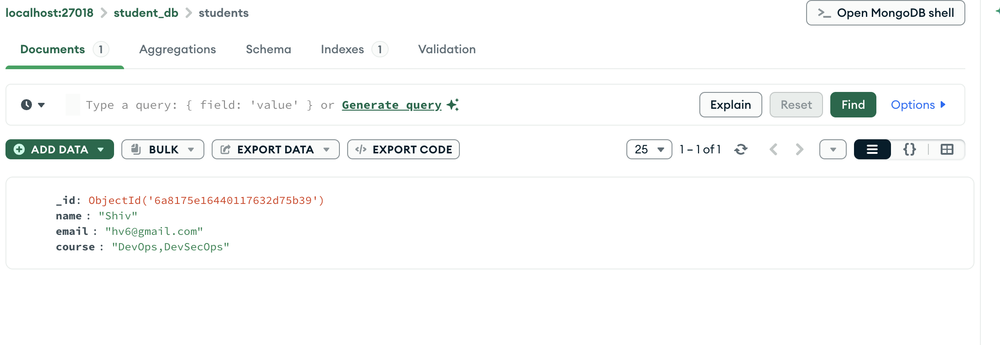

### 6. Data UI Details – Local

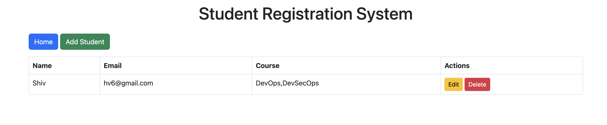

### 7. Student Details Deleted

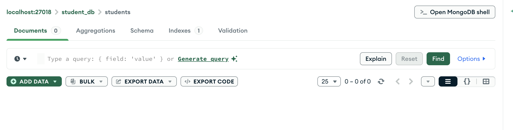

### 8. Docker Logs

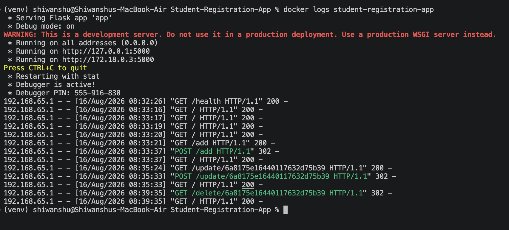

### 9. ECR Created From Pipeline

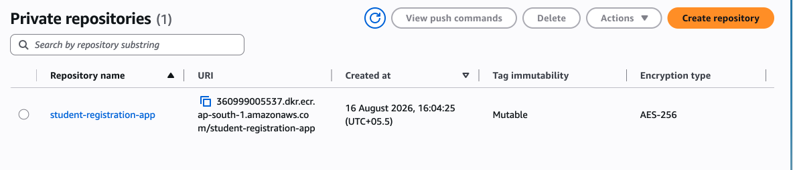

### 10. ECR Pull Success

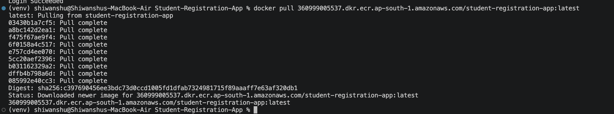

### 11. Test After Pulling Image From ECR

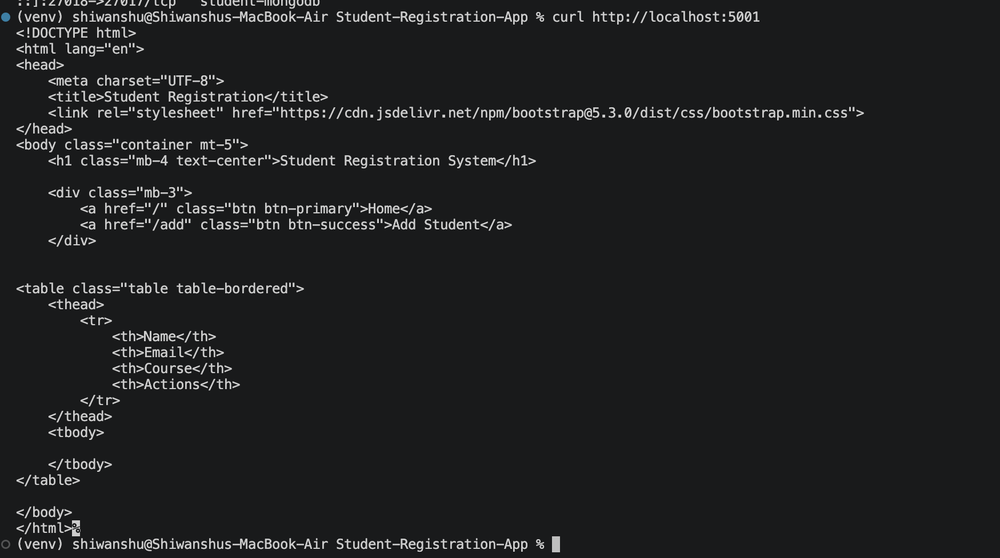

### 12. Docker Logs After Pulling Image From ECR

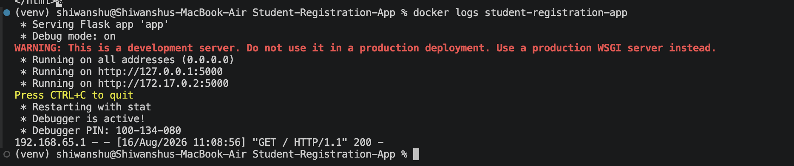

### 13. EC2 Instance Created

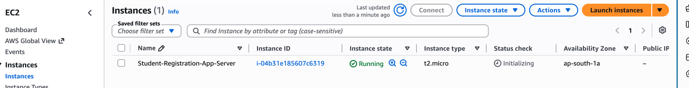

### 14. IAM Role Attached

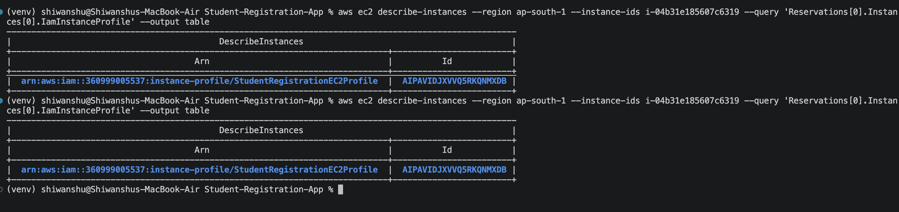

### 15. IAM Policy Attached

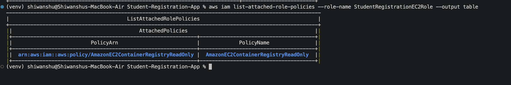

### 16. Docker Image Pulled From ECR On EC2

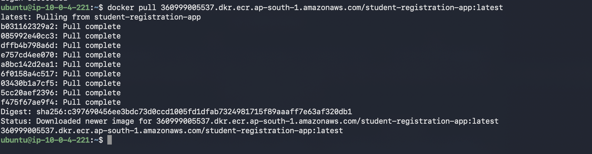

### 17. Testing The App Locally From EC2

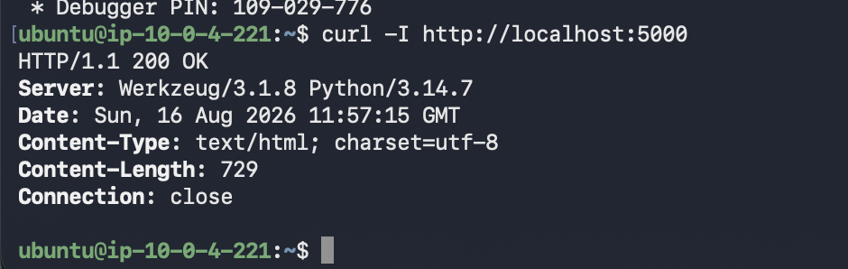

### 18. App Launch UI From EC2

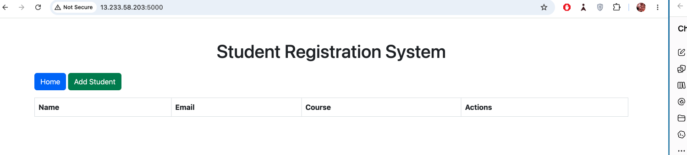

### 19. Student Details Added On EC2 App

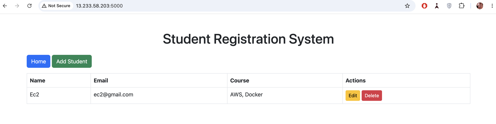

### 20. Student Details Added In DB From EC2

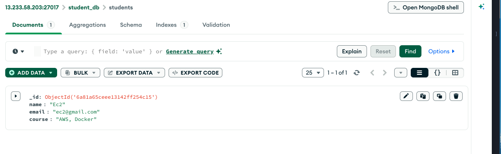

### 21. Image Pushed To ECR Through Pipeline

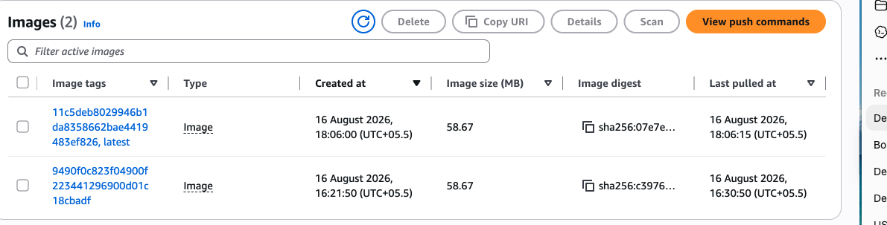

### 22. App Deployed On EC2 Through Pipeline

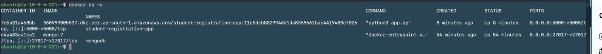

### 23. Docker Network Created To Connect With MongoDB

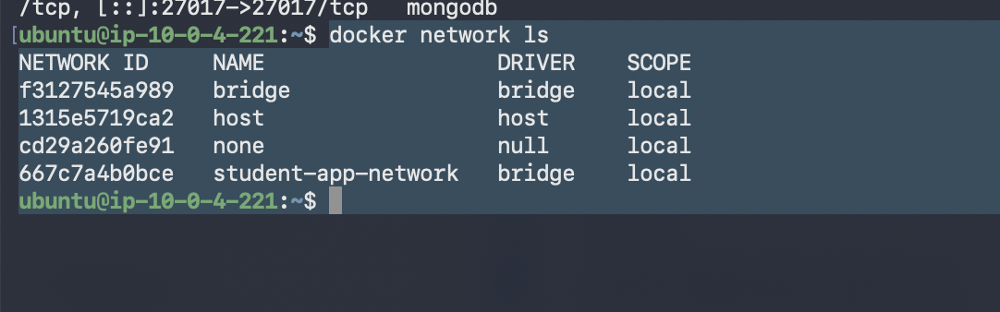

### 24. Health Check Is Fine After Pipeline Deployment

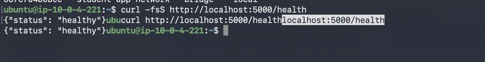

### 25. Deployment Successful Email Through Amazon SES

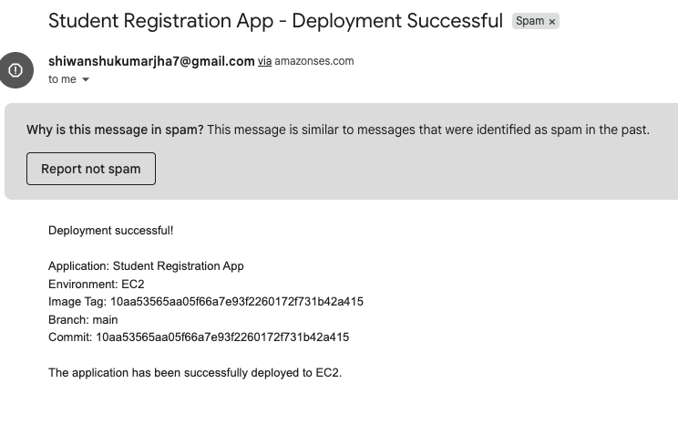

### 26. Deployment Failure Email Through Amazon SES

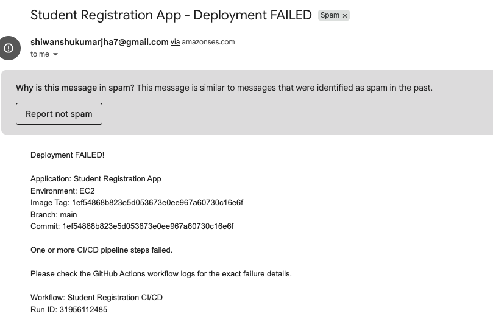

